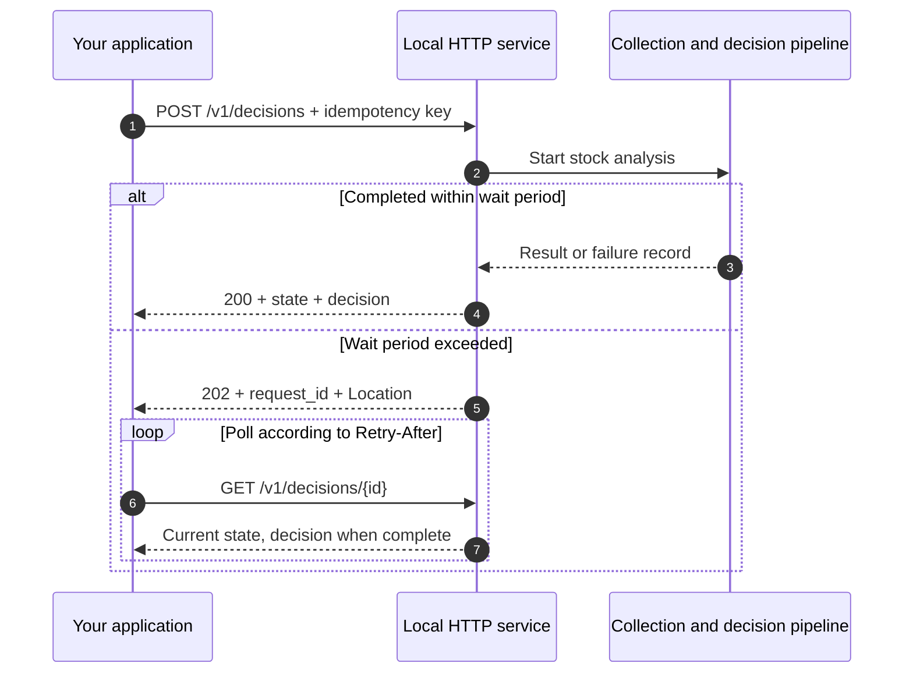
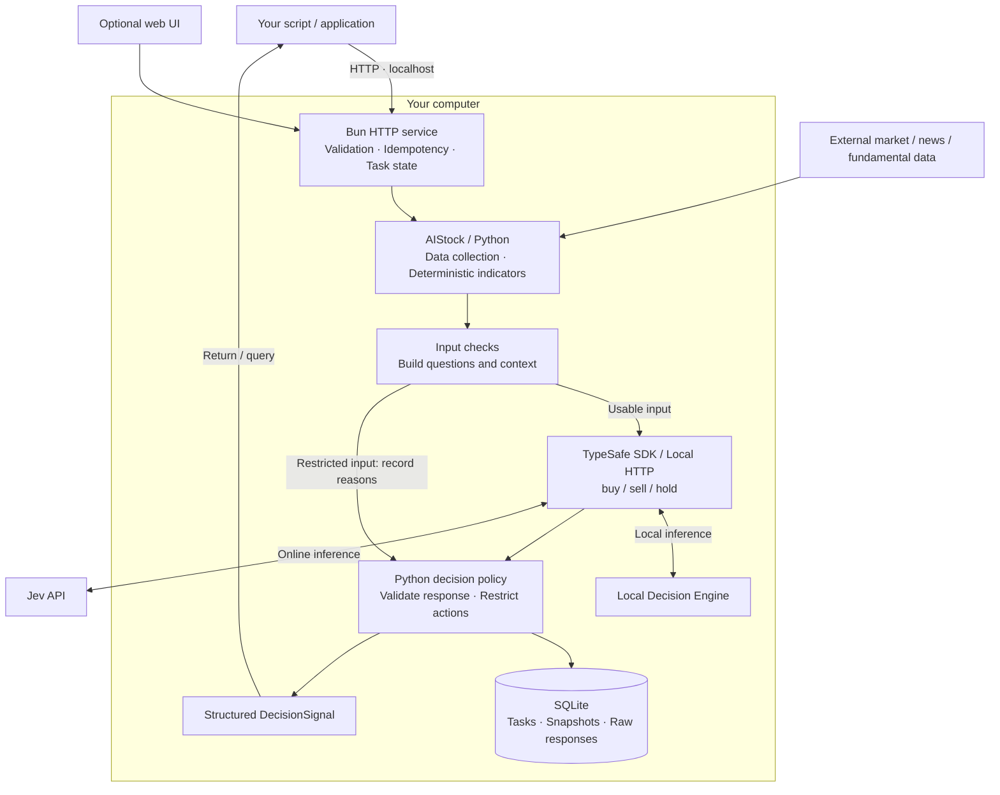

<div align="center">

# Jev Trading

[简体中文](README.md) · [English](README.en.md) · [繁體中文](README.zh-TW.md) · [日本語](README.ja.md) · [한국어](README.ko.md)

### Focused stock decisions. Quick integration. Costs you control.

**Official Jev API or a local model. One HTTP interface.**<br>
Turn market data, indicators, and context into machine-readable **buy / sell / hold** decisions.

**Official API + Local Models** · **HTTP First** · **Self-hosted** · **Auditable**

[Quick start](#quickstart) · [Cloud or local](#local-inference) · [Live analysis](#live) · [HTTP API](#api) · [Architecture](#architecture) · [Preview](#preview) · [FAQ](#faq)

</div>

---

## A lightweight decision API for your trading workflow

**Jev Trading is a stock decision service you deploy and call yourself.** Submit a symbol, position state, and evaluation horizon. Receive structured `buy / sell / hold` decisions, action probabilities, policy results, and supporting evidence. Integrate it with scripts, research tools, or your own trading system.

Use the **official Jev API** by default without running a model on your machine, or connect the **Local Decision Engine** to open-weight models you download and deploy. Both the web interface and HTTP API support both modes. Changing where inference runs keeps your application’s calling workflow intact.

This project provides self-hosted service software, with an optional web interface for setup, exploration, and history. It produces trading signals; your own system handles order execution.

## Why Jev Trading?

| Feature | What you gain | How it works today |
| --- | --- | --- |
| **Focused on decisions** | Results your programs can consume | Reuse AIStock data and indicators, skip long reports, report agents, and notifications, and classify actions directly |
| **Quick to integrate** | A short path into your workflow | Submit a POST and receive JSON or poll an asynchronous task; a Python client example is included |
| **Less redundant work** | More control over inference spending | No extra research report; matching inputs and idempotency keys reuse a task; this app does not automatically retry model requests |
| **Cloud or local** | Choose for your hardware and usage | Official API by default; local inference needs no Jev cloud key; switch with `backend` in the same request format |
| **Multiple sources, direct classification** | Keep the substance of stock analysis | Quotes, bars, technicals, fundamentals, news, trading-cost distribution data, and market context, with missing/degraded data states |
| **Programmatic checks** | See what the model suggested and what was allowed | Separate `model_action` and `final_action`; check freshness, positions, probabilities, and market conditions |
| **Traceable decisions** | Inspect how a result was produced | SQLite snapshots, raw responses, inference provenance, restriction reasons, and evidence export |
| **No browser required** | Automate calls and review manually when useful | Standalone local HTTP service; optional web settings, progress, history, and a key-free demo |

### A shorter path from analysis to action

```text
Symbol + position + evaluation horizon
                  ↓
Market data + deterministic indicators
                  ↓
Official Jev API / Local Decision Engine
                  ↓
Policy checks → buy / sell / hold → your workflow
```

Direct classification removes long-report generation. Idempotency prevents a network resend from starting another analysis. Local inference avoids Jev cloud inference charges, while hardware, electricity, and possible data fees remain. Actual latency and total cost depend on data collection, model, and hardware; no end-to-end speed or savings benchmark is claimed.

## Choose where your model runs

| | Official Jev API · default | Local Decision Engine |
| --- | --- | --- |
| Best suited to | Getting started without maintaining a model runtime | Using compatible hardware and controlling your own inference resources |
| Prepare | Official API key and data collection environment | Model weights, compatible inference service, and data collection environment |
| Inference location | Jev cloud | Your local service |
| Main costs | Official API usage and data fees | Hardware, electricity, maintenance, and data fees |
| Request option | `"backend": "jev"` | `"backend": "local"` |

Tasks and audit records stay on your machine. Cloud mode sends analysis context to Jev. Local mode runs model inference locally, while market and news collection may still use the network. Both modes share the same HTTP interface and decision checks.

<a id="quickstart"></a>
## Quick start: make your first HTTP call

### 1. Prerequisites

| Dependency | Purpose | Needed for demo? |
| --- | --- | --- |
| [Bun](https://bun.sh) | HTTP server, web UI, and Jev SDK | Yes |
| [uv](https://docs.astral.sh/uv/getting-started/installation/) | Set up this project's Python environment | Yes |
| Python ≥ 3.12 | Data contracts, validation, and audit; environment managed by uv | Yes |
| AIStock checkout and dependencies | Collect real stock data | No |
| Jev API key | Cloud inference only; not needed by local backends | No |

Validated on macOS. Startup scripts use a POSIX shell and `.venv/bin/python`; native Windows operation has not been verified.

### 2. Clone and start

```sh
git clone --recurse-submodules https://github.com/EthanAlgoX/jev-trading.git
cd jev-trading
bun install --frozen-lockfile
bun run serve
```

The launcher runs `uv sync --frozen --no-dev` to prepare Python dependencies. The first run needs an internet connection to download dependencies. The service listens at **http://127.0.0.1:3000**; startup messages are currently in Simplified Chinese.

Keep the terminal running. Press `Ctrl+C` to stop. Use `PORT=3010 bun run serve` to change the port.

### 3. Submit a demo decision

In another terminal:

```sh
curl -sS http://127.0.0.1:3000/v1/decisions \
  -H 'Content-Type: application/json' \
  -H 'Idempotency-Key: demo-request-001' \
  -d '{"mode":"demo","position":"flat"}'
```

The following is an **abbreviated completed response**, omitting configuration, timestamps, and audit fields. Demo probabilities come from a fixed response, not live inference.

```json
{
  "api_version": "1",
  "request_id": "2ab77454-5ac8-49be-a1d5-cdc8b171d505",
  "state": "done",
  "mode": "demo",
  "decision": {
    "symbol": "DEMO",
    "model_source": "recorded",
    "model_action": "hold",
    "final_action": "hold",
    "status": "accepted",
    "action_probabilities": { "buy": 0.26, "sell": 0.09, "hold": 0.65 },
    "execution_mode": "signal_only"
  }
}
```

HTTP **202** means analysis is still running. Query the path in `links.self`. A demo never automatically switches to paid inference.

### 4. Use the bundled client

```sh
# Submit and poll automatically; no third-party Python HTTP package needed
python3 examples/http_client.py --demo

# Resume an existing task without another model call
python3 examples/http_client.py --request-id "YOUR_REQUEST_ID"
```

The [Python client](examples/http_client.py) is a starting point for integrating your application.

<a id="local-inference"></a>
## Choose a mode: Jev Cloud or Local Decision Engine

| Mode | Probability source | Cloud key required |
| --- | --- | --- |
| `jev` (default) | Provider-reported classification probabilities | Yes |
| `local` | Local Decision Engine; two calculation methods below | No |

Local Decision Engine is this project’s unified integration name. `logprobs` normalizes candidate-label scores with softmax; `generated` asks a model for probability JSON, then validates and normalizes it. These are different statistical methods, recorded as `label_logprobs` and `generated_probabilities`.

Download and load a model and start a compatible service using the [local deployment guide](docs/local-inference.md), then configure:

```dotenv
JEV_BACKEND=local
JEV_LOCAL_ENGINE=logprobs
JEV_LOCAL_BASE_URL=http://127.0.0.1:8000
JEV_LOCAL_MODEL=jev-latest
```

Web and HTTP share these settings. Saved settings override environment variables. Run `bun run backend:check`, then `bun run serve`. We do not bundle weights; ordinary chat endpoints need a compatible adapter. See the guide for deployment implementations and attribution.

Save the default mode in the web settings, or select `backend` per HTTP request without changing the default. Jev Cloud is the default; local failures do not fall back to cloud. Advanced requests can set `localEngine` to `generated` or `logprobs`; omission uses the configured local method.

```sh
curl -sS http://127.0.0.1:3000/v1/decisions \
  -H 'Content-Type: application/json' \
  -d '{"symbol":"600519","position":"flat","backend":"local","waitSeconds":0}'

python3 examples/http_client.py --symbol 600519 --backend local
```

<a id="live"></a>
## Connect live data and inference

Both inference modes share the AIStock setup below. Cloud mode additionally requires a Jev API key. For local mode, start a compatible service using the [local deployment guide](docs/local-inference.md); no cloud key is needed.

### Prepare AIStock

AIStock collects data and computes indicators in its own Python environment. The supplied `context_only` patch returns analysis data before report generation.

One supported layout:

```text
workspace/
├── AI-Stock/                 # Data-source config and separate Python environment
│   └── .venv/bin/python
└── reference/
    └── jev-trading/           # This project and its own Python environment
```

The service searches for `AI-Stock` beside the project, two levels up, or inside the project. Other paths can be configured explicitly. Follow AIStock's own instructions to install dependencies and configure data sources, then check for the `context_only` entry point.

<details>
<summary><strong>Missing the collection entry point? Apply the patch</strong></summary>

Replace these with actual absolute paths:

```sh
cd /path/to/AI-Stock
git apply --check /path/to/jev-trading/patches/aistock-context-only.patch
git apply /path/to/jev-trading/patches/aistock-context-only.patch
```

Do not reapply an existing patch. If the check fails, inspect version compatibility and local changes rather than forcing an overwrite. See the [initial implementation notes](docs/implementation.md) for scope and validation.

Collection does not generate the original research report or send notifications. Its cache is written to this project's `data/aistock.db`, not AIStock's existing research database.

</details>

### Configure the server

```sh
cp .env.example .env
```

Edit `.env`:

```dotenv
TYPESAFE_AI_API_KEY=your_jev_api_key
JEV_MODEL_ID=jev-latest
PORT=3000

# Set actual paths if automatic discovery fails
AISTOCK_PATH=/path/to/AI-Stock
AISTOCK_PYTHON=/path/to/AI-Stock/.venv/bin/python
```

Configure your key through the [TypeSafe console](https://console.typesafe.ai). Restart and check the service:

```sh
bun run doctor
bun run serve
```

In another terminal, check health:

```sh
curl -sS http://127.0.0.1:3000/v1/health
```

`ready: true` means local configuration checks passed: paths, interpreter file, collection entry point, and key presence. It **does not verify external data connectivity or key validity**.

### Submit live analysis

```sh
curl -sS http://127.0.0.1:3000/v1/decisions \
  -H 'Content-Type: application/json' \
  -H 'Idempotency-Key: stock-600519-001' \
  -d '{
    "symbol": "600519",
    "position": "flat",
    "horizon": 5,
    "execution": "next_session_open",
    "costPercent": 0.3,
    "instructions": "Consider trends, fundamentals, and news. Hold when evidence is insufficient."
  }'
```

Omitting `mode` defaults to `live`. Alternatively:

```sh
python3 examples/http_client.py --symbol 600519 --position flat
```

Example symbol formats include `600519`, `AAPL`, and `HK00700`. Actual coverage depends on AIStock's data sources. `position` is supplied by the caller; the service does not read your brokerage account.

<a id="api"></a>
## HTTP API integration

### Endpoints

| Method | Path | Returns |
| --- | --- | --- |
| GET | `/v1/health` | Liveness, configuration checks, readiness, and active task |
| POST | `/v1/decisions` | A new task or a completed decision |
| GET | `/v1/decisions/{request_id}` | Progress and final decision |
| GET | `/v1/decisions/{request_id}/evidence` | Context, model request, raw response, and audit signal |

### Request fields

| Field | Required | Default / values |
| --- | --- | --- |
| `symbol` | In live mode | Stock symbol; demo uses `DEMO` |
| `position` | Yes | `flat`: no holding / `long`: already holding |
| `backend` | No | Per-request `jev` / `local`; omit to use the service default |
| `mode` | No | `live` / `demo`; defaults to `live` |
| `horizon` | No | 1–250 trading days; default `5` |
| `execution` | No | `next_session_open` / `immediate`; defaults to the former |
| `costPercent` | No | Round-trip cost and slippage assumption, 0–10; default `0.3` (0.3%) |
| `instructions` | No | Strategy instructions, up to 8,000 characters |
| `waitSeconds` | No | 0–25 seconds; default `25`; `0` returns a task immediately |

Unknown fields are rejected. Horizon, costs, and execution timing are evaluation assumptions, not instructions to execute a trade.

### Submit once, query as needed



**Retries:** Generate an `Idempotency-Key` for each new analysis: 8–100 letters, digits, or hyphens. For network retries, reuse the key and analysis parameters; the wait duration may change. Reusing a key with different analysis parameters returns 409. A key is generated if omitted, but a client cannot reliably retry after a lost response without knowing it.

**Waiting:** A 202 includes `Location` and `Retry-After: 2`. Ending the wait or disconnecting does not cancel the task. GET does not call the model again. The service runs one task at a time without a queue; additional work receives `409 BUSY`.

### Interpret results correctly

```text
HTTP success
  └─ Check state
       ├─ In progress → keep polling
       ├─ failed → read error and handle the failure
       └─ done → check decision.status, valid_until, and mode
                    └─ then read decision.final_action
```

| Field | Meaning |
| --- | --- |
| `state` | Task state; `done` only means processing finished |
| `decision.status` | `accepted`, `blocked`, `skipped`, `error`, or `expired` |
| `model_action` | Original model action; may be null without a valid model judgment |
| `final_action` | Policy-checked action; `hold` when blocked or expired |
| `reason_codes` / `warnings` | Action restrictions, data quality, and other notices |
| `valid_until` | Signal expiry; expired queries return a `hold / expired` view |
| `action_probabilities` | Probability distribution over action classes, **not the chance of making a profit** |
| `model_source` | `jev`: online path / `recorded`: demo or recorded-response path ; `local` |

`buy` increases long exposure, `sell` reduces an existing long holding, and `hold` leaves it unchanged. Selling from a flat position is not interpreted as opening a short.

See the [HTTP API reference](docs/http-api.md) for more response, error, and recovery details (Simplified Chinese).

<a id="architecture"></a>
## Architecture



### Responsibilities

| Layer | Responsibility | Main code |
| --- | --- | --- |
| Service | HTTP, task reuse, bounded waiting, query URLs | [server.ts](app/server.ts), [api.ts](app/api.ts) |
| Data | AIStock context-only collection, coverage and provenance | [collector.py](src/jev_trading/collector.py), [aistock_worker.py](src/jev_trading/aistock_worker.py) |
| Model | `createTypeSafeAi → evaluationModel → experimental_evaluate` | [model.ts](app/model.ts) |
| Decision | Probabilities, dates, actions, and model/final differences | [policy.py](src/jev_trading/policy.py), [service.py](src/jev_trading/service.py) |
| Audit | Inputs, question versions, model responses, and final signals | [storage.py](src/jev_trading/storage.py), [jobs.ts](app/jobs.ts) |

Cloud inference uses the Bun SDK; local backends use compatible HTTP. Python handles collection, data contracts, and audit. The advanced Python CLI retains its own HTTP model adapter; API callers do not have to coordinate the two runtimes.

### Checks and failure handling

- Record restrictions for unavailable core bars/technicals, mismatched dates, or expired context.
- Immediate-execution assumptions require an open market and sufficiently fresh quotes. Next-open assumptions are still for evaluation only.
- Block selling from a flat position. Conservative market conditions or degraded core technical data can block buying.
- Validate the model's action and probability contract. Errors, timeouts, and late results cannot become valid signals to add exposure.
- Do not retry the model automatically. Restarted services mark unfinished tasks as failed; callers must explicitly request new analysis.

These are basic implemented checks, not a complete migration of AIStock's report policies. They do not validate actual cash, sellable quantity, or all trading rules.

<a id="preview"></a>
## Optional web workbench

After startup, open [http://127.0.0.1:3000](http://127.0.0.1:3000) to use the same analysis service.


*The UI and screenshots currently use Simplified Chinese. This is a synthetic demo with a fixed response, not live trading performance or a live Jev judgment.*

<details>
<summary><strong>View the narrow-screen layout</strong></summary>

<p align="center">
  
</p>

Responsive layout does not enable remote phone access. The service still listens on the local loopback address only.

</details>

The UI includes connection settings, demo/live selection, progress, history, and evidence export. On macOS, double-click [start.command](start.command). If Node.js/npm is installed but Bun is not, it attempts to obtain Bun through npx. uv remains a prerequisite.

<a id="configuration"></a>
## Configuration and storage

| Setting | Default / description |
| --- | --- |
| `TYPESAFE_AI_API_KEY` | Required for the cloud backend only; also accepts `TYPESAFE_API_KEY` |
| `JEV_MODEL_ID` | `jev-latest`; also accepts `JEV_MODEL` |
| `JEV_BACKEND` / `JEV_LOCAL_BASE_URL` | `jev` / `local` · [Local inference](docs/local-inference.md) |
| `AISTOCK_PATH` | Auto-discovered or explicitly configured AIStock path |
| `AISTOCK_PYTHON` | Defaults to AIStock's `.venv/bin/python` |
| `PORT` | `3000`; bind address is fixed to `127.0.0.1` |
| `JEV_DATA_DIR` | Project `data/`; use separate directories for separate instances |
| `OPEN_BROWSER` | `0` disables browser launch; already set by `bun run serve` |

Bun loads `.env` automatically. Saved web settings take precedence over environment variables. Restart after changing `.env`. An empty key submitted in the UI preserves the existing key.

```text
data/
├── settings.json          # Local connection settings, mode 0600
├── workbench.sqlite       # Tasks and web history
├── decisions.db           # Inputs, requests, responses, and signal audit
├── aistock.db             # Separate market-data cache
├── contexts/              # Live-analysis input snapshots
└── collection.log         # Collection diagnostics
```

The API does not return keys, and keys are not written to analysis records. Git ignores `data/` and `.env`. Decision queries check expiry; evidence export preserves the original signal.

<a id="faq"></a>
## FAQ

| Question / symptom | Explanation / action |
| --- | --- |
| Can I try it without a key? | Set `mode: demo`; neither AIStock nor a Jev key is needed |
| 202 with no decision | Poll `links.self`, or use the Python client |
| `503 NOT_READY` | Run `bun run doctor` or query `/v1/health` and complete configuration |
| `409 BUSY` | Another task is running; retry later with the same idempotency key |
| `409 IDEMPOTENCY_CONFLICT` | Same key, different parameters; use a new key for new analysis |
| Repeated calls return an old result | You reused a key; generate a new one for new analysis |
| HTTP 400 | Check JSON, required position, field spelling, and parameter ranges |
| Jev 401 or model failure | Check the server key, model access, and network, then explicitly retry |
| Slow or failed collection | Inspect `data/collection.log`, AIStock dependencies, and data sources; HTTP/UI collection limit is 240 seconds |
| Model says buy, final action is hold | Inspect reason_codes; policy may have blocked buying |
| ready is true but analysis fails | Readiness does not test every import, data connection, or API permission |
| Port already in use | Use `PORT=3010 bun run serve` and update your client URL |
| Public hosting or automated orders? | Local service only; no multi-user authentication, live orders, or complete execution risk checks |

## Development and validation

```sh
bun run typecheck       # Strict TypeScript checks
bun test app            # SDK, persistence, and HTTP integration
uv run pytest -q        # Python contracts, policy, timeout, storage, and CLI
```

| Validation | Recorded result |
| --- | --- |
| TypeScript | Passed |
| Bun | 18 tests passed, including HTTP integration in a separate process |
| Python | 38 tests passed |
| HTTP demo | Submission, polling, idempotency, results, export, and Python client verified |
| Browser | Desktop and narrow-screen demo, settings, history, and layout checked |
| Real AIStock collection | Collected 600519; see implementation notes for coverage and limits |
| Live Jev inference | Not yet verified; SDK contracts tested with mocked HTTP responses |

Passing tests does not establish profitability. There is no return backtest, automatic stop-loss, target-position sizing, or real execution. Historical replay does not guarantee point-in-time completeness.

<details>
<summary><strong>Repository structure</strong></summary>

```text
jev-trading/
├── app/                   # Bun HTTP service, Jev SDK, tasks, and tests
├── web/                   # Optional web interface
├── src/jev_trading/        # Python collection, contracts, policy, audit, and CLI
├── tests/                 # Python tests
├── examples/              # HTTP client, offline inputs, and sample configuration
├── patches/               # AIStock context-only patch and license
├── docs/                  # API, architecture, implementation notes, and screenshots
├── reference/             # jev-trader reference submodule
├── .env.example           # Server configuration example
├── start.command          # macOS launcher
├── package.json / bun.lock
└── pyproject.toml / uv.lock
```

</details>

## Documentation and attribution

This README is available in five languages using the links at the top. The application UI, logs, and extended documentation are currently primarily in Simplified Chinese; translated READMEs do not imply a localized application.

| Document | Content |
| --- | --- |
| [HTTP API](docs/http-api.md) | Deployment, requests, polling, and recovery |
| [Python HTTP client](examples/http_client.py) | Runnable submission and polling example |
| [Advanced CLI](docs/cli.md) | Collection, recorded-response replay, and audit queries |
| [Architecture and development plan](docs/architecture-and-development-plan.md) | Scope and layers |
| [Web and SDK notes](docs/workbench.md) | Integration and validation |
| [Initial implementation notes](docs/implementation.md) | AIStock patch, real collection, and known limits |

The project draws on AIStock's stock-analysis workflow and jev-trader's Jev SDK integration. [reference/](reference/) is a pinned Git submodule containing upstream source and its MIT license. Run `git submodule update --init --recursive` in an existing checkout to retrieve it. The AIStock license copy is in [patches/AIStock-LICENSE](patches/AIStock-LICENSE). These upstream licenses do not constitute a separate, unified license declaration for this project's new code.
