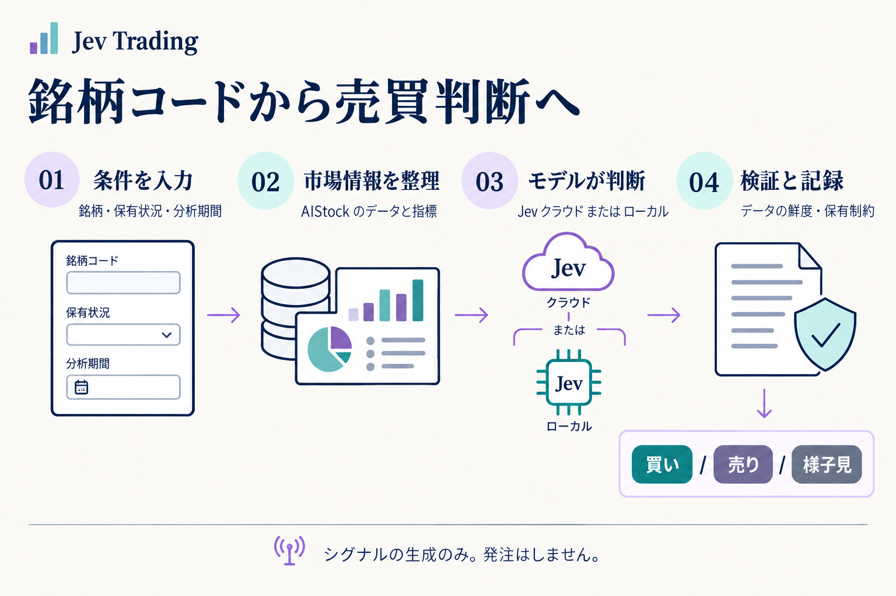

<div align="center">

# Jev Trading

### 銘柄を入力して、根拠を確認できる判断シグナルへ。

相場・ニュース → モデルの判断 → ルールによる検証 → **買い / 売り / 様子見**

[English](README.md) · [简体中文](README.zh-CN.md) · [繁體中文](README.zh-TW.md) · **日本語** · [한국어](README.ko.md)

[デモを試す](#quickstart) · [実データで分析](#live) · [結果の読み方](#results) · [HTTP API](#api) · [困ったとき](#faq)

</div>



## 何ができるプロジェクト？

**Jev Trading は、自分のパソコンで動かす株式の意思決定サービスです。** ブラウザーの画面から操作することも、自分のプログラムから HTTP で呼び出すこともできます。AIStock が集めた相場、指標、企業情報、ニュースをモデルに渡し、構造化された判断とその根拠を保存します。

例えば「`600519`、現在は保有なし、今後5営業日」と入力すると、最終アクション、3つのアクションに対するモデルの確率、データ不足やルールによる制限が返ります。

- **個別銘柄を分析：**銘柄、保有状況、期間を指定し、判断とデータの状態を確認。
- **自分のツールに接続：**同じ API で Jev クラウドとローカルモデルを選択。
- **判断の根拠を振り返る：**履歴、入力スナップショット、モデルの元の応答をローカル保存し、エクスポート。

> **生成するのはシグナルのみで、注文は出しません。** 証券口座との連携、自動損切り、目標保有数量の計算、収益バックテストはありません。アクションの確率は利益が出る確率ではありません。

## 目的に合った始め方

| 目的 | 用意するもの | 手順 |
| --- | --- | --- |
| まず流れを体験 | Bun + uv。キーも AIStock も不要 | [デモ](#quickstart) |
| クラウドで実データを分析 | 上記 + AIStock + Jev API キー | [実データ分析](#live) |
| 自分のモデルで実データを分析 | 上記 + AIStock + モデル重みと互換サービス | [ローカルモデル](#local-inference) |
| スクリプトやアプリから利用 | 起動済みのローカルサービス | [HTTP API](#api) |

<a id="quickstart"></a>
## 1. まずデモを試す

### 実行環境を確認

[Bun](https://bun.sh) と [uv](https://docs.astral.sh/uv/getting-started/installation/) をインストールし、ターミナルを開き直して確認します。

```sh
bun --version
uv --version
```

Bun は Web・HTTP サービスを動かし、uv は Python ≥ 3.12 のプロジェクト環境を用意します。初回は依存関係のダウンロードにインターネット接続が必要です。macOS で検証済みで、Windows ネイティブでの起動は未検証です。

### ダウンロードして起動

```sh
git clone --recurse-submodules https://github.com/EthanAlgoX/jev-trading.git
cd jev-trading
bun install --frozen-lockfile
bun run start
```

すでに取得済みなら、プロジェクトのディレクトリで `bun install` から実行します。起動時に `uv sync --frozen --no-dev` が自動実行されます。

**[http://127.0.0.1:3000](http://127.0.0.1:3000) を開きます。** ワークベンチが表示されれば Web サービスは起動しています。ターミナルは開いたままにし、停止するときは `Ctrl+C` を押します。

### 画面で体験する

現在のアプリ画面は簡体字中国語です。実際のボタン表記を括弧内に示します。

1. **デモモード**（`演示体验`）のままにします。
2. **判断を試す**（`体验一次决策`）をクリックします。
3. 右側でアクション、分類確率、データ状態を確認します。
4. 下の**最近の分析**（`最近分析`）から履歴を開くか、**根拠をエクスポート**（`导出完整依据`）を選びます。

**デモは合成データと固定応答を使います。クラウド・ローカルのどちらのモデルも呼び出さず、有料分析へ自動で切り替わることもありません。**

<details>
<summary>その他の起動方法：Mac、ブラウザーなし、ポート変更</summary>

- Mac では [start.command](start.command) をダブルクリックできます。Bun がなくても Node.js/npm があれば npx で Bun の準備を試みます。uv は別途必要です。
- `bun run serve`：ブラウザーを自動で開かずに同じサービスを起動。
- `PORT=3010 bun run serve`：ポートを3010に変更。ブラウザーとクライアントの接続先も変更してください。

</details>

<a id="live"></a>
## 2. 実データで分析する

必要なのは2つの接続です。**AIStock がデータを用意し、Jev クラウドまたはローカルモデルが判断します。** このリポジトリの取得だけでは AIStock のインストールやモデル重みのダウンロードは行われません。

### A. AIStock を用意する

AIStock を別途取得し、その説明に従って依存関係とデータソースを設定します。AIStock 専用の Python 環境を使用します。配置例：

```text
workspace/
├── AI-Stock/
│   └── .venv/bin/python
└── jev-trading/
```

本プロジェクトには AIStock の `context_only` 入口が必要です。長いレポートを作る前にデータを返し、レポート生成や通知を省略します。すでに対応している場合、パッチの再適用は不要です。

<details>
<summary>context_only がない場合：付属パッチを適用</summary>

実際の絶対パスに置き換えてください。

```sh
cd /path/to/AI-Stock
git apply --check /path/to/jev-trading/patches/aistock-context-only.patch
git apply /path/to/jev-trading/patches/aistock-context-only.patch
```

チェックが成功した場合のみ適用します。失敗した場合は強制せず、AIStock のバージョンとローカル変更を確認してください。対応範囲は[実装記録](docs/implementation.md)を参照してください。

</details>

### B. モデルを選んで設定を保存

| | Jev クラウド（既定） | ローカルモデル |
| --- | --- | --- |
| 用意するもの | Jev API キー | モデル重みと互換推論サービス |
| 推論する場所 | Jev クラウド | 自分のマシン上のサービス |
| Jev クラウドキー | 必要 | 不要 |
| 費用 | API 利用料と、必要に応じたデータ料金 | ハードウェア、電力、保守、必要に応じたデータ料金 |
| リクエスト指定 | `"backend": "jev"` | `"backend": "local"` |

**クラウドの場合：**右上の接続設定（`连接设置`）で API キー、モデル名（既定 `jev-latest`）、自動検出されなかった AIStock と Python のパスを入力して保存します。キーは [TypeSafe コンソール](https://console.typesafe.ai)で管理します。

<details>
<summary>設定ファイルを使う場合：.env</summary>

本プロジェクトのディレクトリで実行します。すでに `.env` がある場合は上書きせず編集してください。

```sh
cp .env.example .env
```

```dotenv
TYPESAFE_AI_API_KEY=your_jev_api_key
JEV_MODEL_ID=jev-latest
AISTOCK_PATH=/absolute/path/to/AI-Stock
AISTOCK_PYTHON=/absolute/path/to/AI-Stock/.venv/bin/python
```

例の値を置き換えてサービスを再起動します。**画面で保存した設定が `.env` より優先されます。** 画面でキーを空欄にして保存した場合、既存のキーを維持します。

</details>

<a id="local-inference"></a>
**ローカルの場合：**先に[ローカル構築ガイド](docs/local-inference.md)で重みと互換サービスを用意します。接続設定でローカルエンジン（`本地决策引擎`）を選び、アドレス、モデル名、確率の計算方式を設定します。通常のチャット API を、必要な `/v1/systemone` の代わりに指定することはできません。`bun run backend:check` でバックエンドの準備状態を確認できます。

クラウドでは分析コンテキストを Jev に送ります。ローカルでは推論を自分のマシンで実行しますが、相場やニュースの取得はネット接続を使う場合があります。ローカルで失敗してもクラウドに自動切替しません。

### C. 確認して分析

```sh
bun run doctor
```

パス、収集入口、必要な設定をチェックします。**外部データソースや API キーの実際の動作を保証するものではありません。** 画面に戻り、実データ分析（`真实分析`）へ切り替えて入力します。

| 項目 | 入力内容 |
| --- | --- |
| 銘柄コード | 例：`600519`、`AAPL`、`HK00700`。対応範囲はデータソース次第 |
| 保有状況 | 未保有または保有中。証券口座から自動取得はしません |
| 分析期間 | 画面では5・10・20営業日を選択可能 |
| 前提条件（任意） | 執行時点、往復コストとスリッページ、戦略の希望 |

送信後、データ収集 → 分類 → 検証と保存を待ちます。執行時点やコストは判断の前提であり、注文指示ではありません。

### 分析をカスタマイズ

銘柄はリクエストごとに変更できます。画面で判断用プロンプトをテンプレートとして保存・更新し、リアルタイム株価・筹码（保有コスト分布）・ニュースの収集や株価取得元の優先順位を指定できます。API に自前のデータを渡せば AIStock の収集を省略できます。各分析にテンプレートのバージョンと実際のプロンプトが記録されます。詳細は [カスタマイズガイド](docs/customization.md)（簡体字中国語）を参照してください。

<a id="results"></a>
## 3. 結果を読む

**最終アクションを見てから、状態、有効期限、制限理由を確認します。** 例えばテクニカルデータの品質が低い場合、モデルが買いを選んでも、最終結果は様子見に変わることがあります。

| 結果 | 意味 |
| --- | --- |
| `buy` / 買い | ロングの保有を増やすシグナル |
| `sell` / 売り | 既存のロング保有を減らすシグナル。未保有時に空売りとは解釈しません |
| `hold` / 様子見 | 現状を維持。モデルの判断、制限、期限切れのいずれもあり得ます |
| `model_action` | モデルの元の提案 |
| `final_action` | ルール適用後のアクション |
| `status` | `accepted` 承認、`blocked` 制限、`skipped` スキップ、`error` エラー、`expired` 期限切れ |
| `reason_codes` / `warnings` | 制限やデータ不足などの理由 |
| `valid_until` | 有効期限。期限切れの照会は `hold / expired` として返ります |
| `action_probabilities` | 各アクションの確率。**利益が出る確率ではありません** |

`state: done` は処理完了を示すだけで、有効なシグナルや取引成功を意味しません。API では `mode` も確認し、デモを実際の判断として扱わないようにします。

<a id="api"></a>
## 4. 自分のプログラムから呼び出す

サービスを起動したまま、**別のターミナル**でデモを送信します。

```sh
curl -sS http://127.0.0.1:3000/v1/decisions \
  -H 'Content-Type: application/json' \
  -H 'Idempotency-Key: demo-request-001' \
  -d '{"mode":"demo","position":"flat"}'
```

完了時の短縮例です。確率は固定のデモ値です。

```json
{
  "state": "done",
  "mode": "demo",
  "decision": {
    "model_source": "recorded",
    "model_action": "hold",
    "final_action": "hold",
    "status": "accepted",
    "action_probabilities": { "buy": 0.26, "sell": 0.09, "hold": 0.65 },
    "execution_mode": "signal_only"
  }
}
```

**202** は処理中です。`links.self` を照会してください。既定で最大25秒待ち、`waitSeconds: 0` ならすぐにタスク ID を返します。GET 照会ではモデルを再実行しません。

付属の Python クライアントは送信とポーリングを自動化します。外部 HTTP ライブラリは不要です。

```sh
python3 examples/http_client.py --demo
```

実データ分析の設定後：

```sh
python3 examples/http_client.py --symbol 600519 --position flat --backend jev
```

ローカルモデルなら `jev` を `local` に変更します。既存タスクを照会する場合：

```sh
python3 examples/http_client.py --request-id "YOUR_REQUEST_ID"
```

| エンドポイント | 用途 |
| --- | --- |
| `GET /v1/health` | サービスと設定の状態 |
| `POST /v1/decisions` | 分析を送信 |
| `GET /v1/decisions/{request_id}` | 進捗と結果 |
| `GET /v1/decisions/{request_id}/evidence` | 入力、元の応答、監査用の根拠 |

<details>
<summary>実データの HTTP リクエスト、パラメーター、再試行</summary>

```sh
curl -sS http://127.0.0.1:3000/v1/decisions \
  -H 'Content-Type: application/json' \
  -H 'Idempotency-Key: stock-600519-001' \
  -d '{"symbol":"600519","position":"flat","backend":"jev","horizon":5,"execution":"next_session_open","costPercent":0.3,"waitSeconds":0}'
```

- `mode` の既定は `live`。実データでは `symbol` が必須です。`position` は必須で、`flat` または `long` を指定します。
- `horizon`：1–250営業日、既定5。`costPercent`：0–10、既定0.3（0.3%）。
- `execution`：`next_session_open`（既定）または `immediate`。`instructions`：最大8000文字。
- `backend`：`jev` または `local`、省略時はサービスの既定値。`localEngine`：`logprobs` または `generated`。
- `waitSeconds`：0–25の整数、既定25。不明なフィールドは拒否されます。
- 新しい分析には新しい `Idempotency-Key`（英数字・ハイフン8–100文字）を使います。ネットワーク再送時は同じキーと分析条件を使い、待機時間のみ変更可能です。同じキーなら元のタスクが返ります。
- 同時処理は1件で、キューはありません。使用中は `409 BUSY`。202 の `Retry-After: 2` は2秒後の照会を示します。
- 切断してもタスクはキャンセルされません。本アプリはモデル要求を自動再試行しません。再起動で未完了タスクは失敗扱いになり、新しい分析の送信が必要です。

</details>

詳細は [HTTP API](docs/http-api.md) を参照してください。

<a id="faq"></a>
## 困ったとき

| 症状 | 次に確認すること |
| --- | --- |
| `bun` / `uv` が見つからない | インストール後にターミナルを開き直し、`--version` を確認 |
| 画面を開けない | サービス用ターミナルが動作中か確認し、`127.0.0.1:3000` へ。競合時は3010を使用 |
| キーがない | デモを利用。実データのローカル分析にも AIStock と互換モデルサービスが必要 |
| `503 NOT_READY` | `bun run doctor` で不足設定を確認 |
| 設定が反映されない | 画面で保存した設定が `.env` より優先。`.env` 編集後は再起動 |
| 202 / 結果がまだない | `links.self` を照会するか Python クライアントで待機 |
| 409 / 古い結果が返る | BUSY は後で再試行。新しい分析には新しいキー。同じキーで分析条件を変更しない |
| データ収集失敗 | `data/collection.log`、AIStock の依存関係とデータソースを確認。収集上限240秒 |
| モデル失敗 / 401 | キー、権限、ネットワーク、ローカル互換サービスを確認して明示的に再試行 |
| 買いが様子見になる | `reason_codes`、データ状態、有効期限を確認 |

<a id="preview"></a>
## 画面と言語について

このページのフロー図は日本語です。5言語の README にはそれぞれ翻訳した画像があります。**アプリ、ログ、詳細ガイドは現在主に簡体字中国語です。** 図の翻訳は画面の多言語対応を意味しません。

<details>
<summary>実際の画面を見る（簡体字中国語・固定デモ）</summary>

[デスクトップ画面](docs/assets/workbench-desktop.png) · [モバイル幅の画面](docs/assets/workbench-mobile.png)

合成データと固定応答を表示したもので、実際のモデル推論ではありません。モバイル幅への対応は、スマートフォンからの遠隔アクセスを有効にするものではありません。

</details>

<a id="architecture"></a>
## 開発と詳細ガイド

Bun は HTTP・タスク・モデル接続、Python はデータ収集・検証・監査記録を担当します。記録はローカルの SQLite に保存します。

| ディレクトリ | 役割 |
| --- | --- |
| `app/`、`web/` | サーバー、モデル接続、Web 画面 |
| `src/jev_trading/`、`tests/` | Python の収集、ルール、監査、テスト |
| `examples/`、`patches/` | 呼び出し例と AIStock 用パッチ |
| `reference/` | 固定バージョンの jev-trader 参考ソース。AIStock ではありません |

<a id="configuration"></a>
<details>
<summary>設定、保存先、開発用チェック</summary>

設定例は [.env.example](.env.example)。`JEV_DATA_DIR` で保存先、`PORT` でポートを変更できます。待受アドレスは `127.0.0.1` 固定です。

| ローカルファイル | 内容 |
| --- | --- |
| `data/settings.json` | 接続設定、権限0600 |
| `data/workbench.sqlite` | タスクと履歴 |
| `data/decisions.db` | 入力、モデル応答、判断の監査記録 |
| `data/aistock.db`、`data/contexts/` | 相場キャッシュと入力スナップショット |
| `data/collection.log` | 収集診断ログ |

`.env` と `data/` は Git の追跡対象外です。API はキーを返さず、分析記録にもキーを書き込みません。

```sh
bun run typecheck
bun test app
uv run pytest -q
```

</details>

**検証範囲：**デモと API テスト、実際の AIStock データ収集の記録があります。Jev クラウドの実推論とローカルの実モデル重みによる推論は未検証です。基本ルールは口座資金、売却可能数量、取引ルール全体を検証しません。収益バックテストもありません。ローカル専用で、複数ユーザーの認証機能はありません。

以下の詳細ガイドは現在、簡体字中国語です。

| ガイド | 内容 |
| --- | --- |
| [HTTP API](docs/http-api.md) | パラメーター、結果、エラー、タスク復旧 |
| [ローカル推論](docs/local-inference.md) · [互換実装](docs/reference-engines.md) | モデルの構築と接続プロトコル |
| [上級 CLI](docs/cli.md) | 収集、オフライン再生、監査照会 |
| [アーキテクチャ](docs/architecture-and-development-plan.md) · [実装](docs/implementation.md) · [ワークベンチ](docs/workbench.md) | 設計、対応範囲、検証記録 |

AIStock の単一銘柄分析と jev-trader のモデル接続を参考にしています。[reference/](reference/) に上流の MIT ライセンス、[AIStock パッチのライセンス](patches/AIStock-LICENSE)に対応する許諾を保持しています。これらは本プロジェクトの新規コード全体に共通ライセンスを与えるものではありません。
