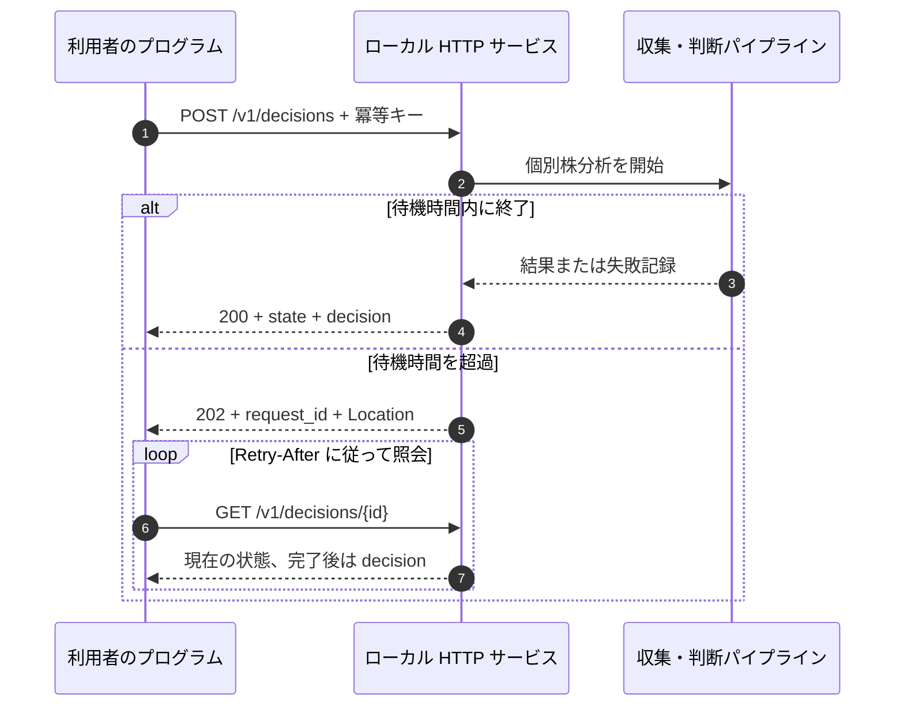
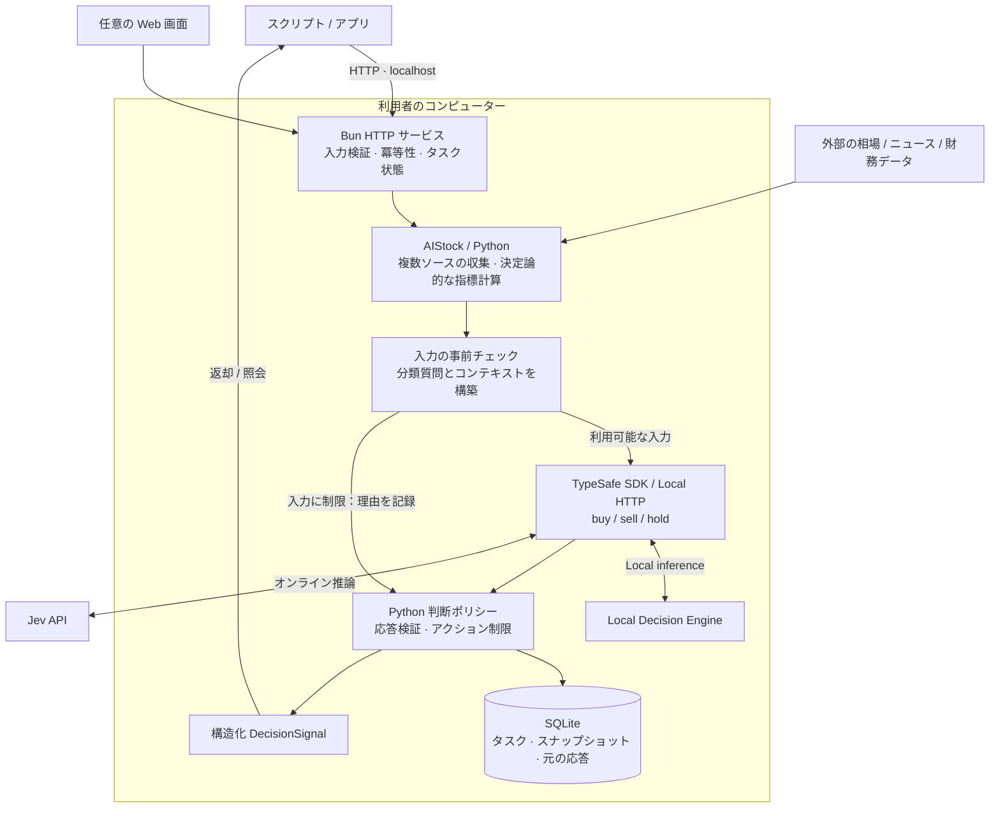
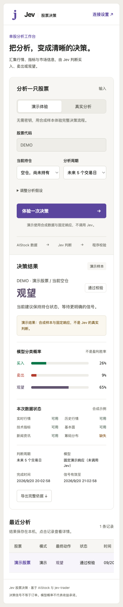

<div align="center">

# Jev Trading

[简体中文](README.md) · [English](README.en.md) · [繁體中文](README.zh-TW.md) · [日本語](README.ja.md) · [한국어](README.ko.md)

### 判断に集中。すぐに接続。コストを自分で管理。

**公式 Jev API とローカルモデルを、ひとつの HTTP API で。**<br>
相場データ・指標・市場情報から、プログラムで扱える **買い / 売り / 保留** の判断を返します。

**Official API + Local Models** · **HTTP First** · **Self-hosted** · **Auditable**

[クイックスタート](#quickstart) · [クラウド / ローカル](#local-inference) · [実データ分析](#live) · [HTTP API](#api) · [仕組み](#architecture) · [画面](#preview) · [FAQ](#faq)

</div>

---

## 取引ワークフローに組み込む、軽量な判断 API

**Jev Trading は、自分で配置して呼び出す株式判断サービスです。** 銘柄、保有状態、評価期間を指定すると、構造化された `buy / sell / hold`、アクション確率、制約チェックの結果と根拠を返します。スクリプト、調査ツール、自分の取引システムに接続できます。

既定の **Jev 公式 API** なら、手元でモデルを動かす必要はありません。**ローカル判断エンジン** では、自分でダウンロード・配置した公開重みモデルを利用できます。Web と HTTP の両方が対応し、推論場所を変えてもアプリの呼び出しフローを維持できます。

提供するのは自分で動かすサービスソフトウェアです。任意の Web 画面で設定・試用・履歴確認ができます。現在は取引シグナルを生成し、注文の執行は利用者のシステムが担当します。

## Jev Trading の特徴

| 特徴 | 利点 | 現在の実装 |
| --- | --- | --- |
| **判断に集中** | プログラムで利用しやすい結果 | AIStock のデータと指標を活用し、長文レポート・レポート Agent・通知を省いて直接分類 |
| **すぐに接続** | 既存のフローへ短い手順で接続 | POST で提出し JSON を取得。長い処理は非同期照会。Python クライアント例を同梱 |
| **重複処理を削減** | 推論費用を管理しやすい | 追加レポートを生成せず、同一入力・冪等キーのタスクを再利用。本アプリはモデル要求を自動再試行しない |
| **クラウド / ローカル** | 設備と利用頻度に合わせて選択 | 既定は公式 API。ローカルでは Jev のクラウドキー不要。同じ形式で `backend` を切り替え |
| **複数ソースから直接分類** | 個別株分析の情報を保持 | 価格、過去足、指標、財務、ニュース、推定取得価格分布、市場環境と欠損・品質低下の状態 |
| **プログラムによる制約** | モデルの提案と許可された判断を区別 | `model_action` と `final_action` を保持し、鮮度・保有方向・確率・市場条件を検証 |
| **追跡可能な判断** | 結果が生まれた過程を確認 | SQLite に入力、元の応答、推論元、制限理由を保存し、エクスポート可能 |
| **ブラウザー不要** | 自動呼び出しと手動確認を両立 | 独立した HTTP サービス。任意の Web 設定・進捗・履歴・キー不要のデモ |

### 分析から判断までの経路を短く

```text
銘柄 + 保有状態 + 評価期間
            ↓
市場データ + 決定論的な指標計算
            ↓
公式 Jev API / ローカル判断エンジン
            ↓
制約チェック → buy / sell / hold → 利用者のフロー
```

直接分類によって長文レポート生成を省き、冪等性によって通信の再送が新しい分析を始めることを防ぎます。ローカル推論は Jev のクラウド推論料を回避できますが、設備・電力・データ料金は別途必要です。実際の遅延と総費用はデータ収集、モデル、設備によって異なり、速度や削減率のベンチマークは提示していません。

## モデルの実行場所を選ぶ

| | Jev 公式 API · 既定 | ローカル判断エンジン |
| --- | --- | --- |
| 向いている用途 | モデル環境を管理せず始める | 対応設備を使い、自分で推論資源を管理する |
| 準備するもの | 公式 API キー、データ収集環境 | モデル重み、互換推論サービス、データ収集環境 |
| 推論場所 | Jev クラウド | 自分のローカルサービス |
| 主な費用 | 公式 API 利用料、データ料金 | 設備、電力、保守、データ料金 |
| 要求オプション | `"backend": "jev"` | `"backend": "local"` |

タスクと監査記録は手元に保存します。クラウド方式では分析コンテキストを Jev に送信します。ローカル方式のモデル推論は手元で実行しますが、相場やニュースの収集には通信が必要な場合があります。どちらも同じ HTTP API と判断チェックを使います。

<a id="quickstart"></a>
## クイックスタート

### 1. 実行環境

| 依存関係 | 用途 | デモに必要か |
| --- | --- | --- |
| [Bun](https://bun.sh) | HTTP サービス、Web 画面、Jev SDK | 必要 |
| [uv](https://docs.astral.sh/uv/getting-started/installation/) | 本プロジェクトの Python 環境を準備 | 必要 |
| Python ≥ 3.12 | データ形式の検証と監査。環境は uv で管理 | 必要 |
| AIStock のチェックアウトと依存関係 | 実際の株式データを収集 | 不要 |
| Jev API キー | クラウド推論用。ローカルでは不要 | 不要 |

macOS で検証済みです。起動処理は POSIX shell と `.venv/bin/python` を使用します。Windows ネイティブ環境での動作は未検証です。

### 2. 取得と起動

```sh
git clone --recurse-submodules https://github.com/EthanAlgoX/jev-trading.git
cd jev-trading
bun install --frozen-lockfile
bun run serve
```

起動時に `uv sync --frozen --no-dev` を実行し、Python の依存関係を準備します。初回はダウンロードのためにインターネット接続が必要です。サービスの URL は **http://127.0.0.1:3000** です。起動メッセージは現在、簡体字中国語です。

ターミナルを起動したままにしてください。停止は `Ctrl+C`、ポート変更は `PORT=3010 bun run serve` です。

### 3. デモの判断を取得

別のターミナルで実行します。

```sh
curl -sS http://127.0.0.1:3000/v1/decisions \
  -H 'Content-Type: application/json' \
  -H 'Idempotency-Key: demo-request-001' \
  -d '{"mode":"demo","position":"flat"}'
```

以下は**完了時の応答を簡略化した例**です。設定、時刻、監査フィールドを省略しています。確率は固定デモ応答の値であり、オンライン推論の結果ではありません。

```json
{
  "api_version": "1",
  "request_id": "2ab77454-5ac8-49be-a1d5-cdc8b171d505",
  "state": "done",
  "mode": "demo",
  "decision": {
    "symbol": "DEMO",
    "model_source": "recorded",
    "model_action": "hold",
    "final_action": "hold",
    "status": "accepted",
    "action_probabilities": { "buy": 0.26, "sell": 0.09, "hold": 0.65 },
    "execution_mode": "signal_only"
  }
}
```

HTTP **202** の場合は処理中です。`links.self` のパスを照会してください。デモから有料の推論へ自動で切り替わることはありません。

### 4. 付属クライアントを使用

```sh
# 外部 Python HTTP ライブラリなしで、送信とポーリングを実行
python3 examples/http_client.py --demo

# 既存タスクを再照会。モデルは再実行しない
python3 examples/http_client.py --request-id "YOUR_REQUEST_ID"
```

[Python クライアント](examples/http_client.py) を、自分のアプリへの組み込み例として利用できます。

<a id="local-inference"></a>
## 呼び出し方式：Jev Cloud またはローカル判断エンジン

| 方式 | 確率の取得方法 | クラウドキー |
| --- | --- | --- |
| `jev` (既定) | プロバイダーが返す分類確率 | 必要 |
| `local` | ローカル判断エンジン。下記の2方式に対応 | 不要 |

ローカル判断エンジンは本プロジェクトの統一接続名です。`logprobs` は候補ラベルのスコアを softmax で正規化します。`generated` はモデルに確率 JSON を生成させ、検証・正規化します。異なる統計手法のため、結果には `label_logprobs` と `generated_probabilities` を区別して記録します。

[ローカル配置ガイド](docs/local-inference.md) に従ってモデルをダウンロード・ロードし、互換サービスを起動して設定します：

```dotenv
JEV_BACKEND=local
JEV_LOCAL_ENGINE=logprobs
JEV_LOCAL_BASE_URL=http://127.0.0.1:8000
JEV_LOCAL_MODEL=jev-latest
```

Web と HTTP は設定を共有し、保存値は環境変数より優先します。`bun run backend:check` で確認し、`bun run serve` で起動します。重みは同梱しません。通常のチャット API には互換アダプターが必要です。配置実装と出典はガイドを参照してください。

Web 設定で既定方式を保存でき、HTTP は `backend` でリクエストごとに選択できます。既定は Jev Cloud です。ローカル失敗時にクラウドへ切り替えません。高度な呼び出しでは `localEngine` に `generated` または `logprobs` を指定できます。省略すると保存済み方式を使います。

```sh
curl -sS http://127.0.0.1:3000/v1/decisions \
  -H 'Content-Type: application/json' \
  -d '{"symbol":"600519","position":"flat","backend":"local","waitSeconds":0}'

python3 examples/http_client.py --symbol 600519 --backend local
```

<a id="live"></a>
## 実データと推論サービスを接続する

どちらの推論方式も、以下の AIStock 設定を使います。クラウド方式では Jev API キーも設定します。ローカル方式は [配置ガイド](docs/local-inference.md) に従って互換サービスを起動し、クラウドキーは不要です。

### AIStock の準備

AIStock は独立した Python 環境でデータ収集と指標計算を行います。本プロジェクトの `context_only` パッチにより、レポートを生成する前に分析データを取り出します。

ディレクトリ構成の例：

```text
workspace/
├── AI-Stock/                 # データソース設定と独立 Python 環境
│   └── .venv/bin/python
└── reference/
    └── jev-trading/           # 本プロジェクトと専用 Python 環境
```

プロジェクトの同階層、2 階層上、またはプロジェクト内の `AI-Stock` を探索します。それ以外の場所は明示的に設定してください。AIStock 自身の手順に従って依存関係とデータソースを準備し、`context_only` の入口があることを確認します。

<details>
<summary><strong>データ取得の入口がない場合：パッチの適用方法</strong></summary>

実際の絶対パスに置き換えてください。

```sh
cd /path/to/AI-Stock
git apply --check /path/to/jev-trading/patches/aistock-context-only.patch
git apply /path/to/jev-trading/patches/aistock-context-only.patch
```

適用済みのパッチを重ねて適用しないでください。チェックに失敗した場合はバージョンとローカル変更を確認し、強制的に上書きしないでください。範囲と検証記録は [初期実装記録](docs/implementation.md) を参照してください。

元の研究レポートの生成や通知は行いません。キャッシュは本プロジェクトの `data/aistock.db` に保存し、AIStock の既存研究データベースには書き込みません。

</details>

### サーバー設定

```sh
cp .env.example .env
```

`.env` を編集します。

```dotenv
TYPESAFE_AI_API_KEY=your_jev_api_key
JEV_MODEL_ID=jev-latest
PORT=3000

# 自動検出できない場合は実際のパスを指定
AISTOCK_PATH=/path/to/AI-Stock
AISTOCK_PYTHON=/path/to/AI-Stock/.venv/bin/python
```

キーは [TypeSafe コンソール](https://console.typesafe.ai) で設定できます。設定後に再起動し、状態を確認します。

```sh
bun run doctor
bun run serve
```

別のターミナルでヘルスチェックを呼び出します。

```sh
curl -sS http://127.0.0.1:3000/v1/health
```

`ready: true` はローカル設定のチェックを通過したことを示します。パス、インタープリターのファイル、取得入口、キーの存在を確認するもので、**外部データソースへの接続やキーの有効性を保証しません**。

### 実データ分析の送信

```sh
curl -sS http://127.0.0.1:3000/v1/decisions \
  -H 'Content-Type: application/json' \
  -H 'Idempotency-Key: stock-600519-001' \
  -d '{
    "symbol": "600519",
    "position": "flat",
    "horizon": 5,
    "execution": "next_session_open",
    "costPercent": 0.3,
    "instructions": "トレンド、ファンダメンタルズ、ニュースを総合し、根拠が不足する場合は保留する。"
  }'
```

`mode` を省略すると `live` になります。クライアントからも実行できます。

```sh
python3 examples/http_client.py --symbol 600519 --position flat
```

銘柄形式の例は `600519`、`AAPL`、`HK00700` です。実際のデータ提供範囲は AIStock のデータソースに依存します。`position` は呼び出し元の申告であり、サービスが実口座を参照するわけではありません。

<a id="api"></a>
## HTTP API の組み込み

### エンドポイント

| メソッド | パス | 内容 |
| --- | --- | --- |
| GET | `/v1/health` | 稼働状態、設定確認、準備状況、実行中タスク |
| POST | `/v1/decisions` | 分析を作成し、タスクまたは完了した判断を返却 |
| GET | `/v1/decisions/{request_id}` | 進捗と最終判断 |
| GET | `/v1/decisions/{request_id}/evidence` | コンテキスト、モデルリクエスト、元の応答、監査シグナル |

### リクエストフィールド

| フィールド | 必須 | 既定値・選択肢 |
| --- | --- | --- |
| `symbol` | live では必須 | 銘柄コード。demo では `DEMO` |
| `position` | 必須 | `flat`：未保有 / `long`：保有中 |
| `backend` | 任意 | `jev` / `local`。省略時はサービスの既定値 |
| `mode` | 任意 | `live` / `demo`。既定は `live` |
| `horizon` | 任意 | 1～250 取引日。既定は `5` |
| `execution` | 任意 | `next_session_open` / `immediate`。既定は前者 |
| `costPercent` | 任意 | 往復コスト・スリッページの想定。0～10、既定 `0.3`（0.3%） |
| `instructions` | 任意 | 最大 8000 文字の戦略指示 |
| `waitSeconds` | 任意 | 0～25 秒。既定 `25`、`0` なら即座にタスクを返却 |

未知のフィールドは拒否します。評価期間、コスト、執行時点はモデルの判断に使う前提であり、実取引の指示ではありません。

### 一度送信し、必要に応じて照会



**再試行：** 新しい分析ごとに `Idempotency-Key` を生成します（英数字・ハイフンの 8～100 文字）。通信障害で再送する場合は同じキーと分析パラメーターを使います。待機時間は変更できます。異なる分析パラメーターでキーを再利用すると 409 を返します。省略時は自動生成されますが、応答を失った場合に安全に再試行しにくくなります。

**待機：** 202 は `Location` と `Retry-After: 2` を含みます。待機終了や接続切断でタスクはキャンセルされません。GET はモデルを再実行しません。同時に処理するのは 1 タスクで、キューはありません。処理中の新規依頼には `409 BUSY` を返します。

### 結果の読み取り

```text
HTTP 成功
  └─ state を確認
       ├─ 処理中 → 照会を継続
       ├─ failed → error を確認し、失敗を処理
       └─ done → decision.status、valid_until、mode を確認
                    └─ decision.final_action を読む
```

| フィールド | 意味 |
| --- | --- |
| `state` | タスク状態。`done` は処理の終了のみを意味する |
| `decision.status` | `accepted`、`blocked`、`skipped`、`error`、`expired` |
| `model_action` | モデルの元の判断。有効な判断がない場合は null の可能性あり |
| `final_action` | 検証後の判断。制限・期限切れの場合は `hold` |
| `reason_codes` / `warnings` | アクションの制約、データ品質、その他の注意情報 |
| `valid_until` | 有効期限。期限切れの照会は `hold / expired` を返す |
| `action_probabilities` | アクション分類の確率分布。**利益が出る確率ではない** |
| `model_source` | `jev`：オンライン経路 / `recorded`：デモ・記録済み応答の経路 ; `local` |

`buy` はロングのエクスポージャーを増やし、`sell` は既存のロング保有を減らし、`hold` は現状を維持します。未保有時の `sell` を空売りの開始とは解釈しません。

応答、エラーコード、復旧の詳細は [HTTP API 文書](docs/http-api.md)（簡体字中国語）を参照してください。

<a id="architecture"></a>
## 仕組み



### 各層の役割

| 層 | 責務 | 主なコード |
| --- | --- | --- |
| サービス | HTTP、タスク再利用、待機、照会 URL | [server.ts](app/server.ts)、[api.ts](app/api.ts) |
| データ | AIStock context-only 収集、カバレッジと出所を保持 | [collector.py](src/jev_trading/collector.py)、[aistock_worker.py](src/jev_trading/aistock_worker.py) |
| モデル | `createTypeSafeAi → evaluationModel → experimental_evaluate` | [model.ts](app/model.ts) |
| 判断 | 確率、日付、アクション、元の判断との差異を検証 | [policy.py](src/jev_trading/policy.py)、[service.py](src/jev_trading/service.py) |
| 監査 | 入力、質問バージョン、モデル応答、最終シグナルを保存 | [storage.py](src/jev_trading/storage.py)、[jobs.ts](app/jobs.ts) |

クラウド呼び出しは Bun SDK、ローカルバックエンドは互換 HTTP を使用し、収集・データ形式の検証・監査は Python が担当します。上級者向け Python CLI には別の HTTP モデルアダプターが残っていますが、API 利用者が両ランタイムを自分で連携させる必要はありません。

### 制約と失敗処理

- 必須の日足・テクニカル情報の欠損、日付不一致、コンテキストの期限切れを記録します。
- 即時執行の想定では市場が開いており、価格情報が十分新しいことを要求します。次の寄り付きという想定も判断用の前提です。
- 未保有時の売却を禁止します。保守的な市場環境や必須テクニカル情報の品質低下で買いを制限する場合があります。
- アクションと確率の形式を検証します。エラー、タイムアウト、遅延結果を新たなリスクを増やす有効シグナルとして扱いません。
- モデルは自動再試行しません。再起動で中断されたタスクは失敗として記録し、新規分析は明示的に依頼します。

これは基本的な制約の実装であり、AIStock の元レポートの全ルールを移植したものではありません。実口座の資金、売却可能数量、すべての取引規則は検証しません。

<a id="preview"></a>
## 任意の Web ワークベンチ

起動後、[http://127.0.0.1:3000](http://127.0.0.1:3000) を開くと同じサービスを利用できます。


*画面は現在、簡体字中国語です。合成サンプルと固定応答のデモであり、実取引の成績やオンライン Jev 判断ではありません。*

<details>
<summary><strong>狭い画面幅での表示</strong></summary>

<p align="center">
  
</p>

画面幅への対応は、スマートフォンからのリモートアクセスを許可する機能ではありません。サービスは引き続きローカルループバックのみで待ち受けます。

</details>

接続設定、デモ・実分析の切り替え、進捗、履歴、根拠のエクスポートに対応します。macOS では [start.command](start.command) をダブルクリックできます。Node.js/npm があり Bun がない場合は npx で Bun を準備します。uv は別途必要です。

<a id="configuration"></a>
## 設定と保存先

| 設定 | 既定値・説明 |
| --- | --- |
| `TYPESAFE_AI_API_KEY` | クラウドバックエンドのみ必須。`TYPESAFE_API_KEY` も対応 |
| `JEV_MODEL_ID` | `jev-latest`。`JEV_MODEL` も対応 |
| `JEV_BACKEND` / `JEV_LOCAL_BASE_URL` | `jev` / `local` · [Local inference](docs/local-inference.md) |
| `AISTOCK_PATH` | 自動検出、または AIStock のパスを指定 |
| `AISTOCK_PYTHON` | AIStock の `.venv/bin/python` |
| `PORT` | `3000`。待ち受けアドレスは `127.0.0.1` 固定 |
| `JEV_DATA_DIR` | プロジェクトの `data/`。複数インスタンスは保存先を分離 |
| `OPEN_BROWSER` | `0` でブラウザー自動起動を無効化。`bun run serve` は設定済み |

Bun が `.env` を読み込みます。Web で保存した設定は環境変数より優先します。`.env` の変更後は再起動してください。画面から空のキーを送信しても既存キーは保持されます。

```text
data/
├── settings.json          # ローカル接続設定、権限 0600
├── workbench.sqlite       # タスクと画面の履歴
├── decisions.db           # 入力・要求・応答・シグナルの監査
├── aistock.db             # 独立した相場データキャッシュ
├── contexts/              # 実分析の入力スナップショット
└── collection.log         # 収集の診断ログ
```

API はキーを返さず、分析記録にもキーを書き込みません。`data/` と `.env` は Git の対象外です。判断照会では期限を確認し、根拠のエクスポートは元のシグナルを保持します。

<a id="faq"></a>
## よくある質問

| 症状・質問 | 対応 |
| --- | --- |
| キーなしで試せますか？ | `mode: demo` を指定。AIStock も Jev キーも不要 |
| 202 で判断がない | `links.self` を照会するか Python クライアントを使用 |
| `503 NOT_READY` | `bun run doctor` または `/v1/health` で不足設定を確認 |
| `409 BUSY` | 別タスクが処理中。同じ冪等キーで後ほど再試行 |
| `409 IDEMPOTENCY_CONFLICT` | 同じキーで異なるパラメーター。新分析には新キーを使用 |
| 新しい分析なのに古い結果が返る | 冪等キーを再利用しているため。新キーを生成 |
| HTTP 400 | JSON、必須 position、フィールド名、値の範囲を確認 |
| Jev 401・モデル呼び出し失敗 | サーバーのキー、モデル権限、ネットワークを確認して明示的に再試行 |
| 収集が遅い・失敗する | `data/collection.log` と AIStock の依存関係・データソースを確認。HTTP/Web の収集上限は 240 秒 |
| モデルは buy、最終結果は hold | reason_codes を確認。ポリシーによって買いが制限された可能性あり |
| ready が true でも失敗する | 準備確認は全依存関係の import、接続、API 権限を検証しない |
| ポートが使用中 | `PORT=3010 bun run serve` を使用し、クライアント URL も変更 |
| 公開ホスティング・自動注文は？ | 現在は本機のみ。複数利用者の認証、実注文、完全な執行リスク検証は未実装 |

## 開発と検証

```sh
bun run typecheck       # TypeScript の厳密な型検査
bun test app            # SDK、永続化、HTTP 統合テスト
uv run pytest -q        # Python の形式・ポリシー・タイムアウト・保存・CLI
```

| 検証項目 | 記録 |
| --- | --- |
| TypeScript | 合格 |
| Bun | 別プロセス HTTP 統合を含む 18 テストが合格 |
| Python | 38 テストが合格 |
| HTTP デモ | 送信、照会、冪等性、結果、エクスポート、Python クライアントを確認 |
| ブラウザー | デスクトップと狭い画面でデモ、設定、履歴、レイアウトを確認 |
| AIStock 実データ収集 | 600519 の収集を実施。範囲と制限は実装記録を参照 |
| Jev オンライン推論 | 未検証。SDK の要求形式は模擬 HTTP 応答でテスト |

テスト合格は収益性の検証ではありません。収益バックテスト、自動損切り、目標保有量の算出、実注文は未実装です。過去データの再生も、その時点で利用可能だった情報だけを使うことを保証しません。

<details>
<summary><strong>ディレクトリ構成</strong></summary>

```text
jev-trading/
├── app/                   # Bun HTTP サービス、SDK、タスク、テスト
├── web/                   # 任意の Web 画面
├── src/jev_trading/        # Python 収集、形式、ポリシー、監査、CLI
├── tests/                 # Python テスト
├── examples/              # HTTP クライアント、オフライン入力、設定例
├── patches/               # AIStock パッチとライセンス
├── docs/                  # API、設計、実装記録、画像
├── reference/             # jev-trader サブモジュール
├── .env.example           # サーバー設定例
├── start.command          # macOS 起動スクリプト
├── package.json / bun.lock
└── pyproject.toml / uv.lock
```

</details>

## 文書と参照元

README は冒頭のリンクから 5 言語を切り替えられます。アプリ画面、ログ、詳細文書は現在主に簡体字中国語です。README の翻訳は、アプリ全体の多言語化を意味しません。

| 文書 | 内容 |
| --- | --- |
| [HTTP API](docs/http-api.md) | デプロイ、要求形式、照会、復旧 |
| [Python HTTP クライアント](examples/http_client.py) | 実行可能な送信・照会例 |
| [上級 CLI](docs/cli.md) | データ収集、記録済み応答の再生、監査照会 |
| [アーキテクチャと開発計画](docs/architecture-and-development-plan.md) | 対象範囲と分層設計 |
| [Web・SDK 実装記録](docs/workbench.md) | 接続と検証 |
| [初期実装記録](docs/implementation.md) | AIStock パッチ、実データ収集、既知の制限 |

AIStock の個別株分析フローと jev-trader の SDK 接続方法を参考にしています。[reference/](reference/) は固定バージョンの Git サブモジュールで、元のソースと MIT ライセンスを含みます。既存チェックアウトでは `git submodule update --init --recursive` で取得できます。AIStock のライセンスは [patches/AIStock-LICENSE](patches/AIStock-LICENSE) に保存しています。これらの上流ライセンスは、本プロジェクトの新規コードに統一ライセンスが別途宣言されたことを意味しません。
