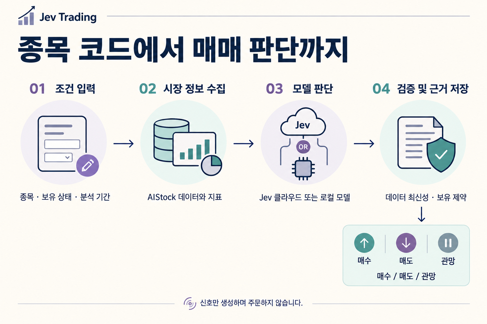

<div align="center">

# Jev Trading

### 종목을 입력하고, 근거를 확인할 수 있는 판단 신호를 받으세요.

시세와 뉴스 → 모델 판단 → 규칙 검증 → **매수 / 매도 / 관망**

[English](README.md) · [简体中文](README.zh-CN.md) · [繁體中文](README.zh-TW.md) · [日本語](README.ja.md) · **한국어**

[데모 체험](#quickstart) · [실제 데이터 분석](#live) · [결과 읽기](#results) · [HTTP API](#api) · [문제 해결](#faq)

</div>



## 어떤 프로젝트인가요?

**Jev Trading은 내 컴퓨터에서 실행하는 주식 의사결정 서비스입니다.** 웹 화면에서 사용하거나 내 프로그램에서 HTTP로 호출할 수 있습니다. AIStock이 수집한 시세, 지표, 기업 정보, 뉴스를 모델에 전달하고, 구조화된 판단과 근거를 저장합니다.

예를 들어 “`600519`, 현재 미보유, 향후 5거래일”을 입력하면 최종 행동, 세 행동에 대한 모델의 확률, 데이터 부족이나 규칙에 따른 제한 사항을 받습니다.

- **개별 종목 분석:** 종목 코드, 보유 상태, 기간을 입력하고 판단과 데이터 상태를 확인합니다.
- **내 도구와 연결:** 같은 API에서 Jev 클라우드 또는 로컬 모델을 선택합니다.
- **판단 근거 검토:** 이력, 입력 스냅샷, 모델 원본 응답을 내 컴퓨터에 저장하고 내보냅니다.

> **신호만 생성하며 주문은 실행하지 않습니다.** 증권 계좌 연결, 자동 손절, 목표 보유 수량 계산, 수익률 백테스트 기능은 없습니다. 행동별 확률은 수익을 낼 확률이 아닙니다.

## 목적에 맞게 시작하기

| 원하는 작업 | 준비할 것 | 시작 위치 |
| --- | --- | --- |
| 먼저 흐름 체험하기 | Bun + uv. 키와 AIStock은 불필요 | [데모 실행](#quickstart) |
| 클라우드로 실제 종목 분석 | 위 환경 + AIStock + Jev API 키 | [실제 분석 연결](#live) |
| 내 모델로 실제 종목 분석 | 위 환경 + AIStock + 모델 가중치와 호환 서비스 | [로컬 모델 연결](#local-inference) |
| 스크립트나 앱에 연결 | 실행 중인 로컬 서비스 | [HTTP API 호출](#api) |

<a id="quickstart"></a>
## 1. 먼저 데모를 실행하세요

### 실행 도구 확인

[Bun](https://bun.sh)과 [uv](https://docs.astral.sh/uv/getting-started/installation/)를 설치한 뒤 터미널을 다시 열어 두 명령을 확인하세요.

```sh
bun --version
uv --version
```

Bun은 웹·HTTP 서비스를 실행하고, uv는 프로젝트의 Python ≥ 3.12 환경을 준비합니다. 첫 실행에는 의존성 다운로드를 위한 인터넷 연결이 필요합니다. macOS에서 검증했으며 Windows 네이티브 실행은 아직 검증하지 않았습니다.

### 다운로드하고 실행

```sh
git clone --recurse-submodules https://github.com/EthanAlgoX/jev-trading.git
cd jev-trading
bun install --frozen-lockfile
bun run start
```

이미 프로젝트가 있다면 해당 디렉터리에서 `bun install`부터 실행하세요. 시작 프로그램이 `uv sync --frozen --no-dev`를 자동으로 실행합니다.

**[http://127.0.0.1:3000](http://127.0.0.1:3000)을 여세요.** 작업 화면이 보이면 웹 서비스가 실행된 것입니다. 터미널은 켜 두고, 종료할 때 `Ctrl+C`를 누르세요.

### 화면에서 첫 체험 완료

현재 앱 화면은 중국어 간체입니다. 아래 괄호 안에 실제 버튼 이름을 함께 표시했습니다.

1. **데모 모드**(`演示体验`)를 유지합니다.
2. **판단 체험**(`体验一次决策`)을 클릭합니다.
3. 오른쪽에서 행동, 분류 확률, 데이터 상태를 확인합니다.
4. 아래 **최근 분석**(`最近分析`)에서 기록을 열거나 **근거 내보내기**(`导出完整依据`)를 선택합니다.

**데모는 합성 데이터와 고정 응답을 사용합니다. 클라우드·로컬 모델을 호출하지 않으며 유료 분석으로 자동 전환하지 않습니다.**

<details>
<summary>다른 실행 방법: Mac 실행 파일, 서버만 실행, 포트 변경</summary>

- Mac에서는 [start.command](start.command)를 더블 클릭할 수 있습니다. Bun이 없어도 Node.js/npm이 있으면 npx로 Bun 준비를 시도합니다. uv는 별도로 필요합니다.
- `bun run serve`: 브라우저를 자동으로 열지 않고 같은 서비스를 실행합니다.
- `PORT=3010 bun run serve`: 포트를 3010으로 변경합니다. 브라우저와 클라이언트 주소도 변경하세요.

</details>

<a id="live"></a>
## 2. 실제 주식 분석 연결

두 가지 연결이 필요합니다. **AIStock은 데이터를 제공하고, Jev 클라우드 또는 로컬 모델은 판단을 제공합니다.** 이 저장소를 복제하는 것만으로 AIStock 설치나 모델 가중치 다운로드가 이루어지지는 않습니다.

### A. AIStock 준비

별도로 AIStock 소스를 준비하고, 해당 프로젝트 설명에 따라 의존성을 설치하고 데이터 소스를 설정하세요. AIStock 자체의 Python 환경을 사용합니다. 권장 배치 예시:

```text
workspace/
├── AI-Stock/
│   └── .venv/bin/python
└── jev-trading/
```

이 프로젝트는 AIStock의 `context_only` 진입점이 필요합니다. 긴 보고서를 생성하기 전에 데이터를 반환하고 보고서·알림 단계를 건너뜁니다. 이미 지원한다면 패치를 다시 적용할 필요가 없습니다.

<details>
<summary>context_only가 없다면 제공된 패치 적용</summary>

아래 경로를 실제 절대 경로로 바꾸세요.

```sh
cd /path/to/AI-Stock
git apply --check /path/to/jev-trading/patches/aistock-context-only.patch
git apply /path/to/jev-trading/patches/aistock-context-only.patch
```

검사가 성공한 경우에만 적용하세요. 실패하면 강제로 덮어쓰지 말고 AIStock 버전과 로컬 변경 사항을 확인하세요. 호환 범위는 [구현 기록](docs/implementation.md)을 참고하세요.

</details>

### B. 모델 선택 및 설정 저장

| | Jev 클라우드 (기본) | 로컬 모델 |
| --- | --- | --- |
| 준비할 것 | Jev API 키 | 다운로드한 가중치와 호환 추론 서비스 |
| 추론 위치 | Jev 클라우드 | 내 컴퓨터의 서비스 |
| Jev 클라우드 키 | 필요 | 불필요 |
| 비용 | API 사용료와 발생 가능한 데이터 비용 | 하드웨어, 전력, 유지보수와 발생 가능한 데이터 비용 |
| 요청 옵션 | `"backend": "jev"` | `"backend": "local"` |

**클라우드 사용:** 오른쪽 위 연결 설정(`连接设置`)에서 API 키, 모델 이름(기본 `jev-latest`), 자동 감지되지 않은 AIStock 및 Python 경로를 입력하고 저장하세요. 키는 [TypeSafe 콘솔](https://console.typesafe.ai)에서 관리합니다.

<details>
<summary>설정 파일이 편하다면 .env 사용</summary>

이 프로젝트 디렉터리에서 실행하세요. `.env`가 이미 있다면 덮어쓰지 말고 편집하세요.

```sh
cp .env.example .env
```

```dotenv
TYPESAFE_AI_API_KEY=your_jev_api_key
JEV_MODEL_ID=jev-latest
AISTOCK_PATH=/absolute/path/to/AI-Stock
AISTOCK_PYTHON=/absolute/path/to/AI-Stock/.venv/bin/python
```

예시 값을 바꾸고 서비스를 다시 시작하세요. **웹에서 저장한 설정이 `.env`보다 우선합니다.** 웹 폼에서 키를 비워 저장하면 기존 키가 유지됩니다.

</details>

<a id="local-inference"></a>
**로컬 사용:** 먼저 [로컬 배포 가이드](docs/local-inference.md)에 따라 가중치와 호환 서비스를 준비하세요. 연결 설정에서 로컬 엔진(`本地决策引擎`)을 선택하고 주소, 모델 이름, 확률 계산 방식을 입력합니다. 일반 채팅 API는 필요한 `/v1/systemone` 엔드포인트를 대신할 수 없습니다. `bun run backend:check`로 백엔드 준비 상태 엔드포인트를 확인할 수 있습니다.

클라우드 모드는 분석 맥락을 Jev에 전송합니다. 로컬 모드는 내 컴퓨터에서 추론하지만 시세·뉴스 수집에는 인터넷이 필요할 수 있습니다. 로컬 호출에 실패해도 클라우드로 자동 전환하지 않습니다.

### C. 확인하고 분석

```sh
bun run doctor
```

경로, 수집 진입점, 필수 설정을 검사합니다. **외부 데이터 소스나 API 키의 실제 동작까지 보장하지는 않습니다.** 웹으로 돌아가 실제 분석(`真实分析`)으로 전환한 뒤 입력하세요.

| 항목 | 입력 내용 |
| --- | --- |
| 종목 코드 | 예: `600519`, `AAPL`, `HK00700`. 지원 범위는 데이터 소스에 따라 다름 |
| 보유 상태 | 미보유 또는 보유 중. 증권 계좌를 자동 조회하지 않음 |
| 분석 기간 | 웹에서는 향후 5·10·20거래일 선택 가능 |
| 가정 (선택) | 실행 시점, 왕복 거래 비용과 슬리피지, 전략 선호 |

제출 후 수집 → 분류 → 검증 및 저장을 기다리세요. 실행 시점과 비용은 분석을 위한 가정이며 주문 지시가 아닙니다.

### 분석 맞춤 설정

요청마다 종목을 바꿀 수 있습니다. 화면에서 판단 프롬프트를 템플릿으로 저장·수정하고, 실시간 시세·매물대·뉴스 수집 여부와 시세 공급자 우선순위를 지정할 수 있습니다. API에 직접 데이터를 전달하면 AIStock 수집을 건너뜁니다. 각 분석에는 전략 버전과 실제 프롬프트가 보존됩니다. 지원 옵션과 예제는 [맞춤 설정 안내](docs/customization.md)(중국어 간체)를 참고하세요.

<a id="results"></a>
## 3. 결과 읽기

**최종 행동을 먼저 보고 상태, 유효기간, 제한 이유를 확인하세요.** 예를 들어 기술 지표 데이터 품질이 낮으면 모델이 매수를 제안했어도 최종 행동은 관망으로 바뀔 수 있습니다.

| 결과 | 의미 |
| --- | --- |
| `buy` / 매수 | 롱 포지션을 늘리는 신호 |
| `sell` / 매도 | 기존 롱 포지션을 줄이는 신호. 미보유 상태에서 공매도로 해석하지 않음 |
| `hold` / 관망 | 현재 상태 유지. 모델 판단, 제한, 만료 때문일 수 있음 |
| `model_action` | 모델의 원래 제안 |
| `final_action` | 규칙 검사를 거친 최종 행동 |
| `status` | `accepted` 승인, `blocked` 제한, `skipped` 건너뜀, `error` 오류, `expired` 만료 |
| `reason_codes` / `warnings` | 제한, 데이터 누락 등의 이유 |
| `valid_until` | 유효기간. 만료 후 조회하면 `hold / expired`로 표시 |
| `action_probabilities` | 행동별 확률. **수익 확률이 아님** |

`state: done`은 처리가 끝났다는 뜻이며 유효한 신호나 거래 성공을 의미하지 않습니다. API 사용자는 `mode`도 확인해 데모 결과를 실제 판단으로 사용하지 않아야 합니다.

<a id="api"></a>
## 4. 내 프로그램에서 호출

서비스를 켜 둔 상태에서 **다른 터미널**로 데모를 제출하세요.

```sh
curl -sS http://127.0.0.1:3000/v1/decisions \
  -H 'Content-Type: application/json' \
  -H 'Idempotency-Key: demo-request-001' \
  -d '{"mode":"demo","position":"flat"}'
```

완료된 응답의 축약 예시입니다. 확률은 고정 데모 값입니다.

```json
{
  "state": "done",
  "mode": "demo",
  "decision": {
    "model_source": "recorded",
    "model_action": "hold",
    "final_action": "hold",
    "status": "accepted",
    "action_probabilities": { "buy": 0.26, "sell": 0.09, "hold": 0.65 },
    "execution_mode": "signal_only"
  }
}
```

**202**는 아직 처리 중이라는 뜻입니다. `links.self`로 조회하세요. 기본 대기 시간은 최대 25초이며 `waitSeconds: 0`이면 즉시 작업 ID를 받습니다. GET 조회는 모델을 다시 호출하지 않습니다.

제공된 Python 클라이언트가 제출과 반복 조회를 처리합니다. 외부 HTTP 라이브러리는 필요 없습니다.

```sh
python3 examples/http_client.py --demo
```

실제 분석 환경을 설정한 뒤:

```sh
python3 examples/http_client.py --symbol 600519 --position flat --backend jev
```

로컬 모델은 `jev`를 `local`로 바꾸세요. 기존 작업 조회:

```sh
python3 examples/http_client.py --request-id "YOUR_REQUEST_ID"
```

| 엔드포인트 | 용도 |
| --- | --- |
| `GET /v1/health` | 서비스와 설정 상태 |
| `POST /v1/decisions` | 분석 제출 |
| `GET /v1/decisions/{request_id}` | 진행 상황과 결과 |
| `GET /v1/decisions/{request_id}/evidence` | 입력, 원본 응답, 감사 근거 |

<details>
<summary>실제 HTTP 요청, 매개변수, 재시도 방식</summary>

```sh
curl -sS http://127.0.0.1:3000/v1/decisions \
  -H 'Content-Type: application/json' \
  -H 'Idempotency-Key: stock-600519-001' \
  -d '{"symbol":"600519","position":"flat","backend":"jev","horizon":5,"execution":"next_session_open","costPercent":0.3,"waitSeconds":0}'
```

- `mode` 기본값은 `live`. 실제 모드에서는 `symbol` 필수. `position`은 필수이며 `flat` 또는 `long`입니다.
- `horizon`: 1–250거래일, 기본 5. `costPercent`: 0–10, 기본 0.3(0.3% 의미).
- `execution`: `next_session_open`(기본) 또는 `immediate`. `instructions`: 최대 8000자.
- `backend`: `jev` 또는 `local`, 생략하면 서버 기본값. `localEngine`: `logprobs` 또는 `generated`.
- `waitSeconds`: 0–25 정수, 기본 25. 알 수 없는 필드는 거부됩니다.
- 새 분석마다 새 `Idempotency-Key`를 사용하세요(영문·숫자·하이픈 8–100자). 네트워크 재시도에는 원래 키와 동일한 분석 조건을 사용하며 대기 시간만 바꿀 수 있습니다. 같은 키는 원래 작업을 반환합니다.
- 한 번에 한 작업만 처리하며 대기열은 없습니다. 사용 중이면 `409 BUSY`. 202 응답의 `Retry-After: 2`는 2초 뒤 조회하라는 뜻입니다.
- 클라이언트 연결이 끊겨도 작업은 취소되지 않습니다. 이 앱은 모델 요청을 자동 재시도하지 않습니다. 재시작하면 미완료 작업은 실패로 표시되며 새 분석을 명시적으로 제출해야 합니다.

</details>

전체 규약은 [HTTP API 문서](docs/http-api.md)를 참고하세요.

<a id="faq"></a>
## 문제 해결

| 증상 | 다음 확인 사항 |
| --- | --- |
| `bun` / `uv`를 찾을 수 없음 | 도구 설치 후 터미널을 다시 열고 `--version` 확인 |
| 웹 화면에 접속 불가 | 서버 터미널 실행 상태 확인 후 `127.0.0.1:3000` 접속. 포트 충돌이면 3010 사용 |
| 키가 없음 | 데모 사용. 실제 로컬 분석에도 AIStock과 호환 모델 서비스는 필요 |
| `503 NOT_READY` | `bun run doctor`로 누락된 설정 확인 |
| 설정이 반영되지 않음 | 웹 저장 설정이 `.env`보다 우선. `.env` 수정 후 재시작 |
| 202 / 결과가 아직 없음 | `links.self` 조회 또는 Python 클라이언트로 대기 |
| 409 / 이전 결과 반복 | BUSY는 나중에 재시도. 새 분석에는 새 키. 같은 키에 다른 분석 조건을 넣지 않기 |
| 데이터 수집 실패 | `data/collection.log`, AIStock 의존성과 데이터 소스 확인. 수집 제한 240초 |
| 모델 실패 / 401 | 키, 권한, 네트워크, 로컬 호환 서비스 확인 후 명시적으로 재시도 |
| 매수가 관망으로 변경 | `reason_codes`, 데이터 상태, 유효기간 확인 |

<a id="preview"></a>
## 화면과 언어 지원

이 페이지는 한국어 흐름도를 사용합니다. 다섯 언어의 README에는 각각 번역된 이미지가 있습니다. **앱, 로그, 상세 가이드는 현재 주로 중국어 간체입니다.** 이미지 번역이 앱 화면의 다국어 지원을 의미하지는 않습니다.

<details>
<summary>실제 화면 보기 (중국어 간체·고정 데모)</summary>

[데스크톱 화면](docs/assets/workbench-desktop.png) · [모바일 너비 화면](docs/assets/workbench-mobile.png)

합성 데이터와 고정 응답을 보여 주며 실제 모델 추론 결과가 아닙니다. 반응형 레이아웃이 휴대폰 원격 접속을 활성화하지는 않습니다.

</details>

<a id="architecture"></a>
## 개발 및 추가 문서

Bun은 HTTP·작업·모델 연결을, Python은 데이터 수집·검증·감사 기록을 담당합니다. SQLite가 로컬 기록을 저장합니다.

| 디렉터리 | 역할 |
| --- | --- |
| `app/`, `web/` | 서버, 모델 연결, 웹 화면 |
| `src/jev_trading/`, `tests/` | Python 수집, 규칙, 감사, 테스트 |
| `examples/`, `patches/` | 호출 예시와 AIStock 패치 |
| `reference/` | 고정 버전 jev-trader 참고 소스. AIStock이 아님 |

<a id="configuration"></a>
<details>
<summary>설정, 저장 위치, 개발 검사</summary>

설정 예시는 [.env.example](.env.example)을 참고하세요. `JEV_DATA_DIR`로 데이터 경로를, `PORT`로 포트를 바꿀 수 있습니다. 수신 주소는 `127.0.0.1`로 고정됩니다.

| 로컬 파일 | 내용 |
| --- | --- |
| `data/settings.json` | 연결 설정, 권한 0600 |
| `data/workbench.sqlite` | 작업과 이력 |
| `data/decisions.db` | 입력, 모델 응답, 판단 감사 기록 |
| `data/aistock.db`, `data/contexts/` | 시세 캐시와 입력 스냅샷 |
| `data/collection.log` | 수집 진단 로그 |

`.env`와 `data/`는 Git 추적에서 제외됩니다. API는 키를 반환하지 않으며 분석 기록에도 키를 저장하지 않습니다.

```sh
bun run typecheck
bun test app
uv run pytest -q
```

</details>

**검증 범위:** 데모·API 테스트와 실제 AIStock 수집 기록이 있습니다. 실제 Jev 클라우드 추론과 실제 로컬 모델 가중치 추론은 아직 검증하지 않았습니다. 기본 규칙은 계좌 자금, 매도 가능 수량, 전체 거래 규칙을 검증하지 않습니다. 수익률 백테스트도 없습니다. 로컬 전용 서비스이며 다중 사용자 인증이 없습니다.

아래 상세 가이드는 현재 중국어 간체로 제공됩니다.

| 가이드 | 내용 |
| --- | --- |
| [HTTP API](docs/http-api.md) | 매개변수, 결과, 오류, 작업 복구 |
| [로컬 추론](docs/local-inference.md) · [호환 구현](docs/reference-engines.md) | 모델 배포와 연결 프로토콜 |
| [고급 CLI](docs/cli.md) | 수집, 오프라인 재생, 감사 조회 |
| [아키텍처](docs/architecture-and-development-plan.md) · [구현](docs/implementation.md) · [워크벤치](docs/workbench.md) | 설계, 호환 범위, 검증 기록 |

AIStock의 개별 종목 분석과 jev-trader의 모델 연결을 참고합니다. [reference/](reference/)에 원본 MIT 라이선스를 보존하며 [AIStock 패치 라이선스](patches/AIStock-LICENSE)를 함께 제공합니다. 이 라이선스들이 본 프로젝트의 새 코드 전체에 적용되는 통합 라이선스를 의미하지는 않습니다.
