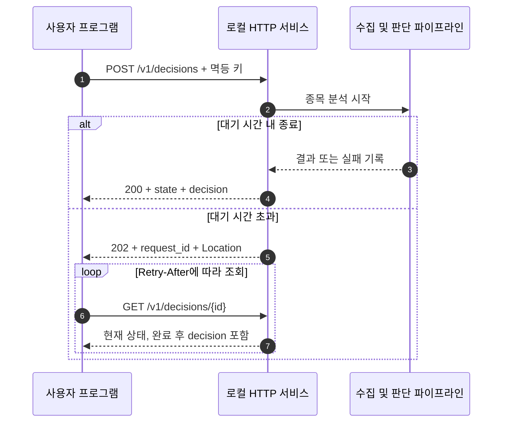
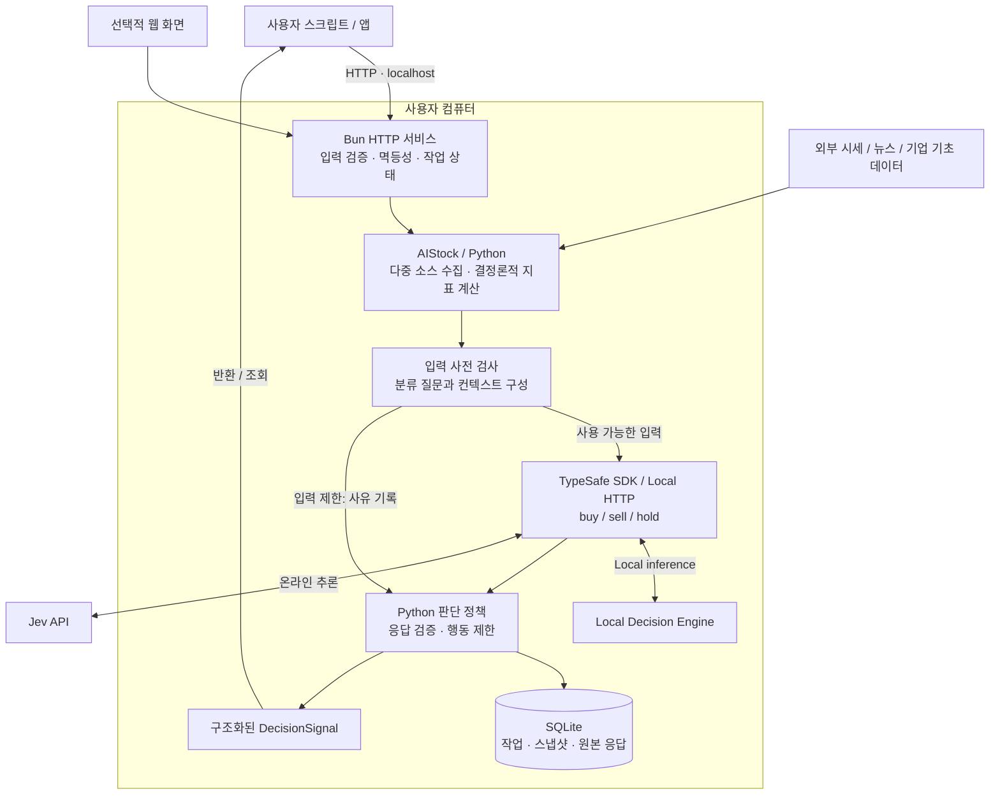

<div align="center">

# Jev Trading

[简体中文](README.md) · [English](README.en.md) · [繁體中文](README.zh-TW.md) · [日本語](README.ja.md) · [한국어](README.ko.md)

### 판단에 집중하고, 빠르게 연결하고, 비용을 직접 관리하세요.

**공식 Jev API와 로컬 모델을 하나의 HTTP 인터페이스로.**<br>
시세·지표·시장 정보를 프로그램이 읽을 수 있는 **매수 / 매도 / 관망** 결과로 바꿉니다.

**Official API + Local Models** · **HTTP First** · **Self-hosted** · **Auditable**

[빠른 시작](#quickstart) · [클라우드 / 로컬](#local-inference) · [실제 분석](#live) · [HTTP API](#api) · [구조](#architecture) · [화면](#preview) · [FAQ](#faq)

</div>

---

## 거래 워크플로에 연결하는 가벼운 의사결정 API

**Jev Trading은 직접 배포하고 호출하는 주식 의사결정 서비스입니다.** 종목, 보유 상태, 평가 기간을 보내면 구조화된 `buy / sell / hold`, 행동 확률, 정책 검사 결과와 근거를 반환합니다. 스크립트, 리서치 도구, 자체 거래 시스템에 연결할 수 있습니다.

기본값인 **Jev 공식 API**는 로컬에서 모델을 실행할 필요가 없습니다. **로컬 의사결정 엔진**을 선택하면 직접 다운로드하고 배포한 공개 가중치 모델을 사용할 수 있습니다. 웹과 HTTP 모두 두 방식을 지원하며, 추론 위치를 바꿔도 애플리케이션 호출 흐름은 유지됩니다.

이 프로젝트는 직접 실행하는 서비스 소프트웨어를 제공합니다. 선택적 웹 화면은 설정·체험·기록 확인에 사용합니다. 현재는 거래 신호를 생성하며, 주문 실행은 사용자의 시스템이 담당합니다.

## Jev Trading의 특징

| 특징 | 사용자에게 주는 가치 | 현재 구현 |
| --- | --- | --- |
| **판단에 집중** | 프로그램이 바로 읽는 결과 | AIStock 데이터와 지표를 활용하고 긴 보고서·보고서 Agent·알림을 생략해 행동을 직접 분류 |
| **빠른 연결** | 기존 흐름에 짧은 절차로 연결 | POST 후 JSON 반환 또는 비동기 조회. Python 클라이언트 예제 포함 |
| **중복 작업 절감** | 추론 지출을 더 쉽게 관리 | 별도 보고서 생성 없이 동일 입력·멱등 키의 작업을 재사용. 앱은 모델 요청을 자동 재시도하지 않음 |
| **클라우드 / 로컬 선택** | 장비와 사용 빈도에 맞춘 추론 | 기본값은 공식 API. 로컬은 Jev 클라우드 키 불필요. 같은 요청 형식에서 `backend`로 전환 |
| **여러 소스로 직접 분류** | 개별 종목 분석의 정보 유지 | 시세, 봉, 지표, 기업 정보, 뉴스, 추정 매입단가 분포, 시장 환경과 누락·품질 저하 상태 기록 |
| **프로그램의 판단 제약** | 모델 제안과 허용된 행동 구분 | `model_action`과 `final_action`을 보존하고 최신성·보유 방향·확률·시장 조건 검사 |
| **추적 가능한 결과** | 판단 과정을 다시 확인 | SQLite에 입력, 원본 응답, 추론 출처, 제한 사유를 저장하고 내보내기 지원 |
| **브라우저 없이 사용** | 자동 호출과 수동 확인 모두 편리 | 독립 HTTP 서비스. 선택적 웹 설정·진행 상황·기록·키 없는 데모 |

### 분석에서 판단까지 더 짧은 경로

```text
종목 + 보유 상태 + 평가 기간
            ↓
시장 데이터 + 결정론적 지표 계산
            ↓
공식 Jev API / 로컬 의사결정 엔진
            ↓
정책 검사 → buy / sell / hold → 사용자 워크플로
```

직접 분류는 긴 보고서 생성 단계를 줄이고, 멱등성은 네트워크 재전송이 새 분석을 시작하지 않게 합니다. 로컬 추론은 Jev 클라우드 추론 요금을 피할 수 있지만 장비·전력·데이터 비용은 따로 고려해야 합니다. 실제 지연과 총비용은 데이터 수집, 모델, 장비에 따라 달라지며 속도나 절감률 벤치마크는 제시하지 않습니다.

## 모델 실행 위치 선택

| | Jev 공식 API · 기본값 | 로컬 의사결정 엔진 |
| --- | --- | --- |
| 적합한 경우 | 모델 실행 환경을 관리하지 않고 시작 | 호환 장비로 모델과 추론 자원을 직접 관리 |
| 준비 사항 | 공식 API 키, 데이터 수집 환경 | 모델 가중치, 호환 추론 서비스, 데이터 수집 환경 |
| 추론 위치 | Jev 클라우드 | 직접 배포한 로컬 서비스 |
| 주요 비용 | 공식 API 사용료, 데이터 비용 | 장비, 전력, 유지 관리, 데이터 비용 |
| 요청 옵션 | `"backend": "jev"` | `"backend": "local"` |

작업과 감사 기록은 로컬에 저장됩니다. 클라우드 방식은 분석 컨텍스트를 Jev에 전송합니다. 로컬 방식은 모델을 로컬에서 실행하지만 시세·뉴스 수집에는 네트워크가 필요할 수 있습니다. 두 방식은 같은 HTTP 인터페이스와 의사결정 검사를 사용합니다.

<a id="quickstart"></a>
## 빠른 시작

### 1. 실행 환경 준비

| 의존성 | 용도 | 데모에 필요 여부 |
| --- | --- | --- |
| [Bun](https://bun.sh) | HTTP 서버, 웹 화면, Jev SDK | 필요 |
| [uv](https://docs.astral.sh/uv/getting-started/installation/) | 이 프로젝트의 Python 환경 준비 | 필요 |
| Python ≥ 3.12 | 데이터 형식, 검증, 감사. 환경은 uv로 관리 | 필요 |
| AIStock 체크아웃 및 의존성 | 실제 종목 데이터 수집 | 불필요 |
| Jev API 키 | 클라우드 추론용. 로컬 백엔드는 불필요 | 불필요 |

macOS에서 검증했습니다. 시작 스크립트는 POSIX 셸과 `.venv/bin/python` 경로를 사용하며, Windows 네이티브 환경은 아직 검증하지 않았습니다.

### 2. 저장소 복제 및 실행

```sh
git clone --recurse-submodules https://github.com/EthanAlgoX/jev-trading.git
cd jev-trading
bun install --frozen-lockfile
bun run serve
```

시작 프로그램은 `uv sync --frozen --no-dev`를 실행해 Python 의존성을 준비합니다. 최초 실행 시 다운로드를 위한 인터넷 연결이 필요합니다. 서비스 주소는 **http://127.0.0.1:3000**입니다. 시작 메시지는 현재 중국어 간체로 표시됩니다.

터미널을 계속 실행해 두세요. `Ctrl+C`로 중지하며, 포트 변경은 `PORT=3010 bun run serve`로 할 수 있습니다.

### 3. 데모 판단 요청

다른 터미널에서 실행합니다.

```sh
curl -sS http://127.0.0.1:3000/v1/decisions \
  -H 'Content-Type: application/json' \
  -H 'Idempotency-Key: demo-request-001' \
  -d '{"mode":"demo","position":"flat"}'
```

아래는 **완료된 응답을 간추린 예시**입니다. 설정, 시간, 감사 필드는 생략했습니다. 데모 확률은 고정 응답이며 온라인 추론 결과가 아닙니다.

```json
{
  "api_version": "1",
  "request_id": "2ab77454-5ac8-49be-a1d5-cdc8b171d505",
  "state": "done",
  "mode": "demo",
  "decision": {
    "symbol": "DEMO",
    "model_source": "recorded",
    "model_action": "hold",
    "final_action": "hold",
    "status": "accepted",
    "action_probabilities": { "buy": 0.26, "sell": 0.09, "hold": 0.65 },
    "execution_mode": "signal_only"
  }
}
```

HTTP **202**는 분석이 진행 중이라는 뜻입니다. 응답의 `links.self`를 조회하세요. 데모가 자동으로 유료 추론으로 전환되지는 않습니다.

### 4. 제공되는 클라이언트 사용

```sh
# 외부 Python HTTP 라이브러리 없이 제출 및 폴링
python3 examples/http_client.py --demo

# 모델을 다시 호출하지 않고 기존 작업 조회 재개
python3 examples/http_client.py --request-id "YOUR_REQUEST_ID"
```

[Python 클라이언트](examples/http_client.py)를 다른 애플리케이션에 통합하는 예시로 활용할 수 있습니다.

<a id="local-inference"></a>
## 호출 방식: Jev Cloud 또는 로컬 의사결정 엔진

| 방식 | 확률 출처 | 클라우드 키 |
| --- | --- | --- |
| `jev` (기본값) | 제공자가 반환하는 분류 확률 | 필요 |
| `local` | 로컬 의사결정 엔진. 아래 두 계산 방식 지원 | 불필요 |

로컬 의사결정 엔진은 이 프로젝트의 통합 연결 이름입니다. `logprobs`는 후보 레이블 점수를 softmax로 정규화합니다. `generated`는 모델이 확률 JSON을 생성하게 한 뒤 검증·정규화합니다. 서로 다른 통계 방식이므로 결과에 `label_logprobs`와 `generated_probabilities`를 구분해 기록합니다.

[로컬 배포 안내](docs/local-inference.md)에 따라 모델을 다운로드·로드하고 호환 서비스를 시작한 뒤 설정하세요:

```dotenv
JEV_BACKEND=local
JEV_LOCAL_ENGINE=logprobs
JEV_LOCAL_BASE_URL=http://127.0.0.1:8000
JEV_LOCAL_MODEL=jev-latest
```

웹과 HTTP는 설정을 공유하며 저장된 설정이 환경 변수보다 우선합니다. `bun run backend:check`로 확인한 뒤 `bun run serve`로 시작하세요. 가중치는 포함되지 않으며 일반 채팅 API에는 호환 어댑터가 필요합니다. 배포 구현과 출처는 안내 문서를 참조하세요.

웹 설정에서 기본 방식을 저장하고 HTTP 요청의 `backend`로 개별 선택할 수 있습니다. 기본값은 Jev Cloud이며 로컬 실패 시 클라우드로 전환하지 않습니다. 고급 호출은 `localEngine`을 `generated` 또는 `logprobs`로 지정할 수 있고, 생략하면 설정된 로컬 방식을 사용합니다.

```sh
curl -sS http://127.0.0.1:3000/v1/decisions \
  -H 'Content-Type: application/json' \
  -d '{"symbol":"600519","position":"flat","backend":"local","waitSeconds":0}'

python3 examples/http_client.py --symbol 600519 --backend local
```

<a id="live"></a>
## 실제 데이터와 추론 서비스 연결

두 추론 방식 모두 아래 AIStock 설정을 사용합니다. 클라우드 방식은 Jev API 키도 설정합니다. 로컬 방식은 [배포 안내](docs/local-inference.md)에 따라 호환 서비스를 시작하며 클라우드 키는 필요하지 않습니다.

### AIStock 준비

AIStock은 자체 Python 환경에서 데이터를 수집하고 지표를 계산합니다. 제공되는 `context_only` 패치는 보고서를 생성하기 전에 분석 데이터를 반환하도록 합니다.

지원되는 디렉터리 구조의 예:

```text
workspace/
├── AI-Stock/                 # 데이터 소스 설정 및 독립 Python 환경
│   └── .venv/bin/python
└── reference/
    └── jev-trading/           # 현재 프로젝트 및 전용 Python 환경
```

프로젝트와 같은 계층, 두 단계 상위, 또는 프로젝트 내부의 `AI-Stock`을 탐색합니다. 다른 위치는 직접 설정할 수 있습니다. AIStock의 안내에 따라 의존성과 데이터 소스를 준비한 뒤 `context_only` 진입점이 있는지 확인하세요.

<details>
<summary><strong>수집 진입점이 없다면: 패치 적용 방법</strong></summary>

실제 절대 경로로 바꾸어 실행하세요.

```sh
cd /path/to/AI-Stock
git apply --check /path/to/jev-trading/patches/aistock-context-only.patch
git apply /path/to/jev-trading/patches/aistock-context-only.patch
```

이미 적용된 패치를 다시 적용하지 마세요. 검사에 실패하면 버전과 로컬 변경 사항을 확인하고 강제로 덮어쓰지 마세요. 적용 범위와 검증 기록은 [초기 구현 기록](docs/implementation.md)을 참고하세요.

기존 리서치 보고서를 생성하거나 알림을 보내지 않습니다. 캐시는 이 프로젝트의 `data/aistock.db`에 저장하며 AIStock의 기존 리서치 데이터베이스에는 쓰지 않습니다.

</details>

### 서버 설정

```sh
cp .env.example .env
```

`.env`를 편집합니다.

```dotenv
TYPESAFE_AI_API_KEY=your_jev_api_key
JEV_MODEL_ID=jev-latest
PORT=3000

# 자동 탐색에 실패하면 실제 경로 지정
AISTOCK_PATH=/path/to/AI-Stock
AISTOCK_PYTHON=/path/to/AI-Stock/.venv/bin/python
```

키는 [TypeSafe 콘솔](https://console.typesafe.ai)에서 설정할 수 있습니다. 설정 후 서비스를 다시 시작하고 점검합니다.

```sh
bun run doctor
bun run serve
```

다른 터미널에서 상태 확인 API를 호출합니다.

```sh
curl -sS http://127.0.0.1:3000/v1/health
```

`ready: true`는 로컬 설정 검사를 통과했다는 뜻입니다. 경로, 인터프리터 파일, 수집 진입점, 키의 존재 여부를 확인하며, **외부 데이터 연결이나 키의 유효성을 검증한 것은 아닙니다**.

### 실제 분석 요청

```sh
curl -sS http://127.0.0.1:3000/v1/decisions \
  -H 'Content-Type: application/json' \
  -H 'Idempotency-Key: stock-600519-001' \
  -d '{
    "symbol": "600519",
    "position": "flat",
    "horizon": 5,
    "execution": "next_session_open",
    "costPercent": 0.3,
    "instructions": "추세, 기업 기초 정보, 뉴스를 종합하고 근거가 부족하면 관망한다."
  }'
```

`mode`를 생략하면 `live`입니다. 클라이언트로도 실행할 수 있습니다.

```sh
python3 examples/http_client.py --symbol 600519 --position flat
```

종목 코드 형식의 예로 `600519`, `AAPL`, `HK00700`이 있습니다. 실제 데이터 범위는 AIStock 데이터 소스에 달려 있습니다. `position`은 호출자가 제공하는 상태이며 서비스가 실제 증권 계좌를 조회하는 것은 아닙니다.

<a id="api"></a>
## HTTP API 통합

### 엔드포인트

| 메서드 | 경로 | 반환 내용 |
| --- | --- | --- |
| GET | `/v1/health` | 서비스 상태, 설정 검사, 준비 여부, 현재 작업 |
| POST | `/v1/decisions` | 분석을 생성하고 작업 또는 완료된 판단 반환 |
| GET | `/v1/decisions/{request_id}` | 진행 상황 및 최종 판단 |
| GET | `/v1/decisions/{request_id}/evidence` | 컨텍스트, 모델 요청, 원본 응답, 감사 신호 |

### 요청 필드

| 필드 | 필수 여부 | 기본값 / 선택값 |
| --- | --- | --- |
| `symbol` | live 모드에서 필수 | 종목 코드. demo는 `DEMO` 사용 |
| `position` | 필수 | `flat`: 미보유 / `long`: 보유 중 |
| `backend` | 선택 | `jev` / `local`. 생략하면 서비스 기본값 사용 |
| `mode` | 선택 | `live` / `demo`, 기본 `live` |
| `horizon` | 선택 | 1~250 거래일, 기본 `5` |
| `execution` | 선택 | `next_session_open` / `immediate`, 기본 전자 |
| `costPercent` | 선택 | 왕복 비용 및 슬리피지 가정. 0~10, 기본 `0.3`(0.3%) |
| `instructions` | 선택 | 최대 8000자의 전략 설명 |
| `waitSeconds` | 선택 | 0~25초, 기본 `25`. `0`이면 작업을 즉시 반환 |

알 수 없는 필드는 거부합니다. 평가 기간, 비용, 실행 시점은 모델 판단을 위한 가정이며 실제 거래를 지시하지 않습니다.

### 한 번 제출하고 필요할 때 조회



**재시도:** 새로운 분석마다 `Idempotency-Key`를 생성하세요(영문자·숫자·하이픈 8~100자). 네트워크 재시도에는 동일한 키와 분석 파라미터를 사용합니다. 대기 시간은 변경할 수 있습니다. 다른 분석 파라미터에 같은 키를 사용하면 409가 반환됩니다. 생략하면 자동 생성되지만 응답을 잃은 뒤 안전하게 재시도하기 어렵습니다.

**대기:** 202 응답에는 `Location`과 `Retry-After: 2`가 포함됩니다. 대기 종료나 연결 해제는 작업을 취소하지 않습니다. GET은 모델을 다시 호출하지 않습니다. 한 번에 작업 하나만 실행하며 대기열은 없습니다. 처리 중인 새 요청에는 `409 BUSY`를 반환합니다.

### 결과를 올바르게 읽기

```text
HTTP 성공
  └─ state 확인
       ├─ 진행 중 → 계속 조회
       ├─ failed → error 확인 및 실패 처리
       └─ done → decision.status, valid_until, mode 확인
                    └─ decision.final_action 읽기
```

| 필드 | 의미 |
| --- | --- |
| `state` | 작업 상태. `done`은 처리가 끝났다는 뜻일 뿐 |
| `decision.status` | `accepted`, `blocked`, `skipped`, `error`, `expired` |
| `model_action` | 모델의 원래 판단. 유효한 판단이 없으면 null일 수 있음 |
| `final_action` | 정책 검증 후 판단. 제한되거나 만료되면 `hold` |
| `reason_codes` / `warnings` | 행동 제약, 데이터 품질, 기타 안내 |
| `valid_until` | 유효기한. 만료된 조회는 `hold / expired` 결과 반환 |
| `action_probabilities` | 행동 분류의 확률 분포. **수익을 낼 확률이 아님** |
| `model_source` | `jev`: 온라인 경로 / `recorded`: 데모 또는 기록된 응답 경로 ; `local` |

`buy`는 롱 익스포저 증가, `sell`은 기존 롱 보유분 감소, `hold`는 현상 유지를 뜻합니다. 미보유 상태의 `sell`을 공매도 진입으로 해석하지 않습니다.

상세 응답, 오류 코드, 복구 방법은 [HTTP API 문서](docs/http-api.md)(중국어 간체)를 참고하세요.

<a id="architecture"></a>
## 작동 구조



### 계층별 역할

| 계층 | 역할 | 주요 코드 |
| --- | --- | --- |
| 서비스 | HTTP, 작업 재사용, 대기, 조회 URL | [server.ts](app/server.ts), [api.ts](app/api.ts) |
| 데이터 | AIStock context-only 수집, 범위와 출처 보존 | [collector.py](src/jev_trading/collector.py), [aistock_worker.py](src/jev_trading/aistock_worker.py) |
| 모델 | `createTypeSafeAi → evaluationModel → experimental_evaluate` | [model.ts](app/model.ts) |
| 판단 | 확률·날짜·행동 검증, 원래 판단과 최종 결과의 차이 보존 | [policy.py](src/jev_trading/policy.py), [service.py](src/jev_trading/service.py) |
| 감사 | 입력, 질문 버전, 모델 응답, 최종 신호 저장 | [storage.py](src/jev_trading/storage.py), [jobs.ts](app/jobs.ts) |

클라우드 추론은 Bun SDK, 로컬 백엔드는 호환 HTTP를 사용하고, Python은 수집·데이터 형식 검증·감사를 담당합니다. 고급 Python CLI에는 별도의 HTTP 모델 어댑터가 남아 있지만 API 호출자가 두 런타임을 직접 연결할 필요는 없습니다.

### 제약 및 실패 처리

- 필수 일봉·기술 데이터 누락, 날짜 불일치, 컨텍스트 만료 시 제한 사유를 기록합니다.
- 즉시 실행 가정에서는 시장이 열려 있고 시세가 충분히 최신이어야 합니다. 다음 개장 시점이라는 가정도 평가용입니다.
- 미보유 상태의 매도는 차단합니다. 보수적인 시장 환경이나 필수 기술 데이터의 품질 저하는 매수를 차단할 수 있습니다.
- 모델의 행동 및 확률 형식을 검증합니다. 오류·시간 초과·늦게 도착한 결과를 신규 위험을 늘리는 유효 신호로 사용하지 않습니다.
- 모델을 자동으로 재시도하지 않습니다. 서비스 재시작 시 미완료 작업을 실패로 기록하고, 새 분석은 명시적으로 요청해야 합니다.

현재 구현은 기본 제약이며 AIStock 보고서의 모든 정책을 옮긴 것은 아닙니다. 실제 계좌 자금, 매도 가능 수량, 모든 거래 규칙을 검증하지 않습니다.

<a id="preview"></a>
## 선택적 웹 워크벤치

서비스를 시작한 뒤 [http://127.0.0.1:3000](http://127.0.0.1:3000)을 열면 같은 분석 기능을 사용할 수 있습니다.


*현재 화면은 중국어 간체입니다. 합성 데이터와 고정 응답을 사용한 데모이며 실거래 성과나 온라인 Jev 판단이 아닙니다.*

<details>
<summary><strong>좁은 화면 레이아웃 보기</strong></summary>

<p align="center">
  
</p>

반응형 레이아웃이 휴대전화의 원격 접근을 허용한다는 뜻은 아닙니다. 서비스는 여전히 로컬 루프백 주소에서만 수신합니다.

</details>

연결 설정, 데모/실제 분석 전환, 진행 상황, 기록, 근거 내보내기를 지원합니다. macOS에서는 [start.command](start.command)를 더블 클릭할 수도 있습니다. Node.js/npm은 있고 Bun이 없으면 npx로 Bun을 준비합니다. uv는 별도로 설치해야 합니다.

<a id="configuration"></a>
## 설정 및 데이터 저장

| 설정 | 기본값 / 설명 |
| --- | --- |
| `TYPESAFE_AI_API_KEY` | 클라우드 백엔드에만 필수. `TYPESAFE_API_KEY`도 지원 |
| `JEV_MODEL_ID` | `jev-latest`. `JEV_MODEL`도 지원 |
| `JEV_BACKEND` / `JEV_LOCAL_BASE_URL` | `jev` / `local` · [Local inference](docs/local-inference.md) |
| `AISTOCK_PATH` | 자동 탐색 또는 AIStock 경로 지정 |
| `AISTOCK_PYTHON` | 기본 AIStock의 `.venv/bin/python` |
| `PORT` | `3000`. 수신 주소는 `127.0.0.1` 고정 |
| `JEV_DATA_DIR` | 프로젝트의 `data/`. 인스턴스마다 저장 경로 분리 가능 |
| `OPEN_BROWSER` | `0`이면 브라우저 자동 실행 안 함. `bun run serve`에 이미 적용 |

Bun이 `.env`를 자동으로 읽습니다. 웹에서 저장한 설정이 환경변수보다 우선합니다. `.env`를 바꾸면 재시작하세요. 화면에서 빈 키를 제출하면 기존 키를 유지합니다.

```text
data/
├── settings.json          # 로컬 연결 설정, 파일 권한 0600
├── workbench.sqlite       # 작업 및 웹 기록
├── decisions.db           # 입력·요청·응답·판단 감사
├── aistock.db             # 별도의 시세 캐시
├── contexts/              # 실제 분석의 입력 스냅샷
└── collection.log         # 수집 진단 로그
```

API는 키를 반환하지 않으며 분석 기록에도 키를 저장하지 않습니다. `data/`와 `.env`는 Git에서 제외됩니다. 판단 조회는 유효기한을 확인하고, 근거 내보내기는 원래 신호를 보존합니다.

<a id="faq"></a>
## 자주 묻는 질문

| 질문 / 문제 | 설명 / 해결 방법 |
| --- | --- |
| 키 없이 체험할 수 있나요? | `mode: demo`를 지정하면 AIStock과 Jev 키 모두 불필요 |
| 202이고 판단 결과가 없음 | `links.self`를 조회하거나 Python 클라이언트 사용 |
| `503 NOT_READY` | `bun run doctor` 또는 `/v1/health`로 누락 설정 확인 |
| `409 BUSY` | 다른 작업이 실행 중. 잠시 뒤 같은 멱등 키로 재시도 |
| `409 IDEMPOTENCY_CONFLICT` | 같은 키에 다른 파라미터를 사용함. 새 분석은 새 키 사용 |
| 계속 이전 결과가 반환됨 | 멱등 키를 재사용했기 때문. 새 분석용 키 생성 |
| HTTP 400 | JSON, 필수 position, 필드 철자, 값 범위 확인 |
| Jev 401 또는 모델 호출 실패 | 서버 키, 모델 권한, 네트워크 확인 후 명시적으로 재시도 |
| 수집이 느리거나 실패함 | `data/collection.log`, AIStock 의존성·데이터 소스 확인. HTTP/웹 수집 제한은 240초 |
| 모델은 buy인데 결과는 hold | reason_codes 확인. 정책이 매수를 제한했을 수 있음 |
| ready가 true인데 분석 실패 | 준비 검사는 모든 import, 데이터 연결, API 권한을 검증하지 않음 |
| 포트가 이미 사용 중 | `PORT=3010 bun run serve` 실행 후 클라이언트 URL도 변경 |
| 공개 호스팅이나 자동 주문이 가능한가요? | 현재는 로컬 서비스만 제공. 다중 사용자 인증, 실주문, 완전한 실행 위험 검증은 없음 |

## 개발 및 검증

```sh
bun run typecheck       # 엄격한 TypeScript 형식 검사
bun test app            # SDK, 영속성, HTTP 통합 테스트
uv run pytest -q        # Python 형식, 정책, 타임아웃, 저장, CLI
```

| 검증 항목 | 기록 |
| --- | --- |
| TypeScript | 통과 |
| Bun | 별도 프로세스 HTTP 통합을 포함한 테스트 18개 통과 |
| Python | 테스트 38개 통과 |
| HTTP 데모 | 제출, 조회, 멱등성, 결과, 내보내기, Python 클라이언트 확인 |
| 브라우저 | 데스크톱과 좁은 화면에서 데모, 설정, 기록, 레이아웃 확인 |
| AIStock 실제 데이터 수집 | 600519 수집 수행. 범위와 한계는 구현 기록 참고 |
| Jev 실제 온라인 추론 | 아직 미검증. SDK 요청 형식은 모의 HTTP 응답으로 테스트 |

테스트 통과가 수익성 검증을 뜻하지는 않습니다. 수익 백테스트, 자동 손절, 목표 보유량 계산, 실제 주문 실행은 없습니다. 과거 데이터 재생도 해당 시점에 이용 가능했던 정보만 사용한다는 보장은 없습니다.

<details>
<summary><strong>프로젝트 구조</strong></summary>

```text
jev-trading/
├── app/                   # Bun HTTP 서버, SDK, 작업, 테스트
├── web/                   # 선택적 웹 화면
├── src/jev_trading/        # Python 수집, 형식, 정책, 감사, CLI
├── tests/                 # Python 테스트
├── examples/              # HTTP 클라이언트, 오프라인 입력, 설정 예시
├── patches/               # AIStock 패치와 라이선스
├── docs/                  # API, 설계, 구현 기록, 스크린샷
├── reference/             # jev-trader 서브모듈
├── .env.example           # 서버 설정 예시
├── start.command          # macOS 시작 스크립트
├── package.json / bun.lock
└── pyproject.toml / uv.lock
```

</details>

## 문서 및 참고 프로젝트

README는 상단 링크에서 다섯 언어로 전환할 수 있습니다. 현재 앱 화면, 로그, 상세 문서는 주로 중국어 간체입니다. README 번역이 애플리케이션 전체의 다국어 지원을 뜻하지는 않습니다.

| 문서 | 내용 |
| --- | --- |
| [HTTP API](docs/http-api.md) | 배포, 요청 형식, 조회, 복구 |
| [Python HTTP 클라이언트](examples/http_client.py) | 실행 가능한 제출·폴링 예시 |
| [고급 CLI](docs/cli.md) | 수집, 기록된 응답 재생, 감사 조회 |
| [구조 및 개발 계획](docs/architecture-and-development-plan.md) | 범위 및 계층 설계 |
| [웹·SDK 구현 기록](docs/workbench.md) | 연결 방식 및 검증 |
| [초기 구현 기록](docs/implementation.md) | AIStock 패치, 실제 수집, 알려진 한계 |

AIStock의 개별 종목 분석 흐름과 jev-trader의 Jev SDK 연결 방식을 참고했습니다. [reference/](reference/)는 고정 버전의 Git 서브모듈이며 원본 코드와 MIT 라이선스를 포함합니다. 기존 체크아웃에서는 `git submodule update --init --recursive`로 가져올 수 있습니다. AIStock 라이선스 사본은 [patches/AIStock-LICENSE](patches/AIStock-LICENSE)에 있습니다. 이 상위 프로젝트의 라이선스가 본 프로젝트의 신규 코드에 별도의 통합 라이선스가 선언되었음을 의미하지는 않습니다.
