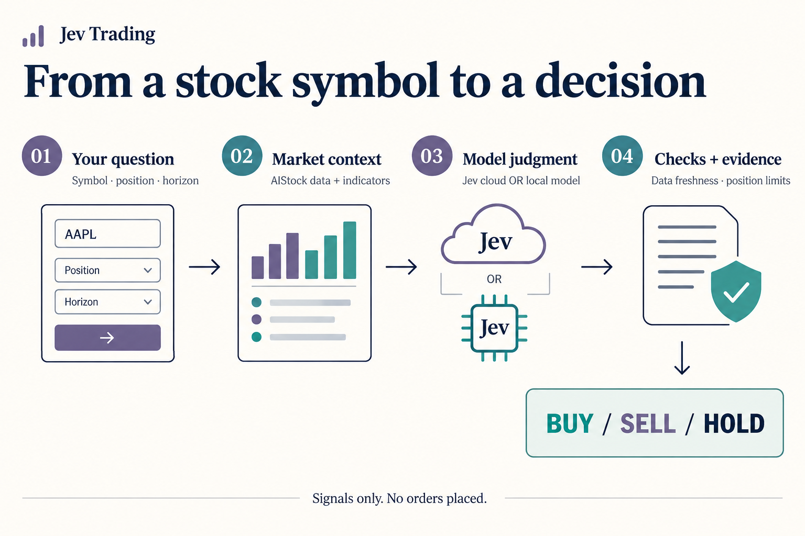

<div align="center">

# Jev Trading

### One stock in. A clear, traceable decision signal out.

Market data & news → Model judgment → Policy checks → **Buy / Sell / Hold**

**English** · [简体中文](README.zh-CN.md) · [繁體中文](README.zh-TW.md) · [日本語](README.ja.md) · [한국어](README.ko.md)

[Try the demo](#quickstart) · [Live analysis](#live) · [Read the results](#results) · [HTTP API](#api) · [Troubleshooting](#faq)

</div>



## What does it do?

**Jev Trading is a stock decision service that runs on your computer.** Use the web workbench or call it from your own software over HTTP. It sends market data, indicators, fundamentals, and news collected by AIStock to a model, then returns a structured decision with a record of the evidence.

For example, submit “`600519`, no current position, next 5 trading days.” Receive a final action, the model's probabilities for the three actions, and any data-quality or policy restrictions.

- **Analyze a stock:** enter a symbol, position, and horizon; inspect the decision and data quality.
- **Connect your tools:** choose Jev cloud or a local model through the same API.
- **Review the evidence:** keep history, input snapshots, and raw model responses locally, with export support.

> **Signals only: no orders are placed.** There is no brokerage account integration, automatic stop-loss, target position sizing, or return backtesting. Action probabilities are not the probability of making a profit.

## Choose your starting point

| You want to… | Prepare | Start here |
| --- | --- | --- |
| Explore the workflow | Bun + uv; no key or AIStock needed | [Run the demo](#quickstart) |
| Analyze real stocks with cloud inference | The above + AIStock + a Jev API key | [Connect live analysis](#live) |
| Analyze real stocks with your own model | The above + AIStock + model weights and a compatible service | [Connect a local model](#local-inference) |
| Integrate a script or application | A running local service | [Call the HTTP API](#api) |

<a id="quickstart"></a>
## 1. Try the demo first

### Check your tools

Install [Bun](https://bun.sh) and [uv](https://docs.astral.sh/uv/getting-started/installation/), reopen your terminal, and check that both commands work:

```sh
bun --version
uv --version
```

Bun runs the web and HTTP service; uv prepares the project's Python ≥ 3.12 environment. The first launch needs internet access to download dependencies. Startup has been validated on macOS; native Windows startup has not been verified.

### Download and start

```sh
git clone --recurse-submodules https://github.com/EthanAlgoX/jev-trading.git
cd jev-trading
bun install --frozen-lockfile
bun run start
```

Already have the project? Enter its directory and start at `bun install`. The launcher runs `uv sync --frozen --no-dev` automatically.

**Open [http://127.0.0.1:3000](http://127.0.0.1:3000).** Seeing the workbench means the web service has started. Keep the terminal running; press `Ctrl+C` to stop it.

### Complete your first walkthrough

The current app uses Simplified Chinese labels; these are included below so you can find the controls.

1. Keep **Demo** selected (`演示体验`).
2. Click **Try a decision** (`体验一次决策`).
3. Review the action, probabilities, and data quality on the right.
4. Open a record in **Recent analyses** (`最近分析`) or select **Export evidence** (`导出完整依据`).

**The demo uses synthetic data and a fixed response. It calls neither cloud nor local models and never automatically switches to paid analysis.**

<details>
<summary>Other ways to start: Mac launcher, service only, custom port</summary>

- On Mac, double-click [start.command](start.command). If Bun is missing but Node.js/npm is available, it tries to prepare Bun with npx. uv is still required.
- `bun run serve`: start the same service without opening a browser automatically.
- `PORT=3010 bun run serve`: use port 3010; update your browser and client addresses too.

</details>

<a id="live"></a>
## 2. Connect live stock analysis

Live analysis needs two connections: **AIStock supplies the data; Jev cloud or a local model supplies the judgment.** Cloning this repository does not install AIStock or download model weights.

### Step A — Prepare AIStock

Set up a separate AIStock checkout, install its dependencies and configure data sources according to its own instructions. Keep its separate Python environment. A convenient layout is:

```text
workspace/
├── AI-Stock/
│   └── .venv/bin/python
└── jev-trading/
```

This project requires AIStock's `context_only` entry point. It returns analysis data before long-report generation, skipping reports and notifications. Do not reapply the patch if the entry point is already present.

<details>
<summary>Missing context_only? Apply the supplied patch</summary>

Replace the paths with actual absolute paths:

```sh
cd /path/to/AI-Stock
git apply --check /path/to/jev-trading/patches/aistock-context-only.patch
git apply /path/to/jev-trading/patches/aistock-context-only.patch
```

Apply only after the check passes. If it fails, check the AIStock version and local changes instead of forcing it. See the [implementation record](docs/implementation.md) for compatibility boundaries.

</details>

### Step B — Choose a model and save settings

| | Jev cloud (default) | Local model |
| --- | --- | --- |
| What to prepare | A Jev API key | Downloaded weights and a compatible inference service |
| Where inference runs | Jev cloud | Your local service |
| Jev cloud key required? | Yes | No |
| Costs | API usage and possible data fees | Hardware, power, maintenance, and possible data fees |
| Request option | `"backend": "jev"` | `"backend": "local"` |

**For cloud inference:** open **Connection settings** (`连接设置`) at the top right. Enter your Jev API key, model name (default `jev-latest`), and AIStock/Python paths if they were not detected, then save. Manage keys in the [TypeSafe console](https://console.typesafe.ai).

<details>
<summary>Prefer a configuration file? Use .env</summary>

Run this in the project directory. If `.env` already exists, edit it instead of overwriting it:

```sh
cp .env.example .env
```

```dotenv
TYPESAFE_AI_API_KEY=your_jev_api_key
JEV_MODEL_ID=jev-latest
AISTOCK_PATH=/absolute/path/to/AI-Stock
AISTOCK_PYTHON=/absolute/path/to/AI-Stock/.venv/bin/python
```

Replace the example values and restart the service. **Saved web settings take precedence over `.env`.** An empty key submitted in the web form keeps the existing key.

</details>

<a id="local-inference"></a>
**For local inference:** follow the [local deployment guide](docs/local-inference.md) to prepare weights and a compatible service first. In Connection settings, choose the local engine (`本地决策引擎`) and enter its address, model name, and probability method. A normal chat endpoint cannot replace the required `/v1/systemone` endpoint. Use `bun run backend:check` to probe the backend readiness endpoint.

Cloud mode sends analysis context to Jev. Local mode runs model inference on your computer, but market and news collection may still use the internet. A local failure never automatically falls back to the cloud.

### Step C — Check and analyze

```sh
bun run doctor
```

This checks paths, the collection entry point, and required settings. **It does not prove that external data sources or model credentials work.** Return to the web UI, switch to **Live analysis** (`真实分析`), and fill in:

| Input | What to enter |
| --- | --- |
| Symbol | For example `600519`, `AAPL`, or `HK00700`; coverage depends on data sources |
| Current position | Flat or already holding; the service does not read your brokerage account |
| Horizon | The web UI offers 5, 10, or 20 trading days |
| Assumptions (optional) | Execution timing, round-trip costs and slippage, strategy preferences |

Submit and wait for collection → classification → validation and saving. Execution timing and costs are evaluation assumptions, not instructions to place an order.

### Customize your analysis

Choose any supported symbol per request. Save reusable decision prompts in the web workbench, control quote/chip/news collection and real-time source priority, or submit your own data through the API. Strategy versions and actual prompts are preserved with each result. See the [customization guide](docs/customization.md) (Simplified Chinese) for supported options and examples.

<a id="results"></a>
## 3. Read the result

**Start with the final action, then check status, expiry, and restriction reasons.** Policy checks can change the model's suggestion: degraded technical data can turn a model's buy into a final hold.

| Result | Meaning |
| --- | --- |
| `buy` | A signal to increase long exposure |
| `sell` | A signal to reduce an existing long position; never interpreted as opening a short when flat |
| `hold` | Keep the position unchanged; may reflect the model, a restriction, or expiry |
| `model_action` | The model's original suggestion |
| `final_action` | The action after policy checks |
| `status` | `accepted`, `blocked`, `skipped`, `error`, or `expired` |
| `reason_codes` / `warnings` | Restrictions, missing data, and other context |
| `valid_until` | Signal expiry; expired queries return a `hold / expired` view |
| `action_probabilities` | Probabilities across actions, **not profit odds** |

`state: done` means processing has finished, not that a valid signal or a successful trade exists. API clients should also check `mode` so demo output is not used as a live judgment.

<a id="api"></a>
## 4. Call it from your own software

Keep the service running and submit a demo from **another terminal**:

```sh
curl -sS http://127.0.0.1:3000/v1/decisions \
  -H 'Content-Type: application/json' \
  -H 'Idempotency-Key: demo-request-001' \
  -d '{"mode":"demo","position":"flat"}'
```

A shortened completed response (fixed demo probabilities):

```json
{
  "state": "done",
  "mode": "demo",
  "decision": {
    "model_source": "recorded",
    "model_action": "hold",
    "final_action": "hold",
    "status": "accepted",
    "action_probabilities": { "buy": 0.26, "sell": 0.09, "hold": 0.65 },
    "execution_mode": "signal_only"
  }
}
```

**202** means the task is still running; query `links.self`. The default wait is up to 25 seconds. Set `waitSeconds: 0` to get a task ID immediately. GET queries do not call the model again.

The included Python client submits and polls automatically, with no third-party HTTP dependencies:

```sh
python3 examples/http_client.py --demo
```

After configuring live analysis:

```sh
python3 examples/http_client.py --symbol 600519 --position flat --backend jev
```

Replace `jev` with `local` for a local model. To query an existing task:

```sh
python3 examples/http_client.py --request-id "YOUR_REQUEST_ID"
```

| Endpoint | Purpose |
| --- | --- |
| `GET /v1/health` | Service and configuration status |
| `POST /v1/decisions` | Submit an analysis |
| `GET /v1/decisions/{request_id}` | Progress and result |
| `GET /v1/decisions/{request_id}/evidence` | Inputs, raw responses, and audit evidence |

<details>
<summary>Live HTTP request, parameters, and retry behavior</summary>

```sh
curl -sS http://127.0.0.1:3000/v1/decisions \
  -H 'Content-Type: application/json' \
  -H 'Idempotency-Key: stock-600519-001' \
  -d '{"symbol":"600519","position":"flat","backend":"jev","horizon":5,"execution":"next_session_open","costPercent":0.3,"waitSeconds":0}'
```

- `mode` defaults to `live`; `symbol` is required for live mode; `position` is required and must be `flat` or `long`.
- `horizon`: 1–250 trading days, default 5. `costPercent`: 0–10, default 0.3 (meaning 0.3%).
- `execution`: `next_session_open` (default) or `immediate`. `instructions`: up to 8000 characters.
- `backend`: `jev` or `local`; omitted uses the service default. `localEngine`: `logprobs` or `generated`.
- `waitSeconds`: integer 0–25, default 25. Unknown fields are rejected.
- Use a new `Idempotency-Key` for each new analysis (8–100 letters, digits, or hyphens). Network retries reuse the original key and identical analysis parameters; waiting time may change. Reusing a key returns the original task.
- One task runs at a time, with no queue. Busy requests return `409 BUSY`. A 202 response includes `Retry-After: 2` for polling after two seconds.
- Disconnecting does not cancel a task. This app does not automatically retry model requests. Restarting marks unfinished tasks failed; explicitly submit a new analysis to try again.

</details>

See the [HTTP API reference](docs/http-api.md) for the full contract.

<a id="faq"></a>
## Troubleshooting

| Symptom | Next step |
| --- | --- |
| `bun` or `uv` not found | Install the tool, reopen the terminal, and run `--version` |
| Cannot open the workbench | Keep the server terminal running; visit `127.0.0.1:3000`, or use 3010 if the port is occupied |
| No API key | Try the demo; live local mode still needs AIStock and a compatible model service |
| `503 NOT_READY` | Run `bun run doctor` and complete the missing settings |
| Settings changes do not take effect | Saved web settings override `.env`; restart after editing `.env` |
| 202 / no result yet | Query `links.self`, or let the Python client wait |
| 409 / old result keeps returning | Retry later for BUSY; use a new key for a new analysis; do not reuse one key with different analysis parameters |
| Data collection fails | Inspect `data/collection.log` and AIStock dependencies/sources; collection has a 240-second limit |
| Model failure / 401 | Check credentials, permissions, and network; check the compatible service for local mode, then explicitly retry |
| Buy becomes hold | Inspect `reason_codes`, data quality, and expiry |

<a id="preview"></a>
## Interface and language support

This page uses an English workflow illustration. Each of the five READMEs has its own localized image. **The app, logs, and extended documentation are currently mostly in Simplified Chinese.** Localized illustrations do not imply a translated application interface.

<details>
<summary>View the actual interface (Simplified Chinese, fixed demo sample)</summary>

[Desktop screenshot](docs/assets/workbench-desktop.png) · [Mobile-width screenshot](docs/assets/workbench-mobile.png)

These show synthetic demo data and a fixed response, not live inference. Responsive layout does not enable remote phone access.

</details>

<a id="architecture"></a>
## Development and further reading

Bun handles HTTP, tasks, and model connections. Python collects data, applies checks, and records the audit trail. SQLite stores local records.

| Directory | Responsibility |
| --- | --- |
| `app/`, `web/` | Server, model adapters, and web UI |
| `src/jev_trading/`, `tests/` | Python collection, policies, audit, and tests |
| `examples/`, `patches/` | Client examples and AIStock adaptation |
| `reference/` | Pinned jev-trader reference source, not AIStock |

<a id="configuration"></a>
<details>
<summary>Configuration, storage, and development checks</summary>

See [.env.example](.env.example). `JEV_DATA_DIR` changes the data directory; `PORT` changes the port. The listening address is fixed at `127.0.0.1`.

| Local file | Contents |
| --- | --- |
| `data/settings.json` | Connection settings, permissions 0600 |
| `data/workbench.sqlite` | Tasks and history |
| `data/decisions.db` | Inputs, model responses, and decision audit |
| `data/aistock.db`, `data/contexts/` | Market data cache and input snapshots |
| `data/collection.log` | Collection diagnostics |

`.env` and `data/` are Git-ignored. API responses do not expose keys, and analysis records do not contain keys.

```sh
bun run typecheck
bun test app
uv run pytest -q
```

</details>

**Validation scope:** project records cover demo/API tests and a real AIStock collection. Real Jev cloud inference and inference with real local weights remain unverified. Basic checks do not validate account funds, sellable quantities, or complete trading rules. There is no return backtest. The service is local-only, without multi-user authentication.

The linked technical guides below are currently in Simplified Chinese.

| Guide | Covers |
| --- | --- |
| [HTTP API](docs/http-api.md) | Parameters, results, errors, and task recovery |
| [Local inference](docs/local-inference.md) · [Compatible implementations](docs/reference-engines.md) | Deploying models and the adapter protocol |
| [Advanced CLI](docs/cli.md) | Collection, offline replay, and audit queries |
| [Architecture](docs/architecture-and-development-plan.md) · [Implementation](docs/implementation.md) · [Workbench](docs/workbench.md) | Design, compatibility boundaries, and validation records |

This project draws on AIStock's single-stock pipeline and jev-trader's model integration. [reference/](reference/) retains the upstream MIT license; the [AIStock patch license](patches/AIStock-LICENSE) accompanies the patch. These upstream licenses do not establish a unified license for this project's new code.
