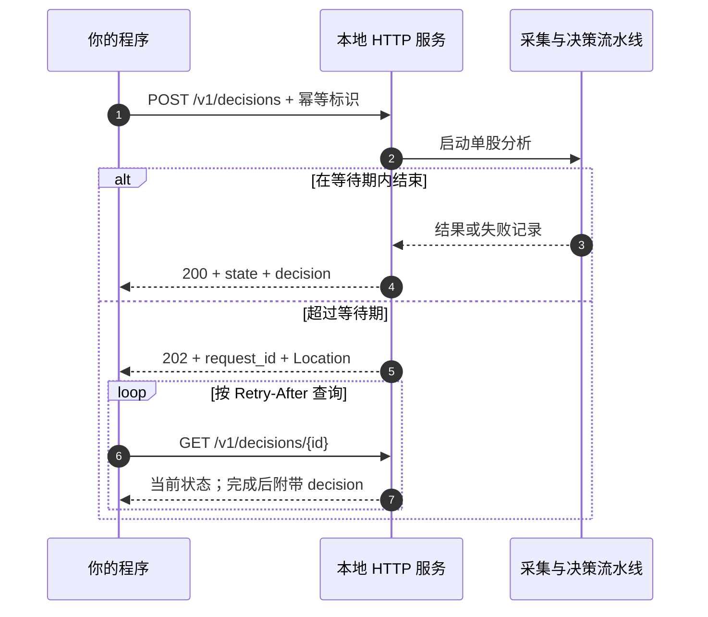
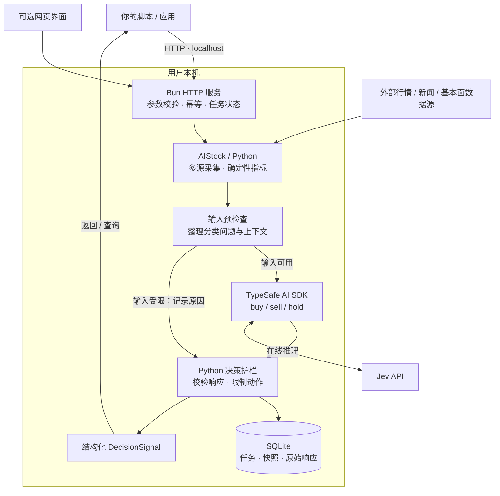

<div align="center">

# Jev Trading

### 本地部署 · HTTP 调用 · 股票分类决策

复用 AIStock 的多源单股分析，将报告生成替换为 Jev 分类，<br>
输出可供程序读取的 **买入 / 卖出 / 观望** 决策。

**Self-hosted** · **Bun + Python** · **TypeSafe AI SDK** · **SQLite**

[快速开始](#quickstart) · [真实分析](#live) · [HTTP API](#api) · [工作原理](#architecture) · [界面预览](#preview) · [常见问题](#faq)

</div>

---

## 项目是什么？

**Jev Trading 是一个由用户自行部署、通过本地 HTTP 接口调用的股票决策服务。** 你启动服务、配置数据源与 Jev 密钥，然后在自己的脚本、应用或研究流程中提交股票代码，获取结构化结果。

项目提供服务程序，**不提供托管 API**。网页是同一服务的辅助界面，用于配置、试用和查看历史；程序调用不需要打开网页。

| 你提供 | 服务负责 | 你获得 |
| --- | --- | --- |
| 股票代码、持仓状态、分析周期 | 采集行情与指标，整理新闻、基本面等信息 | 结构化 `buy / sell / hold` |
| 可选的成本和策略假设 | 调用 Jev 分类，校验输入与动作 | 原始动作、最终动作、概率、限制原因 |
| 本机运行环境与自己的 API Key | 保存任务、输入快照及原始模型响应 | 可查询的历史和可导出的完整依据 |

> **本地部署 ≠ 模型离线运行。** 真实分析会访问配置的外部数据源和 Jev API；演示模式使用合成数据与固定响应，无需密钥。本项目当前只生成决策信号，不下单。

## 核心能力

| 能力 | 当前实现 |
| --- | --- |
| **HTTP 优先** | 一个 POST 提交分析；短时完成直接返回，耗时任务通过 GET 查询 |
| **多源分析** | 复用 AIStock 的行情、历史 K 线、技术指标、基本面、新闻、筹码与市场上下文；保留缺失和降级状态 |
| **分类输出** | Jev 输出买入、卖出或观望，程序保留 `model_action` 与 `final_action` |
| **原 SDK 接入** | 沿用参考 jev-trader 的 Bun + TypeSafe AI SDK 调用方式 |
| **输入及动作护栏** | 检查数据时效、核心数据、持仓方向、市场环境和即时执行假设 |
| **可靠调用** | 幂等请求、状态查询、超时处理；不自动重试模型调用 |
| **本机留痕** | SQLite 保存任务与决策依据，支持导出；过期查询返回保守视图 |
| **可选网页** | 连接设置、无需密钥的演示、进度、历史与导出，适配桌面及手机宽度 |

<a id="quickstart"></a>
## 快速开始：先跑通一次 HTTP 调用

### 1. 准备运行环境

| 依赖 | 用途 | 演示是否需要 |
| --- | --- | --- |
| [Bun](https://bun.sh) | HTTP 服务、网页和 Jev SDK | 需要 |
| [uv](https://docs.astral.sh/uv/getting-started/installation/) | 准备本项目 Python 环境 | 需要 |
| Python ≥ 3.12 | 数据合同、校验与审计；由 uv 管理环境 | 需要 |
| AIStock checkout 及其依赖 | 真实股票的数据采集 | 不需要 |
| Jev API Key | 在线模型判断 | 不需要 |

已在 macOS 环境验证。启动脚本使用 POSIX shell 和 `.venv/bin/python` 路径，Windows 原生运行尚未验证。

### 2. 获取并启动项目

```sh
git clone --recurse-submodules https://github.com/EthanAlgoX/jev-trading.git
cd jev-trading
bun install --frozen-lockfile
bun run serve
```

启动器会执行 `uv sync --frozen --no-dev`，准备本项目的 Python 依赖。首次运行需要联网下载依赖。

```text
Jev 股票决策工作台已启动：http://127.0.0.1:3000
HTTP API：POST /v1/decisions，健康检查：GET /v1/health。
```

保持该终端运行；`Ctrl+C` 停止服务。修改端口可用 `PORT=3010 bun run serve`。

### 3. 提交一个演示决策

另开终端：

```sh
curl -sS http://127.0.0.1:3000/v1/decisions \
  -H 'Content-Type: application/json' \
  -H 'Idempotency-Key: demo-request-001' \
  -d '{"mode":"demo","position":"flat"}'
```

下面是**成功完成时的精简响应示例**，省略配置、时间和审计字段。演示概率来自固定响应，不是在线推理结果。

```json
{
  "api_version": "1",
  "request_id": "2ab77454-5ac8-49be-a1d5-cdc8b171d505",
  "state": "done",
  "mode": "demo",
  "decision": {
    "symbol": "DEMO",
    "model_source": "recorded",
    "model_action": "hold",
    "final_action": "hold",
    "status": "accepted",
    "action_probabilities": { "buy": 0.26, "sell": 0.09, "hold": 0.65 },
    "execution_mode": "signal_only"
  }
}
```

如果返回 HTTP **202**，表示分析仍在进行；按响应中的 `links.self` 查询即可。演示不会自动切换成付费推理。

### 4. 使用封装好的客户端

```sh
# 无第三方 Python HTTP 依赖，自动提交并轮询
python3 examples/http_client.py --demo

# 查询已有任务，不重新调用模型
python3 examples/http_client.py --request-id <request_id>
```

[Python 客户端源码](examples/http_client.py) 可作为你接入其他应用的起点。

<a id="live"></a>
## 连接真实数据与 Jev

### 准备 AIStock

AIStock 负责采集和指标计算，使用它自己的 Python 环境。本项目提供 `context_only` 补丁，让单股流水线在报告生成前返回分析数据。

推荐的目录布局之一：

```text
workspace/
├── AI-Stock/                 # 数据源配置及独立 Python 环境
│   └── .venv/bin/python
└── reference/
    └── jev-trading/           # 当前项目及独立 Python 环境
```

服务会查找同级、上两级或项目内的 `AI-Stock`。其他路径可显式配置。先依照 AIStock 自身说明安装依赖、配置所需数据源，再检查其是否具备 `context_only` 入口。

<details>
<summary><strong>尚未包含采集入口？展开查看补丁应用方式</strong></summary>

替换为实际绝对路径：

```sh
cd /path/to/AI-Stock
git apply --check /path/to/jev-trading/patches/aistock-context-only.patch
git apply /path/to/jev-trading/patches/aistock-context-only.patch
```

已应用补丁的 checkout 不要重复应用。检查失败时先核对版本及本地改动，不要强制覆盖。补丁边界及验证记录见 [首版实现记录](docs/implementation.md)。

采集不生成原研究报告或发送通知。数据缓存写入本项目 `data/aistock.db`，不写入 AIStock 原有研究账本。

</details>

### 配置服务端环境

```sh
cp .env.example .env
```

编辑 `.env`：

```dotenv
TYPESAFE_AI_API_KEY=your_jev_api_key
JEV_MODEL_ID=jev-latest
PORT=3000

# 自动发现失败时填写实际路径
AISTOCK_PATH=/path/to/AI-Stock
AISTOCK_PYTHON=/path/to/AI-Stock/.venv/bin/python
```

密钥可通过 [TypeSafe 控制台](https://console.typesafe.ai) 配置。完成后重启服务并检查：

```sh
bun run doctor
bun run serve
```

在另一终端调用健康接口：

```sh
curl -sS http://127.0.0.1:3000/v1/health
```

`ready: true` 表示本机配置检查通过。检查涵盖路径、解释器文件、采集入口及密钥是否存在，**不代表已验证外部数据源或密钥可用性**。

### 提交真实分析

```sh
curl -sS http://127.0.0.1:3000/v1/decisions \
  -H 'Content-Type: application/json' \
  -H 'Idempotency-Key: stock-600519-001' \
  -d '{
    "symbol": "600519",
    "position": "flat",
    "horizon": 5,
    "execution": "next_session_open",
    "costPercent": 0.3,
    "instructions": "综合趋势、基本面和新闻，证据不足时观望。"
  }'
```

省略 `mode` 时默认 `live`。也可以使用：

```sh
python3 examples/http_client.py --symbol 600519 --position flat
```

代码格式示例包括 `600519`、`AAPL`、`HK00700`，实际数据可用性取决于 AIStock 数据源。`position` 是调用方提供的状态，不代表服务读取过真实账户。

<a id="api"></a>
## HTTP API：如何接入自己的程序

### 接口一览

| 方法 | 路径 | 返回内容 |
| --- | --- | --- |
| GET | `/v1/health` | 服务存活、配置检查、就绪状态及当前任务 |
| POST | `/v1/decisions` | 提交分析；返回任务或已完成的决策 |
| GET | `/v1/decisions/{request_id}` | 任务进度及最终决策 |
| GET | `/v1/decisions/{request_id}/evidence` | 上下文、模型请求、原始响应与审计信号 |

### 请求参数

| 字段 | 必填 | 默认值 / 可选值 |
| --- | --- | --- |
| `symbol` | 真实模式必填 | 股票代码；演示模式使用 `DEMO` |
| `position` | 是 | `flat` 空仓 / `long` 已持有 |
| `mode` | 否 | `live` / `demo`，默认 `live` |
| `horizon` | 否 | 1–250 个交易日，默认 `5` |
| `execution` | 否 | `next_session_open` / `immediate`，默认前者 |
| `costPercent` | 否 | 往返成本与滑点假设，范围 0–10，默认 `0.3`（即 0.3%） |
| `instructions` | 否 | 最多 8000 字符的策略说明 |
| `waitSeconds` | 否 | 0–25 秒，默认 `25`；`0` 立即返回任务 |

未知字段会被拒绝。分析周期、成本和执行时点都是模型判断的假设，不会触发真实交易。

### 一次提交，按需查询



**重试规则：** 为每次新分析生成一个 `Idempotency-Key`（8–100 位字母、数字或连字符）。网络重试使用原标识和相同分析参数，可更改等待时间；不同分析参数复用标识会返回 409。省略标识时服务会自动生成，但网络异常后调用方难以安全重试。

**等待规则：** 202 响应附带 `Location` 和 `Retry-After: 2`。等待结束或客户端断开不会取消任务。GET 查询不会重新调用模型。服务当前一次处理一个任务，不排队；忙碌时返回 `409 BUSY`。

### 正确读取结果

```text
HTTP 成功
  └─ state 是否为 done？
       ├─ 进行中 → 继续查询
       ├─ failed → 读取 error，处理失败
       └─ done → 检查 decision.status、valid_until、mode
                    └─ 再读取 decision.final_action
```

| 字段 | 如何理解 |
| --- | --- |
| `state` | 任务状态；`done` 只说明处理结束 |
| `decision.status` | `accepted`、`blocked`、`skipped`、`error` 或 `expired` |
| `model_action` | 模型原始动作；未获得有效模型判断时可能为 null |
| `final_action` | 程序校验后的动作；被阻止或过期时为 `hold` |
| `reason_codes` / `warnings` | 动作限制、数据质量与其他提示 |
| `valid_until` | 信号有效期；过期查询返回 `hold / expired` 视图 |
| `action_probabilities` | 模型对动作类别的概率分配，**不是盈利胜率** |
| `model_source` | `jev` 在线路径 / `recorded` 演示或录制响应路径 |

`buy` 表示增加多头敞口，`sell` 表示减少已有多头持仓，`hold` 表示保持现状；空仓时的 `sell` 不会被解释为做空。

更多响应约定、错误码和恢复方式见 [完整 HTTP API 文档](docs/http-api.md)。

<a id="architecture"></a>
## 工作原理



### 各层职责

| 层 | 负责的事情 | 主要代码 |
| --- | --- | --- |
| 服务入口 | 接收 HTTP、复用任务、等待或返回查询地址 | [server.ts](app/server.ts)、[api.ts](app/api.ts) |
| 数据层 | 调用 AIStock 的 context-only 流程，保留数据覆盖和来源 | [collector.py](src/jev_trading/collector.py)、[aistock_worker.py](src/jev_trading/aistock_worker.py) |
| 模型层 | `createTypeSafeAi → evaluationModel → experimental_evaluate` | [model.ts](app/model.ts) |
| 决策层 | 校验概率、数据日期和动作，保留模型与最终结果的差异 | [policy.py](src/jev_trading/policy.py)、[service.py](src/jev_trading/service.py) |
| 审计层 | 保存输入、问题版本、模型响应和最终信号 | [storage.py](src/jev_trading/storage.py)、[jobs.ts](app/jobs.ts) |

HTTP 路径的模型调用使用 Bun SDK；Python 负责采集、合同校验与审计。高级 Python CLI 保留独立的 HTTP 模型适配，不要求调用方自己编排这两个运行时。

### 护栏与失败处理

- 核心日线或技术数据不可用、数据日期不一致、上下文过期时，记录限制原因。
- 即时执行假设要求开市且实时报价足够新；下一开盘假设仍只用于决策评估。
- 空仓禁止卖出，保守市场环境或核心技术数据降级可阻止买入。
- 模型响应必须满足动作与概率合同；超时、错误或迟到结果不能作为有效新增风险信号。
- 模型调用不自动重试；服务重启将未完成任务标为失败，需调用方显式发起新分析。

这些是当前已实现的基础护栏，不等于 AIStock 原报告护栏的全量迁移，也未校验真实账户资金、可卖数量或完整交易规则。

<a id="preview"></a>
## 可选网页工作台

服务启动后，打开 [http://127.0.0.1:3000](http://127.0.0.1:3000) 即可使用同一套分析能力。


*截图为合成演示样本，展示的是固定响应，不是实盘表现或在线 Jev 判断。*

<details>
<summary><strong>查看手机宽度布局</strong></summary>

<p align="center">
  
</p>

手机宽度适配仅指界面布局；服务仍默认只允许本机访问，不代表已开放手机远程访问。

</details>

网页支持连接设置、演示与真实模式切换、阶段进度、历史查看和依据导出。Mac 用户也可双击 [start.command](start.command)：已有 Node.js/npm 而未安装 Bun 时，启动器会尝试通过 npx 准备 Bun；仍需预先安装 uv。

<a id="configuration"></a>
## 配置与数据存储

| 配置 | 默认 / 说明 |
| --- | --- |
| `TYPESAFE_AI_API_KEY` | Jev 密钥，真实分析必需；兼容 `TYPESAFE_API_KEY` |
| `JEV_MODEL_ID` | 默认 `jev-latest`；兼容 `JEV_MODEL` |
| `AISTOCK_PATH` | 自动发现，或指定 AIStock 项目路径 |
| `AISTOCK_PYTHON` | 默认使用 AIStock 的 `.venv/bin/python` |
| `PORT` | 默认 `3000`；监听地址固定为 `127.0.0.1` |
| `JEV_DATA_DIR` | 默认项目 `data/`；用于隔离不同运行实例的数据 |
| `OPEN_BROWSER` | `0` 禁止自动打开浏览器；`bun run serve` 已自动设置 |

Bun 自动加载 `.env`。网页保存的配置优先于环境变量；改动 `.env` 后重启生效。网页中提交空密钥表示保留原值。

```text
data/
├── settings.json          # 本机连接配置，文件权限 0600
├── workbench.sqlite       # 任务及网页历史
├── decisions.db           # 输入、请求、响应和决策审计
├── aistock.db             # 独立的行情缓存
├── contexts/              # 真实分析的上下文快照
└── collection.log         # 采集诊断日志
```

API 不返回密钥，密钥不写入分析记录。`data/` 与 `.env` 已被 Git 忽略。决策查询会检查有效期，依据导出保留原始信号，以便审计。

<a id="faq"></a>
## 常见问题

| 遇到的问题 | 原因 / 处理方式 |
| --- | --- |
| 没有密钥，能先试吗？ | 可以。请求显式使用 `mode: demo`，无需 AIStock 或 Jev 密钥 |
| 返回 202，没有决策 | 任务尚未完成；按 `links.self` 查询，或使用 Python 客户端自动轮询 |
| `503 NOT_READY` | 运行 `bun run doctor` 或查询 `/v1/health`，补齐环境和连接配置 |
| `409 BUSY` | 当前已有任务；稍后使用原幂等标识重试 |
| `409 IDEMPOTENCY_CONFLICT` | 同一标识对应不同分析参数；新分析应使用新标识 |
| 想重新分析，但总返回旧结果 | 复用了幂等标识；为新的分析生成新标识 |
| 返回 400 | 检查 JSON、必填 position、字段拼写及参数范围 |
| Jev 返回 401 或模型调用失败 | 检查服务端密钥、模型权限和网络，更新后显式重试 |
| 数据采集慢或失败 | 查看 `data/collection.log`，检查 AIStock 的依赖和数据源；网页/HTTP 采集上限为 240 秒 |
| 模型建议 buy，最终却是 hold | 检查 reason_codes；程序护栏可能阻止了买入 |
| health 的 ready 为 true，仍分析失败 | 就绪检查不验证所有依赖导入、数据源连通性或密钥权限 |
| 端口已占用 | 使用 `PORT=3010 bun run serve`，客户端同步修改地址 |
| 能放到公网或自动交易吗？ | 当前仅提供本机服务，没有多用户认证、实盘下单或完整执行风控 |

## 开发与验证

```sh
bun run typecheck       # TypeScript 严格类型检查
bun test app            # SDK、任务持久化、HTTP 集成等测试
uv run pytest -q        # Python 合同、护栏、超时、存储与 CLI 测试
```

| 验证项 | 当前记录 |
| --- | --- |
| TypeScript 类型检查 | 通过 |
| Bun 测试 | 10 项通过，包括独立进程的本地 HTTP 集成 |
| Python 测试 | 34 项通过 |
| HTTP 演示 | 提交、轮询、幂等、结果、导出及 Python 客户端已跑通 |
| 浏览器 | 桌面及手机宽度的演示、设置、历史和布局已检查 |
| AIStock 真实数据采集 | 曾完成 600519 采集，覆盖和局限见实现记录 |
| Jev 真实在线推理 | 尚未验证；SDK 请求合同以模拟 HTTP 响应测试 |

测试通过不代表已验证策略收益。当前没有收益回测、自动止损、目标仓位计算或真实交易执行；历史数据回放也不保证 point-in-time 完整性。

<details>
<summary><strong>项目目录</strong></summary>

```text
jev-trading/
├── app/                   # Bun HTTP 服务、Jev SDK、任务与测试
├── web/                   # 可选网页界面
├── src/jev_trading/        # Python 采集、合同、护栏、审计和 CLI
├── tests/                 # Python 测试
├── examples/              # HTTP 客户端、离线输入与配置示例
├── patches/               # AIStock context-only 补丁及许可
├── docs/                  # API、架构、实现记录和截图
├── reference/             # jev-trader 参考源码
├── .env.example           # 服务端配置示例
├── start.command          # macOS 启动入口
├── package.json / bun.lock
└── pyproject.toml / uv.lock
```

</details>

## 文档与参考

| 文档 | 内容 |
| --- | --- |
| [HTTP API](docs/http-api.md) | 本地部署、请求约定、查询和恢复 |
| [Python HTTP 客户端](examples/http_client.py) | 可直接运行的提交与轮询示例 |
| [高级 CLI](docs/cli.md) | 数据采集、离线响应重放和审计查询 |
| [架构与开发方案](docs/architecture-and-development-plan.md) | 需求边界及分层设计 |
| [网页与 SDK 实现记录](docs/workbench.md) | 接入细节、运行方式与验证 |
| [首版实现记录](docs/implementation.md) | AIStock 补丁、真实采集及已知局限 |

本项目参考 AIStock 的单股分析流程，以及 jev-trader 的 Jev SDK 接入方式。参考源码以固定版本的 Git 子模块保留在 [reference/](reference/)，包含其 MIT 许可；已有 checkout 可执行 `git submodule update --init --recursive` 获取。AIStock 配套修改的许可副本见 [patches/AIStock-LICENSE](patches/AIStock-LICENSE)。这些上游许可说明不代表本项目新增代码已另行声明统一开源许可证。
