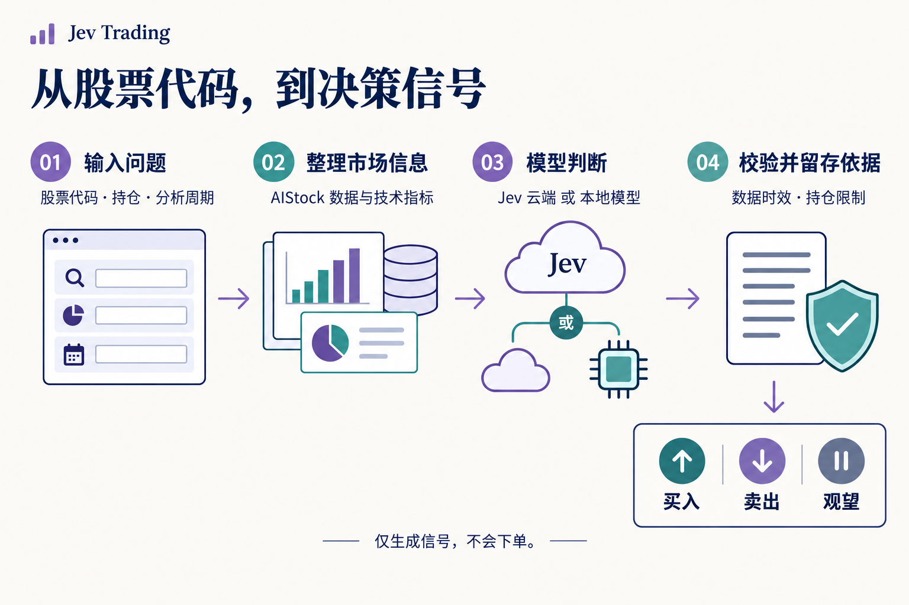
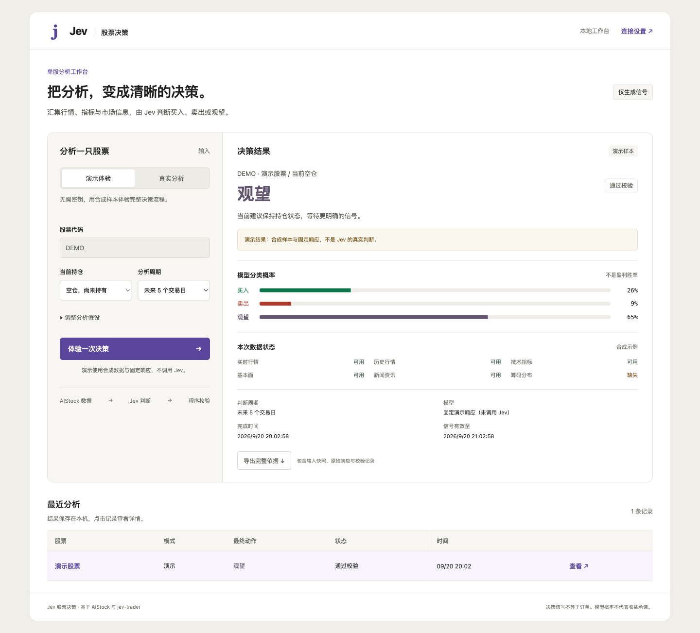

<div align="center">

# Jev Trading

### 输入一只股票，得到清晰、可追溯的决策信号。

行情与新闻 → 模型判断 → 程序校验 → **买入 / 卖出 / 观望**

[English](README.md) · **简体中文** · [繁體中文](README.zh-TW.md) · [日本語](README.ja.md) · [한국어](README.ko.md)

[快速体验](#quickstart) · [真实分析](#live) · [如何读结果](#results) · [API 接入](#api) · [遇到问题](#faq)

</div>



## 这个项目能帮你做什么？

**Jev Trading 是一个运行在你电脑上的股票决策服务。** 你可以通过网页使用，也可以让自己的程序通过 HTTP 接口调用。它把 AIStock 收集的行情、指标、基本面和新闻交给模型，输出结构化判断，并保留分析依据。

例如，你提交「`600519`、目前空仓、关注未来 5 个交易日」，它会返回最终动作、模型对三个动作的概率分配，以及数据缺失或程序限制等信息。

- **看一只股票：**填写代码、持仓和周期，查看判断与数据状态。
- **接入自己的工具：**用同一个 API 选择 Jev 云端或本地模型。
- **回看判断依据：**在本机保存历史、输入快照和模型原始响应，支持导出。

> **当前只生成信号，不会下单。** 没有券商账户接入、自动止损、目标仓位计算或收益回测；模型概率也不是盈利胜率。

## 选一条使用路径

| 你想做什么 | 需要准备 | 从这里开始 |
| --- | --- | --- |
| 先看看效果 | Bun + uv；无需密钥或 AIStock | [运行演示](#quickstart) |
| 分析真实股票，使用云端模型 | 上述环境 + AIStock + Jev API Key | [连接真实分析](#live) |
| 分析真实股票，自己运行模型 | 上述环境 + AIStock + 模型权重与兼容服务 | [配置本地模型](#local-inference) |
| 接入脚本或其他应用 | 已启动的本地服务 | [调用 HTTP API](#api) |

<a id="quickstart"></a>
## 1. 先跑一次演示

### 准备环境

安装 [Bun](https://bun.sh) 和 [uv](https://docs.astral.sh/uv/getting-started/installation/)，重新打开终端，确认两个命令可用：

```sh
bun --version
uv --version
```

Bun 运行网页和 HTTP 服务；uv 准备 Python ≥ 3.12 的项目环境。首次启动需要联网下载依赖。当前已在 macOS 验证，Windows 原生启动尚未验证。

### 下载并启动

```sh
git clone --recurse-submodules https://github.com/EthanAlgoX/jev-trading.git
cd jev-trading
bun install --frozen-lockfile
bun run start
```

已有项目时，直接进入项目目录，从 `bun install` 开始。启动器会自动执行 `uv sync --frozen --no-dev`。

**打开 [http://127.0.0.1:3000](http://127.0.0.1:3000)**，看到工作台就表示网页服务已启动。保持终端运行；按 `Ctrl+C` 停止。

### 在网页上完成第一次体验

1. 保持「**演示体验**」模式。
2. 点击「**体验一次决策**」。
3. 在右侧查看动作、分类概率和数据状态。
4. 在下方「最近分析」回看记录，或点击「导出完整依据」。

**演示使用合成数据与固定响应，不调用云端或本地模型，也不会自动切换为付费分析。**

<details>
<summary>其他启动方式：Mac 双击、仅启动服务、修改端口</summary>

- Mac 可双击 [start.command](start.command)。没有 Bun 但已有 Node.js/npm 时，它会尝试用 npx 准备 Bun；仍需安装 uv。
- `bun run serve`：启动同一服务，不自动打开浏览器。
- `PORT=3010 bun run serve`：改用 3010 端口；网页和客户端地址也要同步修改。

</details>

<a id="live"></a>
## 2. 连接真实股票分析

真实分析需要连接两部分：**AIStock 提供数据，Jev 云端或本地模型提供判断。** 克隆本仓库不会自动安装 AIStock 或下载模型。

### 第一步：准备 AIStock 数据环境

另外准备 AIStock 项目，按照它的说明安装依赖、配置数据源，并保留它自己的 Python 环境。推荐放在同一父目录：

```text
workspace/
├── AI-Stock/
│   └── .venv/bin/python
└── jev-trading/
```

本项目需要 AIStock 的 `context_only` 采集入口：它在生成长报告之前返回数据，跳过报告与通知流程。已有入口时无需重复打补丁。

<details>
<summary>AIStock 没有 context_only 入口？应用配套补丁</summary>

将下面的路径替换成实际绝对路径：

```sh
cd /path/to/AI-Stock
git apply --check /path/to/jev-trading/patches/aistock-context-only.patch
git apply /path/to/jev-trading/patches/aistock-context-only.patch
```

只有检查通过后才应用。检查失败时核对 AIStock 版本和本地改动，不要强制覆盖。版本边界见 [实现记录](docs/implementation.md)。

</details>

### 第二步：选择模型并保存配置

| | Jev 云端（默认） | 本地模型 |
| --- | --- | --- |
| 准备什么 | Jev API Key | 自行下载的权重与兼容推理服务 |
| 判断在哪里运行 | Jev 云端 | 你部署的本机服务 |
| 是否需要 Jev 云端密钥 | 需要 | 不需要 |
| 费用来源 | API 使用及可能的数据费用 | 硬件、电力、维护及可能的数据费用 |
| 请求参数 | `"backend": "jev"` | `"backend": "local"` |

**使用云端：**打开网页右上角「连接设置」，填写 Jev API Key、模型名（默认 `jev-latest`），以及未被自动发现的 AIStock 路径和 Python 路径，然后保存。密钥入口：[TypeSafe 控制台](https://console.typesafe.ai)。

<details>
<summary>更喜欢用配置文件？编辑 .env</summary>

在本项目目录执行；已有 `.env` 时直接编辑，不要覆盖：

```sh
cp .env.example .env
```

```dotenv
TYPESAFE_AI_API_KEY=your_jev_api_key
JEV_MODEL_ID=jev-latest
AISTOCK_PATH=/absolute/path/to/AI-Stock
AISTOCK_PYTHON=/absolute/path/to/AI-Stock/.venv/bin/python
```

替换示例值，保存后重启服务。**网页保存的设置优先于 `.env`**；网页提交空密钥表示保留原值。

</details>

<a id="local-inference"></a>
**使用本地模型：**先按 [本地部署指南](docs/local-inference.md) 准备权重与兼容服务，再在「连接设置」选择「本地决策引擎」，填写地址、模型名和概率计算方式。普通聊天接口不能直接代替所需的 `/v1/systemone` 接口。可运行 `bun run backend:check` 检查后端就绪端点。

云端模式会发送分析上下文给 Jev；本地模式的模型推理在本机完成，但行情和新闻采集仍可能联网。本地失败不会自动转为云端调用。

### 第三步：检查并分析

```sh
bun run doctor
```

它检查路径、采集入口和必要配置，**不保证数据源或模型密钥实际可用**。回到网页，切换「真实分析」，填写：

| 项目 | 如何填写 |
| --- | --- |
| 股票代码 | 如 `600519`、`AAPL`、`HK00700`；可用性取决于数据源 |
| 当前持仓 | 空仓或已持有；系统不会读取真实账户 |
| 分析周期 | 网页可选未来 5、10、20 个交易日 |
| 分析假设（选填） | 执行时点、往返成本与滑点、策略偏好 |

提交后等待「采集数据 → 分类判断 → 校验并保存」。执行时点和成本只是判断假设，不会触发订单。

### 自定义你的分析

股票代码可以每次更换。网页支持保存、更新策略提示词模板，并按次选择实时行情、筹码、新闻采集和行情来源优先级；API 还支持自带数据，跳过 AIStock。每次分析保留策略版本和实际提示词。具体选项与调用示例见 [自定义指南](docs/customization.md)。

<a id="results"></a>
## 3. 如何理解结果

**先看最终动作，再看状态、有效期和限制原因。** 模型的原始建议可能被程序调整，例如技术数据降级时，模型建议买入，最终却是观望。

| 结果 | 含义 |
| --- | --- |
| `buy` / 买入 | 增加多头持仓的信号 |
| `sell` / 卖出 | 减少已有多头持仓的信号；空仓时不解释为做空 |
| `hold` / 观望 | 保持现状；可能是模型判断，也可能是程序限制或信号过期 |
| `model_action` | 模型原始建议 |
| `final_action` | 程序检查后的最终动作 |
| `status` | `accepted` 通过、`blocked` 被限制、`skipped` 跳过、`error` 错误、`expired` 过期 |
| `reason_codes` / `warnings` | 动作限制、缺失数据等原因 |
| `valid_until` | 信号有效期，过期查询会显示 `hold / expired` |
| `action_probabilities` | 三个动作的概率分配，**不是赚钱概率** |

`state: done` 只代表任务处理结束，不代表建议有效，也不代表交易成功。API 调用方还应检查 `mode`，避免把演示当作真实判断。

<a id="api"></a>
## 4. 接入自己的程序

保持服务运行，在**另一个终端**提交演示：

```sh
curl -sS http://127.0.0.1:3000/v1/decisions \
  -H 'Content-Type: application/json' \
  -H 'Idempotency-Key: demo-request-001' \
  -d '{"mode":"demo","position":"flat"}'
```

成功完成后的精简示例（概率为固定演示值）：

```json
{
  "state": "done",
  "mode": "demo",
  "decision": {
    "model_source": "recorded",
    "model_action": "hold",
    "final_action": "hold",
    "status": "accepted",
    "action_probabilities": { "buy": 0.26, "sell": 0.09, "hold": 0.65 },
    "execution_mode": "signal_only"
  }
}
```

返回 **202** 表示仍在运行，按 `links.self` 查询。默认最多等待 25 秒；传 `waitSeconds: 0` 可立即获得任务编号。GET 查询不会重新调用模型。

已有 Python 客户端会自动提交和轮询，无需第三方 HTTP 依赖：

```sh
python3 examples/http_client.py --demo
```

配置真实环境后：

```sh
python3 examples/http_client.py --symbol 600519 --position flat --backend jev
```

使用本地模型时将 `jev` 改为 `local`。查询已有任务：

```sh
python3 examples/http_client.py --request-id "YOUR_REQUEST_ID"
```

| 接口 | 用途 |
| --- | --- |
| `GET /v1/health` | 查看服务和配置状态 |
| `POST /v1/decisions` | 提交一次分析 |
| `GET /v1/decisions/{request_id}` | 查询进度和结果 |
| `GET /v1/decisions/{request_id}/evidence` | 获取输入、原始响应和审计依据 |

<details>
<summary>真实 HTTP 请求、参数与安全重试</summary>

```sh
curl -sS http://127.0.0.1:3000/v1/decisions \
  -H 'Content-Type: application/json' \
  -H 'Idempotency-Key: stock-600519-001' \
  -d '{"symbol":"600519","position":"flat","backend":"jev","horizon":5,"execution":"next_session_open","costPercent":0.3,"waitSeconds":0}'
```

- `mode` 默认 `live`；真实模式必填 `symbol`；`position` 必填 `flat` 或 `long`。
- `horizon` 为 1–250 个交易日，默认 5；`costPercent` 为 0–10，默认 0.3（即 0.3%）。
- `execution` 为 `next_session_open`（默认）或 `immediate`；`instructions` 最多 8000 字符。
- `backend` 为 `jev` 或 `local`，省略沿用服务默认；`localEngine` 可选 `logprobs` 或 `generated`。
- `waitSeconds` 为 0–25 的整数，默认 25。未知字段会被拒绝。
- 每次新分析使用新的 `Idempotency-Key`（8–100 位字母、数字或连字符）。网络重试使用原标识和相同分析参数，可修改等待时间；复用标识会返回原任务。
- 当前一次处理一个任务，不排队；忙碌时返回 `409 BUSY`。202 响应的 `Retry-After: 2` 表示两秒后查询。
- 断开客户端不会取消任务；本项目不自动重试模型请求。重启会将未完成任务标为失败，需要显式发起新分析。

</details>

完整约定见 [HTTP API 文档](docs/http-api.md)。

<a id="faq"></a>
## 遇到问题，从这里排查

| 现象 | 下一步 |
| --- | --- |
| `bun` 或 `uv` 找不到 | 安装对应工具并重开终端，先运行 `--version` |
| 无法打开网页 | 确认启动终端仍在运行，访问 `127.0.0.1:3000`；端口冲突时改为 3010 |
| 没有密钥 | 先选演示；真实本地模式仍需 AIStock 与兼容模型服务 |
| `503 NOT_READY` | 运行 `bun run doctor`，补齐显示缺失的配置 |
| 配置改了但未生效 | 网页保存的设置优先于 `.env`；修改 `.env` 后重启 |
| 202 / 暂无结果 | 按 `links.self` 查询，或用 Python 客户端自动等待 |
| 409 / 总返回旧结果 | BUSY 时稍后重试；新分析用新标识；同一标识不可搭配不同分析参数 |
| 数据采集失败 | 查看 `data/collection.log`，检查 AIStock 依赖和数据源；采集上限为 240 秒 |
| 模型调用失败 / 401 | 检查密钥、权限、网络；本地模式检查兼容服务，再显式重试 |
| 买入变成观望 | 查看 `reason_codes`、数据状态与有效期 |

<a id="preview"></a>
## 界面与语言说明

本页流程图为简体中文版。五种 README 各自使用对应语言的说明图片；**网页、日志与扩展文档目前主要为简体中文**，图片本地化不代表软件界面已支持五种语言。

<details>
<summary>查看实际网页截图（简体中文，固定演示样本）</summary>



[查看手机宽度截图](docs/assets/workbench-mobile.png)。响应式布局不代表开放了手机远程访问。

</details>

<a id="architecture"></a>
## 开发与进一步阅读

Bun 负责 HTTP、任务与模型连接，Python 负责采集、校验与审计，SQLite 保存本机记录。

| 目录 | 负责什么 |
| --- | --- |
| `app/`、`web/` | 服务、模型接入与网页 |
| `src/jev_trading/`、`tests/` | Python 数据采集、规则、审计与测试 |
| `examples/`、`patches/` | 调用示例与 AIStock 适配补丁 |
| `reference/` | 固定版本的 jev-trader 参考源码，不是 AIStock |

<a id="configuration"></a>
<details>
<summary>配置、存储与开发检查命令</summary>

配置样例见 [.env.example](.env.example)。`JEV_DATA_DIR` 可改变数据目录，`PORT` 改变端口，服务监听地址固定为 `127.0.0.1`。

| 本机文件 | 内容 |
| --- | --- |
| `data/settings.json` | 连接设置，权限 0600 |
| `data/workbench.sqlite` | 任务和历史 |
| `data/decisions.db` | 输入、模型响应和决策审计 |
| `data/aistock.db`、`data/contexts/` | 行情缓存与输入快照 |
| `data/collection.log` | 采集诊断日志 |

`.env` 与 `data/` 已被 Git 忽略。API 不返回密钥，密钥不写入分析记录。

```sh
bun run typecheck
bun test app
uv run pytest -q
```

</details>

**验证范围：**项目记录了演示与接口测试、以及一次真实 AIStock 采集；Jev 真实云端推理与真实本地模型权重推理尚未验证。基础规则未覆盖账户资金、可卖数量或完整交易规则，也没有收益回测。当前服务仅限本机，没有多用户认证。

| 文档 | 内容 |
| --- | --- |
| [HTTP API](docs/http-api.md) | 参数、结果、错误和任务恢复 |
| [本地推理](docs/local-inference.md) · [兼容实现](docs/reference-engines.md) | 自行部署模型与接入协议 |
| [高级 CLI](docs/cli.md) | 采集、离线重放和审计查询 |
| [架构](docs/architecture-and-development-plan.md) · [实现记录](docs/implementation.md) · [工作台记录](docs/workbench.md) | 设计、适配边界及验证依据 |

本项目参考 AIStock 的单股分析流程和 jev-trader 的模型接入方式。[reference/](reference/) 保留上游 MIT 许可，[AIStock 补丁许可](patches/AIStock-LICENSE) 随补丁提供；这些许可不代表本项目新增代码已声明统一开源许可证。
