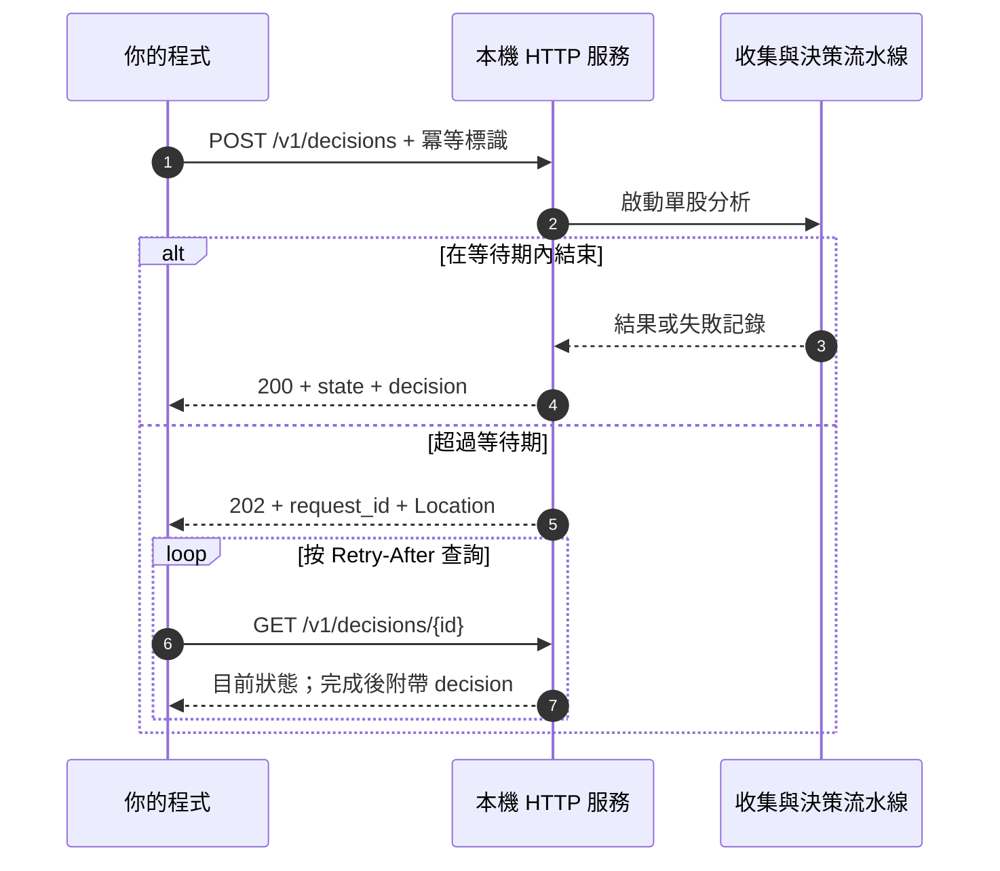
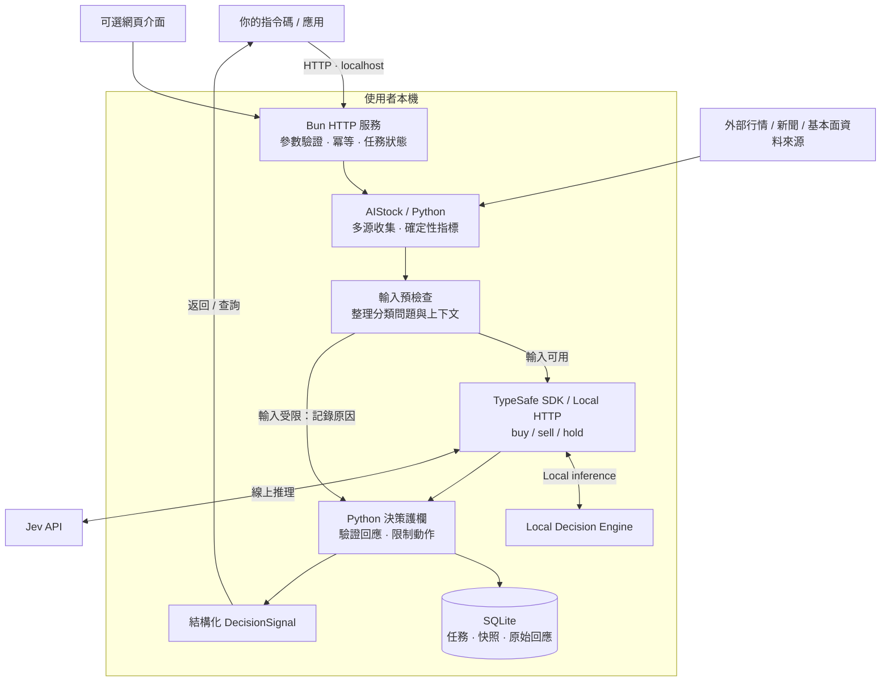

<div align="center">

# Jev Trading

[简体中文](README.md) · [English](README.en.md) · [繁體中文](README.zh-TW.md) · [日本語](README.ja.md) · [한국어](README.ko.md)

### 純淨、快速接入、成本可控的股票決策服務

**官方 Jev API / 本機模型，兩種方式，同一個 HTTP 介面。**<br>
將行情、指標與市場資訊轉成程式可用的 **買入 / 賣出 / 觀望** 決策。

**Official API + Local Models** · **HTTP First** · **Self-hosted** · **Auditable**

[快速開始](#quickstart) · [選擇雲端或本機](#local-inference) · [真實分析](#live) · [HTTP API](#api) · [工作原理](#architecture) · [介面預覽](#preview) · [常見問題](#faq)

</div>

---

## 為你的交易流程，提供輕量決策介面

**Jev Trading 是由你自行部署與呼叫的股票決策服務。** 提交股票代碼、持倉狀態及分析週期，即可取得結構化的 `buy / sell / hold`、動作機率、風控結果與決策依據，接入指令碼、研究工具或自己的交易系統。

預設使用 **Jev 官方 API**，無需在本機執行模型；也能連接 **本機決策引擎**，使用自行下載與部署的開放權重模型。網頁與 HTTP API 均支援兩種方式，切換推論位置不需重寫業務呼叫流程。

專案提供可自行執行的服務程式，網頁用於設定、體驗及檢視歷史。服務在你的機器上執行，目前輸出交易訊號，訂單執行由你的系統負責。

## 為什麼選擇 Jev Trading？

| 特點 | 對你的價值 | 目前實現 |
| --- | --- | --- |
| **純淨：專注決策** | 取得程式可使用的結果 | 重用 AIStock 資料與指標，略過長報告、報告 Agent 與通知流程，直接分類動作 |
| **快速：接入路徑短** | 一個介面接入既有流程 | POST 提交，完成後回傳 JSON；耗時任務非同步查詢，附 Python 呼叫範例 |
| **省錢：減少重複工作** | 將預算用於需要的判斷 | 不額外產生研究報告；相同參數與冪等識別碼重用任務，本專案不自動重試模型請求 |
| **雲端 / 本機自由選擇** | 依設備及使用頻率安排推論 | 預設官方 API；本機模式無需 Jev 雲端金鑰，以同一請求格式切換 `backend` |
| **多源資訊，直接分類** | 保留單股分析的資料基礎 | 行情、K 線、指標、基本面、新聞、籌碼與市場環境，記錄缺失及降級 |
| **程式約束模型判斷** | 分辨建議與最終允許的動作 | 保留 `model_action` 與 `final_action`，驗證時效、持倉方向、機率及市場條件 |
| **過程可追溯** | 回看決策如何產生 | SQLite 儲存快照、原始回應、推論來源及限制原因，支援匯出 |
| **無需前端也能使用** | 自動呼叫與人工檢視皆方便 | 本機 HTTP 獨立執行；可選網頁提供設定、進度、歷史與無需金鑰的示範 |

### 快與省，來自更短的決策流程

```text
股票 + 持倉 + 分析週期
          ↓
多源資料與確定性指標
          ↓
Jev 官方 API / 本機決策引擎
          ↓
程式驗證 → buy / sell / hold → 你的流程
```

直接分類省去長報告產生環節；冪等呼叫避免網路重送觸發新分析。本機模式可避免 Jev 雲端推論費，仍需考慮硬體、電力及可能的資料費。實際延遲與總成本取決於資料收集、模型及設備，目前未承諾端到端速度或節省比例。

## 選擇適合你的執行方式

| | Jev 官方 API · 預設 | 本機決策引擎 |
| --- | --- | --- |
| 適合 | 快速開始，無需維護模型執行環境 | 已有相容設備，希望自行控制模型與推論資源 |
| 準備 | 官方 API Key、資料收集環境 | 模型權重、相容推論服務、資料收集環境 |
| 推論位置 | Jev 雲端 | 自行部署的本機服務 |
| 主要成本 | 官方 API 使用費及資料費 | 設備、電力、維護及資料費 |
| 呼叫方式 | `"backend": "jev"` | `"backend": "local"` |

任務與稽核記錄保存在本機。雲端模式會將分析內容傳送給 Jev；本機模式於本機推論，行情與新聞收集仍可能連網。兩種方式共用 HTTP 介面與決策驗證。

<a id="quickstart"></a>
## 快速開始：先跑通一次 HTTP 呼叫

### 1. 準備執行環境

| 依賴 | 用途 | 示範是否需要 |
| --- | --- | --- |
| [Bun](https://bun.sh) | HTTP 服務、網頁和 Jev SDK | 需要 |
| [uv](https://docs.astral.sh/uv/getting-started/installation/) | 準備本專案 Python 環境 | 需要 |
| Python ≥ 3.12 | 資料契約、驗證與稽核；由 uv 管理環境 | 需要 |
| AIStock checkout 及其依賴 | 真實股票的資料收集 | 不需要 |
| Jev API Key | 雲端模型判斷，本機後端不需要 | 不需要 |

已在 macOS 環境驗證。啟動指令碼使用 POSIX shell 和 `.venv/bin/python` 路徑，Windows 原生執行尚未驗證。

### 2. 取得並啟動專案

```sh
git clone --recurse-submodules https://github.com/EthanAlgoX/jev-trading.git
cd jev-trading
bun install --frozen-lockfile
bun run serve
```

啟動器會執行 `uv sync --frozen --no-dev`，準備本專案的 Python 依賴。首次執行需要聯網下載依賴。

```text
Jev 股票决策工作台已启动：http://127.0.0.1:3000
HTTP API：POST /v1/decisions，健康检查：GET /v1/health。
```

啟動訊息目前以簡體中文顯示。保持該終端執行；`Ctrl+C` 停止服務。修改埠可用 `PORT=3010 bun run serve`。

### 3. 提交一個示範決策

另開終端：

```sh
curl -sS http://127.0.0.1:3000/v1/decisions \
  -H 'Content-Type: application/json' \
  -H 'Idempotency-Key: demo-request-001' \
  -d '{"mode":"demo","position":"flat"}'
```

下面是**成功完成時的精簡回應示例**，省略設定、時間和稽核欄位。示範機率來自固定回應，不是線上推理結果。

```json
{
  "api_version": "1",
  "request_id": "2ab77454-5ac8-49be-a1d5-cdc8b171d505",
  "state": "done",
  "mode": "demo",
  "decision": {
    "symbol": "DEMO",
    "model_source": "recorded",
    "model_action": "hold",
    "final_action": "hold",
    "status": "accepted",
    "action_probabilities": { "buy": 0.26, "sell": 0.09, "hold": 0.65 },
    "execution_mode": "signal_only"
  }
}
```

如果返回 HTTP **202**，表示分析仍在進行；按回應中的 `links.self` 查詢即可。示範不會自動切換成付費推理。

### 4. 使用封裝好的用戶端

```sh
# 無第三方 Python HTTP 依賴，自動提交併輪詢
python3 examples/http_client.py --demo

# 查詢已有任務，不重新呼叫模型
python3 examples/http_client.py --request-id "YOUR_REQUEST_ID"
```

[Python 用戶端原始碼](examples/http_client.py) 可作為你接入其他應用的起點。

<a id="local-inference"></a>
## 選擇呼叫方式：Jev 雲端或本機決策引擎

| 呼叫方式 | 機率來源 | 需要雲端金鑰 |
| --- | --- | --- |
| `jev` (預設) | 供應商回傳的分類機率 | 是 |
| `local` | 本機決策引擎；支援下述兩種計算方式 | 否 |

本機決策引擎是本專案的統一接入名稱。`logprobs` 讀取候選標籤分數並以 softmax 正規化；`generated` 讓模型產生機率 JSON，再驗證與正規化。兩者並非相同的統計方法，結果分別記錄 `label_logprobs` 與 `generated_probabilities`。

先依照 [本機部署指南](docs/local-inference.md) 下載並載入模型、啟動相容服務，再設定：

```dotenv
JEV_BACKEND=local
JEV_LOCAL_ENGINE=logprobs
JEV_LOCAL_BASE_URL=http://127.0.0.1:8000
JEV_LOCAL_MODEL=jev-latest
```

網頁與 HTTP 共用設定，已儲存的網頁設定優先於環境變數。執行 `bun run backend:check` 檢查連線，再以 `bun run serve` 啟動。本專案不附帶權重，一般聊天介面需要相容轉接。部署實作與來源說明請見指南。

網頁儲存預設呼叫方式，HTTP 請求可用 `backend` 單獨選擇，不改變預設值。預設優先使用 Jev 雲端；本機失敗不會轉向雲端。進階請求可指定 `localEngine` 為 `generated` 或 `logprobs`；省略則使用已設定的本機方式。

```sh
curl -sS http://127.0.0.1:3000/v1/decisions \
  -H 'Content-Type: application/json' \
  -d '{"symbol":"600519","position":"flat","backend":"local","waitSeconds":0}'

python3 examples/http_client.py --symbol 600519 --backend local
```

<a id="live"></a>
## 連接真實資料與推論服務

兩種推論方式共用下列 AIStock 資料準備步驟。雲端模式另需設定 Jev API Key；本機模式依照 [本機部署指南](docs/local-inference.md) 啟動相容服務，無需雲端金鑰。

### 準備 AIStock

AIStock 負責收集和指標計算，使用它自己的 Python 環境。本專案提供 `context_only` 補丁，讓單股流水線在報告產生前返回分析資料。

推薦的目錄版面之一：

```text
workspace/
├── AI-Stock/                 # 資料來源設定及獨立 Python 環境
│   └── .venv/bin/python
└── reference/
    └── jev-trading/           # 目前專案及獨立 Python 環境
```

服務會查詢同級、上兩級或專案內的 `AI-Stock`。其他路徑可顯式設定。先依照 AIStock 自身說明安裝依賴、設定所需資料來源，再檢查其是否具備 `context_only` 入口。

<details>
<summary><strong>尚未包含收集入口？展開檢視補丁應用方式</strong></summary>

替換為實際絕對路徑：

```sh
cd /path/to/AI-Stock
git apply --check /path/to/jev-trading/patches/aistock-context-only.patch
git apply /path/to/jev-trading/patches/aistock-context-only.patch
```

已應用補丁的 checkout 不要重複應用。檢查失敗時先核對版本及本機改動，不要強制覆蓋。補丁邊界及驗證記錄見 [首版實現記錄](docs/implementation.md)。

收集不產生原研究報告或傳送通知。資料快取寫入本專案 `data/aistock.db`，不寫入 AIStock 原有研究賬本。

</details>

### 設定伺服器端環境

```sh
cp .env.example .env
```

編輯 `.env`：

```dotenv
TYPESAFE_AI_API_KEY=your_jev_api_key
JEV_MODEL_ID=jev-latest
PORT=3000

# 自動發現失敗時填寫實際路徑
AISTOCK_PATH=/path/to/AI-Stock
AISTOCK_PYTHON=/path/to/AI-Stock/.venv/bin/python
```

金鑰可透過 [TypeSafe 控制檯](https://console.typesafe.ai) 設定。完成後重啟服務並檢查：

```sh
bun run doctor
bun run serve
```

在另一終端呼叫健康介面：

```sh
curl -sS http://127.0.0.1:3000/v1/health
```

`ready: true` 表示本機設定檢查透過。檢查涵蓋路徑、直譯器檔案、收集入口及金鑰是否存在，**不代表已驗證外部資料來源或金鑰可用性**。

### 提交真實分析

```sh
curl -sS http://127.0.0.1:3000/v1/decisions \
  -H 'Content-Type: application/json' \
  -H 'Idempotency-Key: stock-600519-001' \
  -d '{
    "symbol": "600519",
    "position": "flat",
    "horizon": 5,
    "execution": "next_session_open",
    "costPercent": 0.3,
    "instructions": "綜合趨勢、基本面和新聞，證據不足時觀望。"
  }'
```

省略 `mode` 時預設 `live`。也可以使用：

```sh
python3 examples/http_client.py --symbol 600519 --position flat
```

代碼格式示例包括 `600519`、`AAPL`、`HK00700`，實際資料可用性取決於 AIStock 資料來源。`position` 是呼叫方提供的狀態，不代表服務讀取過真實賬戶。

<a id="api"></a>
## HTTP API：如何接入自己的程式

### 介面一覽

| 方法 | 路徑 | 返回內容 |
| --- | --- | --- |
| GET | `/v1/health` | 服務存活、設定檢查、就緒狀態及目前任務 |
| POST | `/v1/decisions` | 提交分析；返回任務或已完成的決策 |
| GET | `/v1/decisions/{request_id}` | 任務進度及最終決策 |
| GET | `/v1/decisions/{request_id}/evidence` | 上下文、模型請求、原始回應與稽核訊號 |

### 請求參數

| 欄位 | 必填 | 預設值 / 選項 |
| --- | --- | --- |
| `symbol` | 真實模式必填 | 股票代碼；示範模式使用 `DEMO` |
| `position` | 是 | `flat` 空倉 / `long` 已持有 |
| `backend` | 否 | 本次後端：`jev` / `local`；省略使用服務預設 |
| `mode` | 否 | `live` / `demo`，預設 `live` |
| `horizon` | 否 | 1–250 個交易日，預設 `5` |
| `execution` | 否 | `next_session_open` / `immediate`，預設前者 |
| `costPercent` | 否 | 往返成本與滑點假設，範圍 0–10，預設 `0.3`（即 0.3%） |
| `instructions` | 否 | 最多 8000 字元的策略說明 |
| `waitSeconds` | 否 | 0–25 秒，預設 `25`；`0` 立即返回任務 |

未知欄位會被拒絕。分析週期、成本和執行時點都是模型判斷的假設，不會觸發真實交易。

### 一次提交，按需查詢



**重試規則：** 為每次新分析產生一個 `Idempotency-Key`（8–100 位字母、數字或連字元）。網路重試使用原標識和相同分析參數，可更改等待時間；不同分析參數重用標識會返回 409。省略標識時服務會自動產生，但網路異常後呼叫方難以安全重試。

**等待規則：** 202 回應附帶 `Location` 和 `Retry-After: 2`。等待結束或用戶端斷開不會取消任務。GET 查詢不會重新呼叫模型。服務目前一次處理一個任務，不排隊；忙碌時返回 `409 BUSY`。

### 正確讀取結果

```text
HTTP 成功
  └─ state 是否為 done？
       ├─ 進行中 → 繼續查詢
       ├─ failed → 讀取 error，處理失敗
       └─ done → 檢查 decision.status、valid_until、mode
                    └─ 再讀取 decision.final_action
```

| 欄位 | 如何理解 |
| --- | --- |
| `state` | 任務狀態；`done` 只說明處理結束 |
| `decision.status` | `accepted`、`blocked`、`skipped`、`error` 或 `expired` |
| `model_action` | 模型原始動作；未取得有效模型判斷時可能為 null |
| `final_action` | 程式驗證後的動作；被阻止或過期時為 `hold` |
| `reason_codes` / `warnings` | 動作限制、資料質量與其他提示 |
| `valid_until` | 訊號有效期；過期查詢返回 `hold / expired` 檢視 |
| `action_probabilities` | 模型對動作類別的機率分配，**不是盈利勝率** |
| `model_source` | `jev` 線上路徑 / `recorded` 示範或錄製回應路徑 ; `local` |

`buy` 表示增加多頭敞口，`sell` 表示減少已有多頭持倉，`hold` 表示保持現狀；空倉時的 `sell` 不會被解釋為做空。

更多回應約定、錯誤代碼和恢復方式見 [完整 HTTP API 文件](docs/http-api.md)。

<a id="architecture"></a>
## 工作原理



### 各層職責

| 層 | 負責的事情 | 主要程式碼 |
| --- | --- | --- |
| 服務入口 | 接收 HTTP、重用任務、等待或返回查詢地址 | [server.ts](app/server.ts)、[api.ts](app/api.ts) |
| 資料層 | 呼叫 AIStock 的 context-only 流程，保留資料覆蓋和來源 | [collector.py](src/jev_trading/collector.py)、[aistock_worker.py](src/jev_trading/aistock_worker.py) |
| 模型層 | `createTypeSafeAi → evaluationModel → experimental_evaluate` | [model.ts](app/model.ts) |
| 決策層 | 驗證機率、資料日期和動作，保留模型與最終結果的差異 | [policy.py](src/jev_trading/policy.py)、[service.py](src/jev_trading/service.py) |
| 稽核層 | 儲存輸入、問題版本、模型回應和最終訊號 | [storage.py](src/jev_trading/storage.py)、[jobs.ts](app/jobs.ts) |

雲端模型呼叫使用 Bun SDK，本機後端使用相容 HTTP；Python 負責收集、契約驗證與稽核。高階 Python CLI 保留獨立的 HTTP 模型適配，不要求呼叫方自己編排這兩個執行時。

### 護欄與失敗處理

- 核心日線或技術資料不可用、資料日期不一致、上下文過期時，記錄限制原因。
- 即時執行假設要求開市且實時報價足夠新；下一開盤假設仍只用於決策評估。
- 空倉禁止賣出，保守市場環境或核心技術資料降級可阻止買入。
- 模型回應必須滿足動作與機率契約；逾時、錯誤或遲到結果不能作為有效新增風險訊號。
- 模型呼叫不自動重試；服務重啟將未完成任務標為失敗，需呼叫方顯式發起新分析。

這些是目前已實現的基礎護欄，不等於 AIStock 原報告護欄的全量遷移，也未驗證真實賬戶資金、可賣數量或完整交易規則。

<a id="preview"></a>
## 可選網頁工作臺

服務啟動後，開啟 [http://127.0.0.1:3000](http://127.0.0.1:3000) 即可使用同一套分析能力。


*目前應用介面為簡體中文。截圖為合成示範樣本，展示的是固定回應，不是實盤表現或線上 Jev 判斷。*

<details>
<summary><strong>檢視手機寬度版面</strong></summary>

<p align="center">
  
</p>

手機寬度調整僅指介面版面；服務仍預設只允許本機存取，不代表已開放手機遠端存取。

</details>

網頁支援連線設定、示範與真實模式切換、階段進度、歷史檢視和依據匯出。Mac 使用者也可雙擊 [start.command](start.command)：已有 Node.js/npm 而未安裝 Bun 時，啟動器會嘗試透過 npx 準備 Bun；仍需預先安裝 uv。

<a id="configuration"></a>
## 設定與資料儲存

| 設定 | 預設 / 說明 |
| --- | --- |
| `TYPESAFE_AI_API_KEY` | Jev 金鑰，僅雲端後端必需；相容 `TYPESAFE_API_KEY` |
| `JEV_MODEL_ID` | 預設 `jev-latest`；相容 `JEV_MODEL` |
| `JEV_BACKEND` / `JEV_LOCAL_BASE_URL` | `jev` / `local` · [Local inference](docs/local-inference.md) |
| `AISTOCK_PATH` | 自動發現，或指定 AIStock 專案路徑 |
| `AISTOCK_PYTHON` | 預設使用 AIStock 的 `.venv/bin/python` |
| `PORT` | 預設 `3000`；監聽地址固定為 `127.0.0.1` |
| `JEV_DATA_DIR` | 預設專案 `data/`；用於隔離不同執行執行個體的資料 |
| `OPEN_BROWSER` | `0` 禁止自動開啟瀏覽器；`bun run serve` 已自動設定 |

Bun 自動載入 `.env`。網頁儲存的設定優先於環境變數；改動 `.env` 後重啟生效。網頁中提交空金鑰表示保留原值。

```text
data/
├── settings.json          # 本機連線設定，檔案權限 0600
├── workbench.sqlite       # 任務及網頁歷史
├── decisions.db           # 輸入、請求、回應和決策稽核
├── aistock.db             # 獨立的行情快取
├── contexts/              # 真實分析的上下文快照
└── collection.log         # 收集診斷日誌
```

API 不返回金鑰，金鑰不寫入分析記錄。`data/` 與 `.env` 已被 Git 忽略。決策查詢會檢查有效期，依據匯出保留原始訊號，以便稽核。

<a id="faq"></a>
## 常見問題

| 遇到的問題 | 原因 / 處理方式 |
| --- | --- |
| 沒有金鑰，能先試嗎？ | 可以。請求顯式使用 `mode: demo`，無需 AIStock 或 Jev 金鑰 |
| 返回 202，沒有決策 | 任務尚未完成；按 `links.self` 查詢，或使用 Python 用戶端自動輪詢 |
| `503 NOT_READY` | 執行 `bun run doctor` 或查詢 `/v1/health`，補齊環境和連線設定 |
| `409 BUSY` | 目前已有任務；稍後使用原冪等標識重試 |
| `409 IDEMPOTENCY_CONFLICT` | 同一標識對應不同分析參數；新分析應使用新標識 |
| 想重新分析，但總返回舊結果 | 重用了冪等標識；為新的分析產生新標識 |
| 返回 400 | 檢查 JSON、必填 position、欄位拼寫及參數範圍 |
| Jev 返回 401 或模型呼叫失敗 | 檢查伺服器端金鑰、模型權限和網路，更新後顯式重試 |
| 資料收集慢或失敗 | 檢視 `data/collection.log`，檢查 AIStock 的依賴和資料來源；網頁/HTTP 收集上限為 240 秒 |
| 模型建議 buy，最終卻是 hold | 檢查 reason_codes；程式護欄可能阻止了買入 |
| health 的 ready 為 true，仍分析失敗 | 就緒檢查不驗證所有依賴匯入、資料來源連通性或金鑰權限 |
| 埠已佔用 | 使用 `PORT=3010 bun run serve`，用戶端同步修改地址 |
| 能放到公網或自動交易嗎？ | 目前僅提供本機服務，沒有多使用者認證、實盤下單或完整執行風控 |

## 開發與驗證

```sh
bun run typecheck       # TypeScript 嚴格型別檢查
bun test app            # SDK、任務持久化、HTTP 整合等測試
uv run pytest -q        # Python 契約、護欄、逾時、儲存與 CLI 測試
```

| 驗證項 | 目前記錄 |
| --- | --- |
| TypeScript 型別檢查 | 透過 |
| Bun 測試 | 10 項透過，包括獨立程序的本機 HTTP 整合 |
| Python 測試 | 34 項透過 |
| HTTP 示範 | 提交、輪詢、冪等、結果、匯出及 Python 用戶端已跑通 |
| 瀏覽器 | 桌面及手機寬度的示範、設定、歷史和版面已檢查 |
| AIStock 真實資料收集 | 曾完成 600519 收集，覆蓋和侷限見實現記錄 |
| Jev 真實線上推理 | 尚未驗證；SDK 請求契約以模擬 HTTP 回應測試 |

測試透過不代表已驗證策略收益。目前沒有收益回測、自動止損、目標倉位計算或真實交易執行；歷史資料回放也不保證 point-in-time 完整性。

<details>
<summary><strong>專案目錄</strong></summary>

```text
jev-trading/
├── app/                   # Bun HTTP 服務、Jev SDK、任務與測試
├── web/                   # 可選網頁介面
├── src/jev_trading/        # Python 收集、契約、護欄、稽核和 CLI
├── tests/                 # Python 測試
├── examples/              # HTTP 用戶端、離線輸入與設定示例
├── patches/               # AIStock context-only 補丁及許可
├── docs/                  # API、架構、實現記錄和截圖
├── reference/             # jev-trader 參考原始碼
├── .env.example           # 伺服器端設定示例
├── start.command          # macOS 啟動入口
├── package.json / bun.lock
└── pyproject.toml / uv.lock
```

</details>

## 文件與參考

本 README 提供五種語言版本，可透過頁首連結切換。目前網頁、日誌及延伸文件主要為簡體中文；README 的多語言支援不代表應用介面已完成國際化。

| 文件 | 內容 |
| --- | --- |
| [HTTP API](docs/http-api.md) | 本機部署、請求約定、查詢和恢復 |
| [Python HTTP 用戶端](examples/http_client.py) | 可直接執行的提交與輪詢示例 |
| [高階 CLI](docs/cli.md) | 資料收集、離線回應重放和稽核查詢 |
| [架構與開發方案](docs/architecture-and-development-plan.md) | 需求邊界及分層設計 |
| [網頁與 SDK 實現記錄](docs/workbench.md) | 接入細節、執行方式與驗證 |
| [首版實現記錄](docs/implementation.md) | AIStock 補丁、真實收集及已知侷限 |

本專案參考 AIStock 的單股分析流程，以及 jev-trader 的 Jev SDK 接入方式。參考原始碼以固定版本的 Git 子模組保留在 [reference/](reference/)，包含其 MIT 許可；已有 checkout 可執行 `git submodule update --init --recursive` 取得。AIStock 配套修改的許可副本見 [patches/AIStock-LICENSE](patches/AIStock-LICENSE)。這些上游許可說明不代表本專案新增程式碼已另行宣告統一開源許可證。
