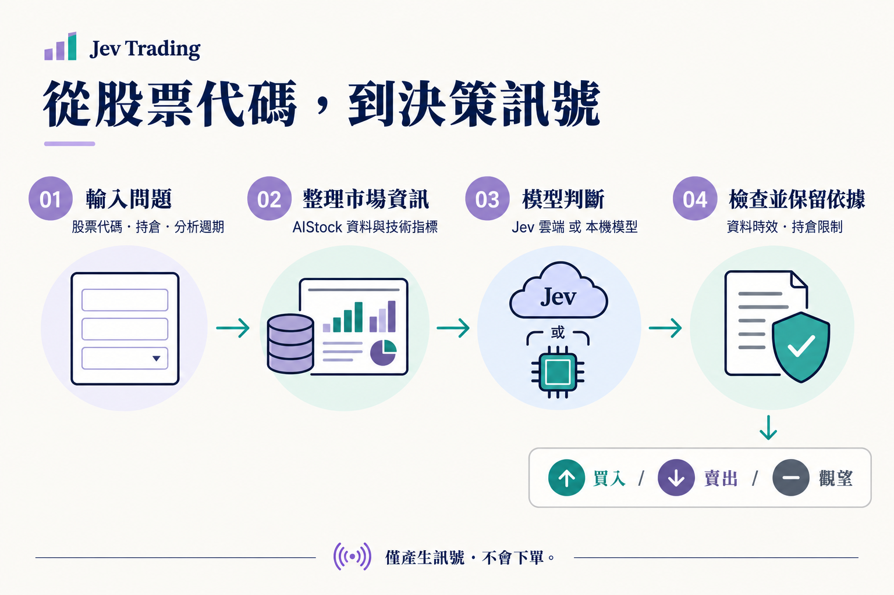

<div align="center">

# Jev Trading

### 輸入一檔股票，得到清晰、可追溯的決策訊號。

行情與新聞 → 模型判斷 → 程式檢查 → **買入 / 賣出 / 觀望**

[English](README.md) · [简体中文](README.zh-CN.md) · **繁體中文** · [日本語](README.ja.md) · [한국어](README.ko.md)

[快速體驗](#quickstart) · [真實分析](#live) · [如何讀結果](#results) · [API 接入](#api) · [遇到問題](#faq)

</div>



## 這個專案能幫你做什麼？

**Jev Trading 是一個執行在你電腦上的股票決策服務。** 你可以透過網頁使用，也可以讓自己的程式透過 HTTP 介面呼叫。它把 AIStock 收集的行情、指標、基本面和新聞交給模型，輸出結構化判斷，並保留分析依據。

例如，你提交「`600519`、目前空倉、關注未來 5 個交易日」，它會回傳最終動作、模型對三個動作的機率分配，以及資料缺失或程式限制等資訊。

- **看一檔股票：**填寫股票代碼、持倉和週期，檢視判斷與資料狀態。
- **接入自己的工具：**用同一個 API 選擇 Jev 雲端或本機模型。
- **回看判斷依據：**在本機儲存歷史、輸入快照和模型原始回應，支援匯出。

> **目前只生成訊號，不會下單。** 沒有券商帳戶接入、自動停損、目標倉位計算或收益回測；模型機率也不是盈利勝率。

## 選一條使用路徑

| 你想做什麼 | 需要準備 | 從這裡開始 |
| --- | --- | --- |
| 先看看效果 | Bun + uv；無需金鑰或 AIStock | [執行示範](#quickstart) |
| 分析真實股票，使用雲端模型 | 上述環境 + AIStock + Jev API Key | [連線真實分析](#live) |
| 分析真實股票，自己執行模型 | 上述環境 + AIStock + 模型權重與相容服務 | [設定本機模型](#local-inference) |
| 接入指令碼或其他應用 | 已啟動的本機服務 | [呼叫 HTTP API](#api) |

<a id="quickstart"></a>
## 1. 先跑一次示範

### 準備環境

安裝 [Bun](https://bun.sh) 和 [uv](https://docs.astral.sh/uv/getting-started/installation/)，重新開啟終端機，確認兩個命令可用：

```sh
bun --version
uv --version
```

Bun 執行網頁和 HTTP 服務；uv 準備 Python ≥ 3.12 的專案環境。首次啟動需要連網下載相依套件。目前已在 macOS 驗證，Windows 原生啟動尚未驗證。

### 下載並啟動

```sh
git clone --recurse-submodules https://github.com/EthanAlgoX/jev-trading.git
cd jev-trading
bun install --frozen-lockfile
bun run start
```

已有專案時，直接進入專案目錄，從 `bun install` 開始。啟動器會自動執行 `uv sync --frozen --no-dev`。

**開啟 [http://127.0.0.1:3000](http://127.0.0.1:3000)**，看到工作台就表示網頁服務已啟動。保持終端機執行；按 `Ctrl+C` 停止。

### 在網頁上完成第一次體驗

目前網頁按鈕使用簡體中文，以下附上實際名稱方便對照。

1. 保持**示範模式**（`演示体验`）。
2. 點選**體驗一次決策**（`体验一次决策`）。
3. 在右側檢視動作、分類機率和資料狀態。
4. 在下方「最近分析」回看記錄，或點選**匯出完整依據**（`导出完整依据`）。

**示範使用合成資料與固定回應，不呼叫雲端或本機模型，也不會自動切換為付費分析。**

<details>
<summary>其他啟動方式：Mac 雙擊、僅啟動服務、修改連接埠</summary>

- Mac 可雙擊 [start.command](start.command)。沒有 Bun 但已有 Node.js/npm 時，它會嘗試用 npx 準備 Bun；仍需安裝 uv。
- `bun run serve`：啟動同一服務，不自動開啟瀏覽器。
- `PORT=3010 bun run serve`：改用 3010 連接埠；網頁和用戶端地址也要同步修改。

</details>

<a id="live"></a>
## 2. 連線真實股票分析

真實分析需要連線兩部分：**AIStock 提供資料，Jev 雲端或本機模型提供判斷。** 複製此儲存庫不會自動安裝 AIStock 或下載模型。

### 第一步：準備 AIStock 資料環境

另外準備 AIStock 專案，按照它的說明安裝相依套件、設定資料來源，並保留它自己的 Python 環境。推薦放在同一父目錄：

```text
workspace/
├── AI-Stock/
│   └── .venv/bin/python
└── jev-trading/
```

本專案需要 AIStock 的 `context_only` 採集入口：它在生成長報告之前回傳資料，跳過報告與通知流程。已有入口時無需重複打補丁。

<details>
<summary>AIStock 沒有 context_only 入口？應用配套補丁</summary>

將下面的路徑替換成實際絕對路徑：

```sh
cd /path/to/AI-Stock
git apply --check /path/to/jev-trading/patches/aistock-context-only.patch
git apply /path/to/jev-trading/patches/aistock-context-only.patch
```

只有檢查通過後才套用。檢查失敗時核對 AIStock 版本和本機改動，不要強制覆蓋。版本邊界見 [實作記錄](docs/implementation.md)。

</details>

### 第二步：選擇模型並儲存設定

| | Jev 雲端（預設） | 本機模型 |
| --- | --- | --- |
| 準備什麼 | Jev API Key | 自行下載的權重與相容推理服務 |
| 判斷在哪裡執行 | Jev 雲端 | 你部署的本機服務 |
| 是否需要 Jev 雲端金鑰 | 需要 | 不需要 |
| 費用來源 | API 使用及可能的資料費用 | 硬體、電力、維護及可能的資料費用 |
| 請求參數 | `"backend": "jev"` | `"backend": "local"` |

**使用雲端：**開啟網頁右上角「連線設定」（`连接设置`），填寫 Jev API Key、模型名（預設 `jev-latest`），以及未被自動發現的 AIStock 路徑和 Python 路徑，然後儲存。金鑰入口：[TypeSafe 控制檯](https://console.typesafe.ai)。

<details>
<summary>更喜歡用設定檔案？編輯 .env</summary>

在本專案目錄執行；已有 `.env` 時直接編輯，不要覆蓋：

```sh
cp .env.example .env
```

```dotenv
TYPESAFE_AI_API_KEY=your_jev_api_key
JEV_MODEL_ID=jev-latest
AISTOCK_PATH=/absolute/path/to/AI-Stock
AISTOCK_PYTHON=/absolute/path/to/AI-Stock/.venv/bin/python
```

替換示例值，儲存後重啟服務。**網頁儲存的設定優先於 `.env`**；網頁提交空金鑰表示保留原值。

</details>

<a id="local-inference"></a>
**使用本機模型：**先按 [本機部署指南](docs/local-inference.md) 準備權重與相容服務，再在「連線設定」（`连接设置`）選擇「本機決策引擎」（`本地决策引擎`），填寫地址、模型名和機率計算方式。普通聊天介面不能直接代替所需的 `/v1/systemone` 介面。可執行 `bun run backend:check` 檢查後端就緒端點。

雲端模式會傳送分析上下文給 Jev；本機模式的模型推理在本機完成，但行情和新聞採集仍可能連網。本機失敗不會自動轉為雲端呼叫。

### 第三步：檢查並分析

```sh
bun run doctor
```

它檢查路徑、採集入口和必要設定，**不保證資料來源或模型金鑰實際可用**。回到網頁，切換「真實分析」（`真实分析`），填寫：

| 項目 | 如何填寫 |
| --- | --- |
| 股票代碼 | 如 `600519`、`AAPL`、`HK00700`；可用性取決於資料來源 |
| 目前持倉 | 空倉或已持有；系統不會讀取真實帳戶 |
| 分析週期 | 網頁可選未來 5、10、20 個交易日 |
| 分析假設（選填） | 執行時點、往返成本與滑點、策略偏好 |

提交後等待「採集資料 → 分類判斷 → 檢查並儲存」。執行時點和成本只是判斷假設，不會觸發訂單。

<a id="results"></a>
## 3. 如何理解結果

**先看最終動作，再看狀態、有效期和限制原因。** 模型的原始建議可能被程式調整，例如技術資料降級時，模型建議買入，最終卻是觀望。

| 結果 | 含義 |
| --- | --- |
| `buy` / 買入 | 增加多頭持倉的訊號 |
| `sell` / 賣出 | 減少已有多頭持倉的訊號；空倉時不解釋為做空 |
| `hold` / 觀望 | 保持現狀；可能是模型判斷，也可能是程式限制或訊號過期 |
| `model_action` | 模型原始建議 |
| `final_action` | 程式檢查後的最終動作 |
| `status` | `accepted` 通過、`blocked` 被限制、`skipped` 跳過、`error` 錯誤、`expired` 過期 |
| `reason_codes` / `warnings` | 動作限制、缺失資料等原因 |
| `valid_until` | 訊號有效期，過期查詢會顯示 `hold / expired` |
| `action_probabilities` | 三個動作的機率分配，**不是賺錢機率** |

`state: done` 只代表任務處理結束，不代表建議有效，也不代表交易成功。API 呼叫方還應檢查 `mode`，避免把示範當作真實判斷。

<a id="api"></a>
## 4. 接入自己的程式

保持服務執行，在**另一個終端機**提交示範：

```sh
curl -sS http://127.0.0.1:3000/v1/decisions \
  -H 'Content-Type: application/json' \
  -H 'Idempotency-Key: demo-request-001' \
  -d '{"mode":"demo","position":"flat"}'
```

成功完成後的精簡示例（機率為固定示範值）：

```json
{
  "state": "done",
  "mode": "demo",
  "decision": {
    "model_source": "recorded",
    "model_action": "hold",
    "final_action": "hold",
    "status": "accepted",
    "action_probabilities": { "buy": 0.26, "sell": 0.09, "hold": 0.65 },
    "execution_mode": "signal_only"
  }
}
```

回傳 **202** 表示仍在執行，按 `links.self` 查詢。預設最多等待 25 秒；傳 `waitSeconds: 0` 可立即獲得任務編號。GET 查詢不會重新呼叫模型。

已有 Python 用戶端會自動提交和輪詢，無需第三方 HTTP 相依套件：

```sh
python3 examples/http_client.py --demo
```

設定真實環境後：

```sh
python3 examples/http_client.py --symbol 600519 --position flat --backend jev
```

使用本機模型時將 `jev` 改為 `local`。查詢已有任務：

```sh
python3 examples/http_client.py --request-id "YOUR_REQUEST_ID"
```

| 介面 | 用途 |
| --- | --- |
| `GET /v1/health` | 檢視服務和設定狀態 |
| `POST /v1/decisions` | 提交一次分析 |
| `GET /v1/decisions/{request_id}` | 查詢進度和結果 |
| `GET /v1/decisions/{request_id}/evidence` | 獲取輸入、原始回應和稽核依據 |

<details>
<summary>真實 HTTP 請求、參數與安全重試</summary>

```sh
curl -sS http://127.0.0.1:3000/v1/decisions \
  -H 'Content-Type: application/json' \
  -H 'Idempotency-Key: stock-600519-001' \
  -d '{"symbol":"600519","position":"flat","backend":"jev","horizon":5,"execution":"next_session_open","costPercent":0.3,"waitSeconds":0}'
```

- `mode` 預設 `live`；真實模式必填 `symbol`；`position` 必填 `flat` 或 `long`。
- `horizon` 為 1–250 個交易日，預設 5；`costPercent` 為 0–10，預設 0.3（即 0.3%）。
- `execution` 為 `next_session_open`（預設）或 `immediate`；`instructions` 最多 8000 字元。
- `backend` 為 `jev` 或 `local`，省略沿用服務預設；`localEngine` 可選 `logprobs` 或 `generated`。
- `waitSeconds` 為 0–25 的整數，預設 25。未知欄位會被拒絕。
- 每次新分析使用新的 `Idempotency-Key`（8–100 位字母、數字或連字元）。網路重試使用原識別碼和相同分析參數，可修改等待時間；重用識別碼會回傳原任務。
- 目前一次處理一個任務，不排隊；忙碌時回傳 `409 BUSY`。202 回應的 `Retry-After: 2` 表示兩秒後查詢。
- 斷開用戶端不會取消任務；本專案不自動重試模型請求。重啟會將未完成任務標為失敗，需要顯式發起新分析。

</details>

完整約定見 [HTTP API 文件](docs/http-api.md)。

<a id="faq"></a>
## 遇到問題，從這裡排查

| 現象 | 下一步 |
| --- | --- |
| `bun` 或 `uv` 找不到 | 安裝對應工具並重開終端機，先執行 `--version` |
| 無法開啟網頁 | 確認啟動終端機仍在執行，存取 `127.0.0.1:3000`；連接埠衝突時改為 3010 |
| 沒有金鑰 | 先選示範；真實本機模式仍需 AIStock 與相容模型服務 |
| `503 NOT_READY` | 執行 `bun run doctor`，補齊顯示缺失的設定 |
| 設定改了但未生效 | 網頁儲存的設定優先於 `.env`；修改 `.env` 後重啟 |
| 202 / 暫無結果 | 按 `links.self` 查詢，或用 Python 用戶端自動等待 |
| 409 / 總回傳舊結果 | BUSY 時稍後重試；新分析用新識別碼；同一識別碼不可搭配不同分析參數 |
| 資料採集失敗 | 檢視 `data/collection.log`，檢查 AIStock 相依套件和資料來源；採集上限為 240 秒 |
| 模型呼叫失敗 / 401 | 檢查金鑰、權限、網路；本機模式檢查相容服務，再顯式重試 |
| 買入變成觀望 | 檢視 `reason_codes`、資料狀態與有效期 |

<a id="preview"></a>
## 介面與語言說明

本頁流程圖為繁體中文版。五種 README 各自使用對應語言的說明圖片；**網頁、日誌與延伸文件目前主要為簡體中文**，圖片本機化不代表軟體介面已支援五種語言。

<details>
<summary>檢視實際網頁截圖（簡體中文，固定示範樣本）</summary>

[桌面截圖](docs/assets/workbench-desktop.png) · [手機寬度截圖](docs/assets/workbench-mobile.png)。響應式版面不代表開放了手機遠端存取。

</details>

<a id="architecture"></a>
## 開發與進一步閱讀

Bun 負責 HTTP、任務與模型連線，Python 負責採集、檢查與稽核，SQLite 儲存本機記錄。

| 目錄 | 負責什麼 |
| --- | --- |
| `app/`、`web/` | 服務、模型接入與網頁 |
| `src/jev_trading/`、`tests/` | Python 資料採集、規則、稽核與測試 |
| `examples/`、`patches/` | 呼叫示例與 AIStock 適配補丁 |
| `reference/` | 固定版本的 jev-trader 參考原始碼，不是 AIStock |

<a id="configuration"></a>
<details>
<summary>設定、儲存與開發檢查命令</summary>

設定樣例見 [.env.example](.env.example)。`JEV_DATA_DIR` 可改變資料目錄，`PORT` 改變連接埠，服務監聽地址固定為 `127.0.0.1`。

| 本機檔案 | 內容 |
| --- | --- |
| `data/settings.json` | 連線設定，權限 0600 |
| `data/workbench.sqlite` | 任務和歷史 |
| `data/decisions.db` | 輸入、模型回應和決策稽核 |
| `data/aistock.db`、`data/contexts/` | 行情快取與輸入快照 |
| `data/collection.log` | 採集診斷日誌 |

`.env` 與 `data/` 已被 Git 忽略。API 不回傳金鑰，金鑰不寫入分析記錄。

```sh
bun run typecheck
bun test app
uv run pytest -q
```

</details>

**驗證範圍：**專案記錄了示範與介面測試、以及一次真實 AIStock 採集；Jev 真實雲端推理與真實本機模型權重推理尚未驗證。基礎規則未覆蓋帳戶資金、可賣數量或完整交易規則，也沒有收益回測。目前服務僅限本機，沒有多使用者認證。

| 文件 | 內容 |
| --- | --- |
| [HTTP API](docs/http-api.md) | 參數、結果、錯誤和任務恢復 |
| [本機推理](docs/local-inference.md) · [相容實作](docs/reference-engines.md) | 自行部署模型與接入協議 |
| [高階 CLI](docs/cli.md) | 採集、離線重放和稽核查詢 |
| [架構](docs/architecture-and-development-plan.md) · [實作記錄](docs/implementation.md) · [工作台記錄](docs/workbench.md) | 設計、適配邊界及驗證依據 |

本專案參考 AIStock 的單股分析流程和 jev-trader 的模型接入方式。[reference/](reference/) 保留上游 MIT 許可，[AIStock 補丁許可](patches/AIStock-LICENSE) 隨補丁提供；這些許可不代表本專案新增程式碼已宣告統一開源授權條款。
